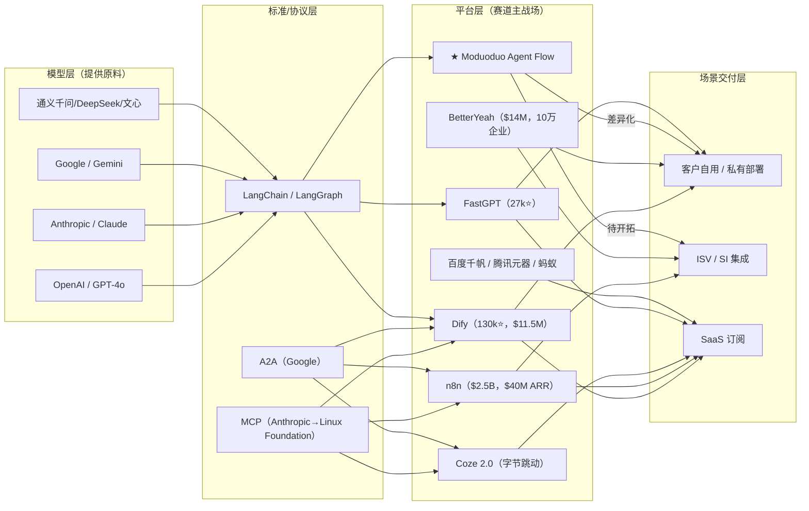

# Moduoduo Agent Flow 现状功能链路与技术资产盘点（用于技术路线图/BP）

更新时间：2026-03-04  
盘点范围：`D:\MProgram\Mcode\Moduoduo-Agent-Flow` 当前代码与部署配置（非远期规划稿）

---

## 0. 执行摘要（给 BP 可直接引用）

Moduoduo Agent Flow 是在 Flowise（全球最流行的开源 LLM 可视化编排平台之一，2025.08 被 Workday 收购）基础上，进行二次开发和中文化定制的**可视化 AI Agent 工作流编排平台**。当前版本（v1.0.0-beta.1）已形成完整的产品闭环：

- **可视化 Agent 编排引擎**（继承自 Flowise）：拖拽式 330+ 节点画布，覆盖 Chatflow（单 Agent）、Agentflow（多 Agent 协作）、Assistant 三种编排范式，支持条件分支、循环、人机交互。
- **企业级多租户架构**（基于 Flowise Enterprise 能力扩展）：Organization → Workspace → User 三级隔离，60+ 细粒度 RBAC 权限，4 种 SSO 协议（Azure/Google/GitHub/Auth0），Stripe 订阅计费。
- **全链路 AI 能力接入**（继承自 Flowise 节点生态）：OpenAI/Anthropic/Google/Mistral/Ollama 等 15+ LLM Provider，ChromaDB/Pinecone/Qdrant/Milvus 等 10+ 向量数据库，100+ 外部工具集成。
- **ModuoduoPro AI 网关**（自研增量）：自研 OpenAI-compatible 模型网关节点，统一多厂商模型调用入口，动态模型发现。
- **完整的 RAG + 评估闭环**（继承自 Flowise）：Document Store → 分块 → 向量化 → 检索 → 评估数据集 → 自动评估器 → 质量度量。
- **双语国际化**（自研增量）：前端 1350+ i18n key、后端 330 节点 3300+ 翻译 key，中英双语完整覆盖。

> **诚实说明：** 本项目的核心能力（编排引擎、RBAC、SSO、多租户、评估体系等）大部分继承或基于 Flowise 上游。真正的自研增量主要集中在：①完整中英双语国际化 ②ModuoduoPro 模型网关 ③邀请码/邮箱验证注册体系 ④中文化部署和适配 ⑤10 项软著知识产权布局。需要在 BP 中准确区分"继承能力"和"自研增量"，避免引起投资人质疑。

从"平台化复用"角度看，本项目已沉淀出**可复用的 6 大平台能力层**（继承+自研混合）：可视化编排引擎、企业级身份与权限体系、AI 模型网关、文档知识管理、评估质量体系、模板市场生态——可作为模多多产品矩阵的底层 PaaS 复用。

---

## 1. 项目架构全景图

```
┌──────────────────────────────────────────────────────────────────────┐
│                     Moduoduo Agent Flow v1.0.0-beta.1               │
├──────────────────────────────────────────────────────────────────────┤
│                                                                      │
│  ┌──────────────────┐    ┌──────────────────┐    ┌───────────────┐  │
│  │   UI Layer        │    │   API Layer       │    │  Queue Layer  │  │
│  │   React 18        │───▶│   Express.js      │───▶│  BullMQ       │  │
│  │   MUI 5 + i18n    │    │   60+ REST APIs   │    │  Prediction   │  │
│  │   ReactFlow       │    │   SSE Streaming   │    │  Upsert       │  │
│  │   Redux Toolkit   │    │   JWT + Session   │    │  Redis-backed │  │
│  │   Vite 5          │    │   TypeScript      │    │               │  │
│  └──────────────────┘    └────────┬─────────┘    └───────────────┘  │
│                                   │                                  │
│  ┌────────────────────────────────┼───────────────────────────────┐  │
│  │              中间件管线 Middleware Pipeline                      │  │
│  │  CORS → Cookie → XSS → Logger → JWT/Session → RBAC → Metrics  │  │
│  └────────────────────────────────┼───────────────────────────────┘  │
│                                   │                                  │
│  ┌────────────────────────────────┼───────────────────────────────┐  │
│  │              核心服务 Core Services                              │  │
│  │  ┌──────────┐ ┌──────────┐ ┌───────────┐ ┌────────────────┐  │  │
│  │  │NodesPool │ │SSEStream │ │CachePool  │ │UsageCacheMgr   │  │  │
│  │  │330 nodes │ │20 events │ │In-Memory  │ │Quota Tracking  │  │  │
│  │  └──────────┘ └──────────┘ └───────────┘ └────────────────┘  │  │
│  └────────────────────────────────────────────────────────────────┘  │
│                                                                      │
│  ┌────────────────────────────────────────────────────────────────┐  │
│  │              企业层 Enterprise Layer                             │  │
│  │  ┌──────────┐ ┌──────────┐ ┌────────┐ ┌──────┐ ┌──────────┐ │  │
│  │  │Identity  │ │SSO ×4    │ │Stripe  │ │RBAC  │ │MultiTena │ │  │
│  │  │Manager   │ │Azure AD  │ │Plans   │ │60+   │ │Org → WS  │ │  │
│  │  │License   │ │Google    │ │Quotas  │ │Perms │ │→ User    │ │  │
│  │  │Validate  │ │Auth0     │ │Seats   │ │15Cat │ │Isolation │ │  │
│  │  └──────────┘ │GitHub    │ └────────┘ └──────┘ └──────────┘ │  │
│  │               └──────────┘                                     │  │
│  └────────────────────────────────────────────────────────────────┘  │
│                                                                      │
│  ┌────────────────────────────────────────────────────────────────┐  │
│  │              数据层 Data Layer (TypeORM)                         │  │
│  │  SQLite / MySQL / MariaDB / PostgreSQL                         │  │
│  │  30 entities │ Auto-migrations │ Encrypted credentials         │  │
│  └────────────────────────────────────────────────────────────────┘  │
│                                                                      │
│  ┌────────────────────────────────────────────────────────────────┐  │
│  │              ModuoduoPro AI 网关                                 │  │
│  │  OpenAI-compatible │ 动态模型发现 │ 多厂商统一接入               │  │
│  │  Base: moduoduo.pro/v1 │ GPT/Claude/Gemini 兜底               │  │
│  └────────────────────────────────────────────────────────────────┘  │
└──────────────────────────────────────────────────────────────────────┘
```

### 技术栈

| 层级 | 技术选型 |
|------|----------|
| 前端 | React 18、Vite 5、MUI 5、Redux Toolkit、React Router 6、ReactFlow、i18next |
| 后端 | Node.js 18/20、Express、TypeScript、oclif CLI |
| 数据库 | TypeORM、SQLite（开发）/ PostgreSQL（生产） |
| 缓存/队列 | Redis、BullMQ、@bull-board |
| AI/LLM | LangChain 全家桶、OpenAI SDK、多厂商 SDK |
| 认证 | Passport.js（JWT + Local + SSO）、bcryptjs |
| 部署 | Docker + Docker Compose、Nginx、Turborepo |
| 监控 | Prometheus / OpenTelemetry |
| 包管理 | pnpm workspaces + Turborepo monorepo |

---

## 2. 当前已实现能力（按真实代码口径）

### 2.1 核心功能完整清单

#### A. 可视化编排引擎（核心资产）

| 功能 | 状态 | 技术细节 |
|------|------|----------|
| Chatflow 编排 | ✅ 已落地 | 单 Agent 对话流编排，ReactFlow 画布，节点拖拽连接 |
| Agentflow 编排 | ✅ 已落地 | 多 Agent 协作编排，支持条件分支、循环 |
| AgentFlow v2 画布 | ✅ 已落地 | 增强画布，节点内编辑、执行状态可视化 |
| Multi-Agent 编排 | ✅ 已落地 | 多智能体协作，Agent 间状态传递与切换 |
| Assistant 模式 | ✅ 已落地 | OpenAI Assistant + Custom Assistant 两种模式 |
| 330+ 内置节点 | ✅ 已落地 | Chat Models / LLMs / Embeddings / Retrievers / VectorStores / Tools / Memory / Chains 等全品类 |
| 节点动态加载 | ✅ 已落地 | NodesPool 自动扫描加载，支持禁用、过滤 |
| 流式输出 | ✅ 已落地 | SSE 20 种事件类型（token/tool/reasoning/action/TTS 等） |
| 执行记录 | ✅ 已落地 | Execution 实体，状态追踪（INPROGRESS/FINISHED/ERROR/TERMINATED/TIMEOUT） |
| 流程导入导出 | ✅ 已落地 | JSON 格式，跨实例迁移 |

#### B. 企业级多租户体系

| 功能 | 状态 | 技术细节 |
|------|------|----------|
| 用户注册/登录 | ✅ 已落地 | 邮箱验证码注册、邀请码注册、密码登录 |
| JWT + Cookie 认证 | ✅ 已落地 | Auth Token（60min）+ Refresh Token（90d），HttpOnly Cookie |
| SSO 四协议 | ✅ 已落地 | Azure AD、Google OAuth、GitHub OAuth、Auth0 |
| RBAC 权限模型 | ✅ 已落地 | 15 类资源 × 60+ 细粒度权限（view/create/update/delete/...） |
| Organization 管理 | ✅ 已落地 | 组织创建、用户管理、角色分配 |
| Workspace 隔离 | ✅ 已落地 | 工作区级资源隔离，多工作区切换 |
| 角色管理 | ✅ 已落地 | Owner / Member / Personal Workspace 预设角色 + 自定义角色 |
| 登录活动审计 | ✅ 已落地 | IP 解析、地理位置、登录时长追踪 |
| 用户活动日志 | ✅ 已落地 | UserActivityLog 全操作记录 |
| 邀请码体系 | ✅ 已落地 | 生成、限额、过期、使用日志 |
| 密码找回/重置 | ✅ 已落地 | 邮箱验证 + 临时 Token 机制 |
| Stripe 订阅计费 | ✅ 已落地（Cloud 模式） | FREE/STARTER/PRO 三档，功能开关 + 配额限制 |

#### C. AI 能力接入层

| 功能 | 状态 | 技术细节 |
|------|------|----------|
| ModuoduoPro 模型网关 | ✅ 已落地 | OpenAI-compatible API，动态模型列表，多厂商统一调用 |
| 多 LLM Provider | ✅ 已落地 | OpenAI、Anthropic、Google、Mistral、Groq、Ollama、Azure OpenAI 等 15+ |
| 多向量数据库 | ✅ 已落地 | ChromaDB、Pinecone、Qdrant、Supabase、FAISS、Milvus、Elasticsearch 等 10+ |
| 多 Embedding 模型 | ✅ 已落地 | OpenAI Embeddings、HuggingFace、Cohere、各大厂 Embeddings |
| 多 Memory 类型 | ✅ 已落地 | Buffer Memory、Window Memory、Summary Memory、Vector Store Memory 等 |
| NVIDIA NIM 集成 | ✅ 已落地 | 独立路由 `/nvidia-nim` |
| OpenAI Realtime API | ✅ 已落地 | 实时音频/对话接入 |
| TTS 集成 | ✅ 已落地 | Text-to-Speech 流式输出（base64 音频块） |

#### D. 知识管理 & RAG

| 功能 | 状态 | 技术细节 |
|------|------|----------|
| Document Store | ✅ 已落地 | 文档上传、管理、状态追踪 |
| 文档分块 | ✅ 已落地 | 可视化分块预览、多种分块策略 |
| 向量化 & 检索 | ✅ 已落地 | 向量存储配置、向量查询测试 |
| 文件管理 | ✅ 已落地 | 多格式支持（PDF/XLSX/CSV/TXT 等） |
| URL 内容抓取 | ✅ 已落地 | fetch-links API |

#### E. 评估与质量体系

| 功能 | 状态 | 技术细节 |
|------|------|----------|
| Dataset 管理 | ✅ 已落地 | 数据集创建、条目管理、序号排列 |
| Evaluator 配置 | ✅ 已落地 | 评估器定义与配置 |
| Evaluation 执行 | ✅ 已落地 | 自动评估执行，多轮评估支持 |
| 评估结果查看 | ✅ 已落地 | 按条目指标查看、状态追踪 |

#### F. 运维与部署

| 功能 | 状态 | 技术细节 |
|------|------|----------|
| Docker 部署 | ✅ 已落地 | 多种 Docker Compose 配置（dev/prod/test） |
| 生产镜像 | ✅ 已落地 | 前后端分离镜像 `meng9zzg/moduoduo-*` |
| 数据库迁移 | ✅ 已落地 | TypeORM 自动迁移，4 种数据库全覆盖 |
| API Key 管理 | ✅ 已落地 | 多 Key 创建、权限绑定 |
| 限流保护 | ✅ 已落地 | 每 Chatflow 独立限流器 |
| 服务端日志 | ✅ 已落地 | Winston 结构化日志 + 前端查看 |
| Prometheus / OTel | ✅ 已落地 | 可选指标采集 |
| BullMQ Dashboard | ✅ 已落地 | 队列可视化管理 `/admin/queues` |
| 备份脚本 | ✅ 已落地 | 生产环境备份 + 部署自动化 |

#### G. 模板市场 & 生态

| 功能 | 状态 | 技术细节 |
|------|------|----------|
| 内置模板市场 | ✅ 已落地 | 50+ 预置模板，分类浏览 |
| 自定义模板 | ✅ 已落地 | 用户创建、分享、badge 标记 |
| 模板导入导出 | ✅ 已落地 | JSON 格式跨实例 |

#### H. 国际化

| 功能 | 状态 | 技术细节 |
|------|------|----------|
| 前端 i18n | ✅ 已落地 | 30 命名空间、1350+ key、zh/en 双语 |
| 后端节点 i18n | ✅ 已落地 | 330 节点 × 3300+ 翻译 key |
| 模板翻译 | ✅ 已落地 | 50 模板中英双语 |
| 画布翻译 | ✅ 已落地 | 180+ key，47 个对话框 |

---

## 3. 技术价值评估

### 3.1 核心技术价值（高价值资产）

| 资产 | 价值等级 | 来源 | 说明 |
|------|----------|------|------|
| **可视化编排引擎** | ⭐⭐⭐⭐⭐ | 继承自 Flowise | 330+ 节点、3 种编排范式，是平台核心。但非自研——Flowise 上游能力 |
| **深度中文化体系** | ⭐⭐⭐⭐⭐ | **自研增量** | 4600+ i18n key 全覆盖——最大的工程量壁垒，Flowise 原版仅英文 |
| **ModuoduoPro AI 网关** | ⭐⭐⭐⭐ | **自研增量** | OpenAI-compatible 统一模型接入层，动态模型发现——Flowise 无此能力 |
| **企业级多租户架构** | ⭐⭐⭐⭐ | 继承自 Flowise Enterprise | Org→Workspace→User + 60+ RBAC + SSO——基于上游能力做中文化适配 |
| **SSE 流式框架** | ⭐⭐⭐ | 继承自 Flowise | 20 种事件类型——上游能力 |
| **数据库抽象层** | ⭐⭐⭐ | 继承自 Flowise | 4 种数据库无缝切换——上游能力 |
| **邀请码+邮箱注册** | ⭐⭐⭐ | **自研增量** | 增长工具链——Flowise 无此功能 |
| **BullMQ 异步队列** | ⭐⭐⭐ | 继承自 Flowise | 双队列——上游能力 |
| **Stripe 订阅计费** | ⭐⭐⭐ | 继承自 Flowise Enterprise | SaaS 商业化——基于上游能力适配 |
| **评估质量体系** | ⭐⭐⭐ | 继承自 Flowise | LLMOps 链路——上游能力 |
| **10 项软著** | ⭐⭐⭐ | **自研增量** | 知识产权布局——ToB/ToG 合规 |

### 3.2 能力来源区分（继承 vs 自研，必须对投资人透明）

> **重要：** Flowise 自身（尤其 Enterprise 版）已具备 RBAC、SSO（Azure/Google/Auth0）、多租户、评估体系等企业级功能。以下严格区分来源。

**继承自 Flowise 上游的核心能力：**

| 能力 | Flowise 上游状态 | Moduoduo 的工作 |
|------|------------------|-----------------|
| 可视化编排引擎（Chatflow/Agentflow/MultiAgent） | ✅ Flowise 核心能力 | 二次开发：UI 定制、品牌化 |
| 330+ 节点生态 | ✅ Flowise 社区贡献 | 跟进上游 + 少量新增 |
| RBAC 权限模型 | ✅ Flowise Enterprise 已有 | 本地化适配、权限细化 |
| SSO（Azure/Google/Auth0） | ✅ Flowise Enterprise 已有 | 新增 GitHub SSO + 中文化配置界面 |
| 多租户（Org→Workspace） | ✅ Flowise Enterprise 已有 | 基于上游扩展 |
| 评估体系（Dataset/Evaluator） | ✅ Flowise 已有 | 汉化 + 流程优化 |
| Stripe 订阅计费 | ✅ Flowise Enterprise 已有 | 配置适配 |
| Document Store + RAG 链路 | ✅ Flowise 核心能力 | 使用上游能力 |
| BullMQ 队列 | ✅ Flowise 已有 | 使用上游能力 |
| SSE 流式框架 | ✅ Flowise 已有 | 使用上游能力 |

**真正的自研增量（可以在 BP 中强调）：**

1. **完整中英双语国际化**：4600+ i18n key，330 节点 3300+ 翻译 key，50 模板翻译——Flowise 原版仅有英文，这是最大的工程量增量
2. **ModuoduoPro 模型网关**：自研 OpenAI-compatible 统一模型调用节点，动态模型发现——Flowise 无此能力
3. **邀请码注册体系**：邀请码生成、限额、过期、使用追踪——Flowise 无此功能
4. **邮箱验证码注册**：独立的注册链路——Flowise 无此功能
5. **GitHub SSO**：在 Flowise 已有的 Azure/Google/Auth0 基础上新增 GitHub OAuth
6. **用户活动追踪增强**：登录审计日志、IP 地理位置解析（ip2region）
7. **中文化部署方案**：Docker 镜像品牌化、中文部署文档、QQ 企业邮 SMTP 适配
8. **10 项软著知识产权**：系统性拆分申报，保护知识产权
9. **品牌资产**：域名、Docker Hub 镜像、官网

---

## 4. 技术债务评估

### 4.1 已识别技术债务

| 类别 | 债务描述 | 严重程度 | 影响 |
|------|----------|----------|------|
| **上游依赖** | 基于 Flowise fork，需持续跟进上游更新，合并冲突风险大 | 🔴 高 | 长期维护成本高，上游重大变更可能需要大量适配 |
| **上游授权风险** | Flowise 于 2025.08 被 Workday 收购，未来授权政策可能变化 | 🔴 高 | 需关注 Apache 2.0 协议下的合规性，考虑独立分支策略 |
| **License 硬编码** | IdentityManager 中 License 验证已被硬编码禁用（强制 OPEN_SOURCE 模式） | 🟡 中 | 企业/Cloud 模式功能虽已实现但无法通过正式授权验证启用 |
| **测试覆盖不足** | 仅有少量单元测试（encryption.test.ts、validation.test.ts），E2E 测试框架（Cypress）存在但覆盖率低 | 🟡 中 | 重构风险高，回归测试依赖手动 |
| **前端 JSX 未迁移** | UI 仍使用 `.jsx` 而非 `.tsx`，缺少 TypeScript 类型安全 | 🟡 中 | 前端代码维护性低于后端 |
| **节点翻译维护** | 330 节点 × 3300+ 翻译 key，新增节点需同步维护多语言 | 🟡 中 | 国际化维护成本持续增长 |
| **SQLite 限制** | 默认 SQLite 在并发/大数据量场景有性能瓶颈 | 🟢 低 | 生产环境已推荐 PostgreSQL |
| **Monorepo 构建** | Turborepo + pnpm 构建链较重，新开发者上手成本高 | 🟢 低 | 影响开发体验但不影响功能 |

### 4.2 架构风险

| 风险 | 评级 | 对策建议 |
|------|------|----------|
| Flowise 上游分叉越走越远 | 🔴 高 | 建立独立更新策略，按需 cherry-pick 上游功能，逐步解耦 |
| Workday 收购后 Flowise 可能闭源 | 🔴 高 | 当前 Apache 2.0 已 fork 的代码不受影响，但需关注新版本授权变化 |
| LangChain 版本碎片化 | 🟡 中 | 锁定 LangChain 版本，建立兼容性测试矩阵 |
| Node.js 单线程瓶颈 | 🟡 中 | BullMQ 队列已缓解，但高并发推理仍需水平扩展 |

---

## 5. 可为平台层复用的能力

### 5.1 平台复用架构图

```
┌──────────────────────────────────────────────────────────────────────┐
│                    模多多 PaaS 平台复用层                             │
├──────────────────────────────────────────────────────────────────────┤
│                                                                      │
│  L0  通用基础层（可直接复用）                                         │
│  ┌──────────┐ ┌──────────┐ ┌──────────┐ ┌──────────┐ ┌──────────┐  │
│  │JWT/SSO   │ │RBAC权限  │ │多租户    │ │数据库    │ │i18n 国际 │  │
│  │认证框架  │ │60+ 权限  │ │Org→WS   │ │抽象层    │ │化框架    │  │
│  └──────────┘ └──────────┘ └──────────┘ └──────────┘ └──────────┘  │
│                                                                      │
│  L1  AI 能力层（可组合复用）                                          │
│  ┌──────────┐ ┌──────────┐ ┌──────────┐ ┌──────────┐ ┌──────────┐  │
│  │Moduoduo  │ │SSE 流式  │ │RAG 文档  │ │向量存储  │ │评估质量  │  │
│  │Pro 网关  │ │框架      │ │知识管理  │ │抽象层    │ │体系      │  │
│  └──────────┘ └──────────┘ └──────────┘ └──────────┘ └──────────┘  │
│                                                                      │
│  L2  业务能力层（可适配复用）                                         │
│  ┌──────────┐ ┌──────────┐ ┌──────────┐ ┌──────────┐ ┌──────────┐  │
│  │可视化    │ │模板市场  │ │Stripe    │ │邀请码    │ │审计日志  │  │
│  │编排引擎  │ │生态      │ │订阅计费  │ │增长体系  │ │合规体系  │  │
│  └──────────┘ └──────────┘ └──────────┘ └──────────┘ └──────────┘  │
│                                                                      │
├──────────────────────────────────────────────────────────────────────┤
│  复用目标产品                                                        │
│  ┌──────────┐ ┌──────────┐ ┌──────────┐ ┌──────────┐               │
│  │QAgent    │ │MCV App   │ │模多多    │ │新业务    │               │
│  │文旅场景  │ │CV 应用   │ │官网SaaS  │ │线        │               │
│  └──────────┘ └──────────┘ └──────────┘ └──────────┘               │
└──────────────────────────────────────────────────────────────────────┘
```

### 5.2 各层复用清单

#### L0 通用基础层（零改造直接复用）

| 模块 | 代码位置 | 复用方式 | 复用到 |
|------|----------|----------|--------|
| JWT + Session + SSO 认证框架 | `enterprise/middleware/passport/` | npm 包 / 直接引用 | 所有产品线 |
| RBAC 权限引擎 | `enterprise/rbac/` | 权限定义可扩展 | 所有需要权限的产品 |
| 多租户 Org→Workspace 架构 | `enterprise/database/entities/` | 数据模型复用 | SaaS 产品 |
| TypeORM 4 数据库抽象 | `DataSource.ts` + migrations | 直接复用 | 所有 Node.js 后端 |
| i18n 前后端框架 | `ui/src/i18n/` + `components/locales/` | 框架 + 流程复用 | 出海产品 |
| 邮件发送服务 | `enterprise/utils/sendEmail.ts` | 直接复用 | 所有需邮件的产品 |
| IP 地理位置解析 | `IpLocationService` | 直接复用 | 审计/风控 |

#### L1 AI 能力层（组合式复用）

| 模块 | 代码位置 | 复用方式 | 复用到 |
|------|----------|----------|--------|
| ModuoduoPro 模型网关 | `components/nodes/chatmodels/ModuoduoPro/` | 独立 AI Gateway | QAgent、所有 AI 产品 |
| SSE 流式框架（20 事件类型） | `utils/SSEStreamer.ts` | 通用流式协议 | QAgent（qa-api 可共用）|
| Document Store 知识管理 | `services/document-store/` | 知识库服务 | QAgent RAG 链路 |
| 向量存储抽象层 | `components/nodes/vectorstores/` | 10+ 向量库适配器 | 所有 RAG 场景 |
| 评估数据集 + 评估器 | `services/evaluations/` | LLMOps 质量保证 | 所有 LLM 产品 |
| BullMQ 异步队列框架 | `queue/QueueManager.ts` | 任务队列 | 大批量处理场景 |

#### L2 业务能力层（适配后复用）

| 模块 | 代码位置 | 复用方式 | 复用到 |
|------|----------|----------|--------|
| 可视化编排引擎 | `ui/src/views/agentflowsv2/` | 编排 UI 组件 | 新编排类产品 |
| 模板市场 | `services/marketplaces/` | 市场机制 | 所有需模板的产品 |
| Stripe 订阅计费 | `enterprise/` (StripeManager) | SaaS 商业化 | 所有 SaaS 产品 |
| 邀请码增长体系 | `enterprise/services/invite-code/` | 增长工具 | 所有 C 端产品 |
| 审计日志系统 | `enterprise/services/audit/` | 合规工具 | 企业级产品 |

### 5.3 与 QAgent 的复用接口

| Agent Flow 能力 | QAgent 对应需求 | 复用路径 |
|------------------|-----------------|----------|
| ModuoduoPro 网关 | qa-api 多模型调用 | 替换 qa-api 的模型调用层，统一走网关 |
| SSE 流式协议 | qa-api RAG SSE 输出 | 统一流式协议标准 |
| Document Store | qa-api 知识库 | 共享知识管理后端 |
| RBAC + 多租户 | QAgent 未来多景区部署 | 共享身份与权限体系 |
| 评估体系 | QAgent 问答质量评测 | 共享 LLMOps 评估链路 |
| i18n 框架 | QAgent 出海需求 | 共享国际化方案 |

---

## 6. 全球竞品分析与市场定位

### 6.1 竞品全景图

```
┌──────────────────────────────────────────────────────────────────────┐
│                  AI Agent 工作流编排平台竞争格局                       │
├──────────────────────────────────────────────────────────────────────┤
│                                                                      │
│  第一梯队（全球头部，估值 $1B+）                                      │
│  ┌──────────┐ ┌──────────┐ ┌──────────┐                            │
│  │ Dify     │ │ Coze     │ │ n8n      │                            │
│  │ 128k⭐   │ │ 字节跳动 │ │ 工作流   │                            │
│  │ 开源标杆 │ │ 零代码   │ │ 自动化   │                            │
│  └──────────┘ └──────────┘ └──────────┘                            │
│                                                                      │
│  第二梯队（开源/垂直，强社区）                                        │
│  ┌──────────┐ ┌──────────┐ ┌──────────┐ ┌──────────┐              │
│  │ Flowise  │ │ LangFlow │ │ CrewAI   │ │ AutoGen  │              │
│  │ 被收购   │ │ Python系 │ │ 多Agent  │ │ 微软     │              │
│  └──────────┘ └──────────┘ └──────────┘ └──────────┘              │
│                                                                      │
│  第三梯队（中国垂直）                                                │
│  ┌──────────┐ ┌──────────┐ ┌──────────┐ ┌──────────┐              │
│  │ 百度千帆 │ │ 腾讯元器 │ │BetterYeah│ │ FastGPT  │              │
│  │ 搜索生态 │ │ 微信生态 │ │ 企业级   │ │ 开源RAG  │              │
│  └──────────┘ └──────────┘ └──────────┘ └──────────┘              │
│                                                                      │
│  Moduoduo Agent Flow 定位                                            │
│  ┌──────────────────────────────────────────┐                       │
│  │ 第二~三梯队之间                            │                       │
│  │ 基于 Flowise 的企业级增强平台              │                       │
│  │ 差异化：多租户 + 中文深度 + 模型网关       │                       │
│  └──────────────────────────────────────────┘                       │
└──────────────────────────────────────────────────────────────────────┘
```

### 6.2 核心竞品详细对比

| 维度 | Moduoduo Agent Flow | Dify | Coze（扣子） | Flowise（原版/上游） | LangFlow |
|------|---------------------|------|-------------|---------------------|----------|
| **定位** | Flowise 二次开发+中文化 | 开源 LLM 应用平台 | 零代码 AI Bot | 开源 LLM 编排（被 Workday 收购） | 开源可视化编排 |
| **GitHub Stars** | 私有仓库 | 130k+ | N/A | 42k+ | 50k+ |
| **编排模式** | Chatflow+Agentflow+MultiAgent | Workflow+Chatbot | Bot+Workflow+Agent Plan | Chatflow+Agentflow+MultiAgent | Flow |
| **节点数量** | 330+（继承上游） | 200+ | 100+插件 | 330+（上游源） | 200+ |
| **企业功能** | ✅ 继承+扩展 | ✅ 企业版 | ✅ 企业版 | ✅ Enterprise 版有完整企业功能 | ❌ |
| **多租户** | ✅ 继承自 Flowise | ✅ 企业版 | ❌ | ✅ Enterprise 版 | ❌ |
| **SSO** | ✅ 4种协议（+GitHub） | ✅ 企业版 | N/A | ✅ Enterprise 版（Azure/Google/Auth0） | ❌ |
| **RBAC** | ✅ 继承+适配 | ✅ 企业版 | ❌ | ✅ Enterprise 版 | ❌ |
| **中文支持** | ✅ 深度双语（自研增量） | ✅ 多语言 | ✅ 原生中文 | ❌ 仅英文 | ❌ 仅英文 |
| **私有部署** | ✅ Docker | ✅ Docker/K8s | ❌ | ✅ Docker | ✅ Docker |
| **商业模式** | 私有部署+SaaS | 开源+企业版 | 免费SaaS | 开源（2025.08 被 Workday 收购） | 开源 |
| **RAG 完整度** | ✅ 继承上游 | ✅ 领先 | ⚠️ 插件式 | ✅ 完整 | ⚠️ 基础 |
| **评估体系** | ✅ 继承上游 | ✅ 领先 | ❌ | ✅ 完整 | ❌ |
| **技术栈** | Node.js/React（同上游） | Python/React | Go/React | Node.js/React | Python/React |
| **融资/背景** | 创业团队 | $11.5M（阿里云投资） | 字节跳动 | 被 Workday（$73B）收购 | DataStax 支持 |

### 6.3 全球视角分析

#### 优势（诚实版——区分继承能力和自研增量）

1. **深度中文化是最大自研增量**：4600+ i18n key 双语覆盖（前端 1350+ 后端 3300+），330 节点、50 模板、47 个对话框全部中文化——这是所有海外开源编排平台（Flowise/LangFlow/n8n）不具备的，是面向中国市场的真实工程壁垒
2. **ModuoduoPro 统一模型网关**（自研）：多厂商模型统一接入 + 动态发现，简化了多模型管理复杂度——Flowise 上游无此能力
3. **邀请码+邮箱验证注册体系**（自研）：增长工具链——Flowise 上游无此功能
4. **企业级功能"开箱可用"**（继承+适配）：继承 Flowise Enterprise 的 RBAC/SSO/多租户能力，但进行了中文化适配和部署优化，降低了中国客户的使用门槛
5. **私有部署+中文化部署方案**：Docker 镜像品牌化 + 中文部署文档 + QQ 企业邮 SMTP 适配
6. **10 项软著合规背书**：ToB/ToG 销售的硬性要求
7. **基于成熟上游**：Flowise 42k⭐ + 被 $73B 市值的 Workday 收购，验证了底层架构的成熟度和市场价值

#### 短板（必须诚实面对）

1. **自研增量有限**：核心能力（编排引擎/RBAC/SSO/多租户/评估/RAG/队列/流式）均继承自 Flowise 上游。自研部分主要是中文化、模型网关、邀请码、部署适配——在 BP 中如果过度声称"自研"，经不起技术尽调
2. **社区与品牌为零**：私有仓库，无开源社区效应——Dify 130k⭐、Flowise 42k⭐、LangFlow 50k⭐ 的社区飞轮不可逆
3. **上游依赖风险**：Flowise 2025.08 被 Workday 收购，fork 分支的长期独立演进面临挑战——上游新功能无法自动同步，架构分叉越来越大
4. **MCP 协议支持缺失**：MCP 已被 OpenAI/Google/Microsoft/Linux Foundation 统一采纳，Dify 已支持——不跟进意味着被行业标准排除
5. **缺少独创编排范式**：核心编排引擎来自 Flowise 上游，未形成差异化——Dify 有 Workflow+Iteration+Parallel，Coze 2.0 有 Agent Plan，n8n 有 AI+Code+Human
6. **零客户验证**：无标杆案例，PMF 未验证
7. **测试覆盖率低**：自动化测试不足，企业客户 POC 阶段可能要求测试报告
8. **A2A 生态缺位**：未接入 Agent-to-Agent 标准协议

### 6.4 中国视角分析

#### 市场定位

中国 AI Agent 平台市场 2025 年规模约 190 亿人民币，2025-2028 年 CAGR > 110%。市场呈三大阵营分化：

| 阵营 | 代表 | Moduoduo 定位 |
|------|------|---------------|
| 大厂生态型 | 扣子(Coze)、百度千帆、腾讯元器、蚂蚁 Agentar | 无法正面竞争，但可差异化私有部署 |
| 开源技术型 | Dify、FastGPT、LangFlow | 功能对齐，企业级增强为差异点 |
| 企业级专业型 | BetterYeah、实在智能 | 同一赛道，需建立行业深度 |

#### 中国市场优势

1. **深度中文化**（自研核心增量）：节点/模板/画布/文档全部中文化，4600+ i18n key——这是 Flowise 原版不具备的
2. **私有部署开箱可用**：继承 Flowise 的 Docker 部署能力 + 中文化部署文档/镜像/配置
3. **10 项软著背书**：ToG 项目投标的硬性条件
4. **源码级定制能力**：vs 大厂 SaaS 的"黑盒"限制，企业可按需深度定制
5. **基于成熟开源基座**：Flowise 42k⭐ + Workday 收购验证 → 底层架构经过大量社区验证

#### 中国市场短板（必须诚实面对）

1. **自研壁垒薄弱**：核心能力来自 Flowise 上游——任何团队花几周时间也可以 fork Flowise 做中文化。"中文化"不是技术壁垒，是工程量壁垒
2. **零客户案例**：BetterYeah 有百丽国际 800+ 节点等标杆案例，本项目零案例
3. **无安全认证**：BetterYeah 已通过等保三级 + ISO27001，本项目尚未启动
4. **无大厂背书**：BetterYeah 获阿里云领投 $14M，Dify 获阿里云投资——大厂背书 = 企业客户信任锚点
5. **国产大模型接入深度不足**：ModuoduoPro 网关以海外模型接口为主，国产模型（文心/通义/DeepSeek/混元）的深度适配不够
6. **行业模板少**：50 通用模板 vs BetterYeah 100+ 行业模板
7. **团队规模限制**：对比 BetterYeah 创始团队（钉钉前副总裁张毅等），资源差距显著

### 6.5 市场水位判断

**水位评级：🔴 深水区，但尚有结构性机会**

**判断依据：**

1. **资本密度极高**：AI Agent 已占全球 VC 投资的 33%，头部公司估值 $5-10B（Sierra $10B、Harvey $5B），二级市场收入倍数高达 52x ARR
2. **头部效应明显**：Dify 128k⭐，社区飞轮已启动；Coze 背靠字节跳动流量池；n8n 获数亿美元融资
3. **行业加速整合**：Flowise 被 Workday 收购（2025.08）标志开源工具被大厂吸收的趋势
4. **但结构性机会存在**：
   - **私有部署刚需**：国央企、金融、医疗等行业不接受 SaaS，需要可私有部署的解决方案
   - **垂直场景深耕**：通用平台难以满足垂直行业（文旅、教育、制造）的深度需求
   - **中国特色合规**：等保、信创、数据出境等合规要求形成天然壁垒
   - **模型网关需求**：企业需要统一管理多厂商模型的中间层，ModuoduoPro 网关有独立价值

---

## 7. 未来方向建议

### 7.1 短期（0-3 个月）

| 方向 | 具体行动 | 价值 |
|------|----------|------|
| MCP 协议接入 | 集成 Model Context Protocol，支持标准化工具调用 | 追齐行业标准 |
| 国产大模型深度适配 | 文心 4.0、通义千问、DeepSeek、混元深度适配和优化 | 中国市场准入 |
| 行业模板扩充 | 文旅/教育/客服场景 30+ 模板 | 降低客户上手门槛 |
| 测试覆盖提升 | 核心链路 E2E + 单元测试覆盖率 > 60% | 降低维护风险 |

### 7.2 中期（3-6 个月）

| 方向 | 具体行动 | 价值 |
|------|----------|------|
| 与 QAgent 能力融合 | 将 QAgent 的实时多模态对话能力整合为编排节点 | 差异化：多模态 Agent 编排 |
| A2A 协议支持 | 接入 Agent-to-Agent 标准协议 | 多智能体互操作 |
| 安全认证 | 等保三级 + SOC 2 | ToB/ToG 合规准入 |
| 独立编排范式 | 探索超越 Chatflow/Agentflow 的新编排范式 | 差异化竞争力 |
| 可观测性增强 | LLMOps 全链路追踪、成本分析、质量大盘 | 企业客户核心诉求 |

### 7.3 长期（6-12 个月）

| 方向 | 具体行动 | 价值 |
|------|----------|------|
| 平台 PaaS 化 | 抽离核心能力为独立微服务，支持多产品线复用 | 平台效率 |
| 开源社区建设 | 考虑核心引擎开源，建立社区生态 | 品牌 + 社区飞轮 |
| 垂直行业 SaaS | 文旅/教育/制造 3 个行业 SaaS 垂直方案 | 商业化闭环 |
| 脱离 Flowise 依赖 | 逐步自研核心编排引擎，彻底解除上游风险 | 长期技术独立性 |

---

## 8. 知识产权资产

### 8.1 软著资产矩阵（10 项）

| 序号 | 软著名称 | 覆盖能力 |
|------|----------|----------|
| 1 | 模多多-可视化智能体工作流编排平台 | Canvas 编排引擎核心 |
| 2 | 模多多-智能体生产搭建平台 | Agent 生产构建 |
| 3 | 模多多-多智能体协作编排引擎 | Multi-Agent 协作 |
| 4 | 模多多-向量知识管理系统 | Document Store + RAG |
| 5 | 模多多-智能客服对话系统 | 对话系统能力 |
| 6 | 模多多-智能体模板市场管理系统 | 模板市场 |
| 7 | 模多多-数据集管理与分析系统 | 数据集 + 评估 |
| 8 | 模多多-智能体自定义工具集成平台 | 工具集成 |
| 9 | 模多多-智能体运行监控管理系统 | 执行监控 |
| 10 | 模多多-用户认证与安全管理系统 | 企业安全体系 |

### 8.2 品牌资产

- 域名：moduoduo.pro / ai.moduoduo.site
- Docker Hub：`meng9zzg/moduoduo-*` 系列镜像
- 产品名：Moduoduo Agent Flow / ModuoduoPro

---

## 9. 给 BP 的关键数据点

| 指标 | 数据 |
|------|------|
| 代码规模 | Monorepo 4 个包，300+ 源文件 |
| 节点数量 | 330+ 可编排节点 |
| API 数量 | 60+ REST API 端点 |
| 数据模型 | 30 个数据库实体 |
| RBAC 权限 | 15 类资源 × 60+ 细粒度权限 |
| i18n 覆盖 | 4600+ 翻译 key，中英双语 |
| 模型支持 | 15+ LLM Provider |
| 向量库支持 | 10+ 向量数据库 |
| SSO 协议 | 4 种（Azure/Google/GitHub/Auth0） |
| 软著数量 | 10 项 |
| 目标市场规模 | 全球 $78.4B（2025）→ $526.2B（2030），CAGR 46.3% |
| 中国市场规模 | ¥190B（2025），CAGR > 110% |
| VC 占比 | AI Agent 占全球 VC 投资 33% |

---

## 附录 A：项目文件结构

```
Moduoduo-Agent-Flow/
├── packages/
│   ├── server/                 # 后端（Express + TypeORM + Passport）
│   │   ├── src/
│   │   │   ├── index.ts              # App 启动 + 中间件
│   │   │   ├── DataSource.ts          # 数据库连接（4 种 DB）
│   │   │   ├── IdentityManager.ts     # 认证/RBAC/SSO/Stripe
│   │   │   ├── NodesPool.ts           # 节点池加载
│   │   │   ├── routes/                # 60+ API 路由
│   │   │   ├── controllers/           # 业务控制器
│   │   │   ├── services/              # 业务服务
│   │   │   ├── database/entities/     # 24 核心实体
│   │   │   ├── enterprise/            # 企业层（7 实体 + SSO + RBAC）
│   │   │   ├── queue/                 # BullMQ 队列
│   │   │   └── utils/                 # SSEStreamer 等工具
│   │   └── package.json
│   ├── ui/                     # 前端（React 18 + MUI 5 + Vite 5）
│   │   ├── src/
│   │   │   ├── App.jsx                # 根组件
│   │   │   ├── routes/                # 30+ 页面路由
│   │   │   ├── views/                 # 业务视图
│   │   │   ├── i18n/                  # 国际化配置
│   │   │   └── ui-component/          # 通用组件
│   │   └── package.json
│   ├── components/             # AI 节点库（330+ 节点）
│   │   ├── nodes/                     # 节点实现
│   │   │   ├── chatmodels/ModuoduoPro/ # 自研模型网关节点
│   │   │   ├── llms/                  # LLM 节点
│   │   │   ├── embeddings/            # Embedding 节点
│   │   │   ├── vectorstores/          # 向量存储节点
│   │   │   ├── tools/                 # 工具节点
│   │   │   └── ...
│   │   ├── locales/                   # 节点翻译
│   │   └── package.json
│   └── api-documentation/      # API 文档服务
├── docker/                     # Docker 配置
├── workplan/                   # 工作计划
│   ├── m_bushu/                       # 部署文档
│   ├── m_rz/                          # 软著申报（10 项）
│   └── m_ui/                          # UI 相关
├── docker-compose.prod.yml     # 生产部署
├── turbo.json                  # Turborepo 配置
├── package.json                # 根配置（pnpm workspaces）
└── .env                        # 环境变量
```

---

## 附录 B：SSE 流式事件协议（20 种事件类型）

| 事件 | 用途 | 数据格式 |
|------|------|----------|
| `start` | 流开始（去重） | `{}` |
| `token` | 单 token 块 | `string` |
| `sourceDocuments` | 检索来源文档 | `Document[]` |
| `artifacts` | 生成物 | `object` |
| `usedTools` | 已使用工具 | `Tool[]` |
| `calledTools` | 已调用工具 | `Tool[]` |
| `fileAnnotations` | 文件引用 | `Annotation[]` |
| `tool` | 工具执行事件 | `object` |
| `agentReasoning` | Agent 推理步骤 | `object` |
| `nextAgent` | 多 Agent 切换 | `object` |
| `agentFlowEvent` | Agent 流状态变化 | `object` |
| `agentFlowExecutedData` | Agent 流执行数据 | `object` |
| `nextAgentFlow` | 下一 Agent 流转换 | `object` |
| `action` | 人机交互动作 | `object` |
| `abort` | 流中止 | `{}` |
| `end` | 流完成 | `[DONE]` |
| `error` | 错误（401 脱敏） | `string` |
| `metadata` | 会话元数据 | `{chatId, sessionId, ...}` |
| `usageMetadata` | Token 用量 | `{promptTokens, completionTokens}` |
| `tts_*` | TTS 音频流 | `base64 + format info` |

---

## 附录 C：RBAC 权限矩阵（15 类 × 60+ 权限）

| 资源类别 | 权限清单 |
|----------|----------|
| chatflows | view, create, update, duplicate, delete, export, import, config, domains |
| agentflows | view, create, update, duplicate, delete, export, import, config, domains |
| tools | view, create, update, delete, export |
| assistants | view, create, update, delete |
| credentials | view, create, update, delete, share |
| variables | view, create, update, delete |
| apikeys | view, create, update, delete, import |
| documentStores | view, create, update, delete, add-loader, delete-loader, preview-process, upsert-config |
| datasets | view, create, update, delete |
| executions | view, delete |
| evaluators | view, create, update, delete |
| evaluations | view, create, update, delete, run |
| templates | marketplace, custom, custom-delete, toolexport, flowexport, custom-share |
| workspace | view, create, update, add-user, unlink-user, delete, export, import |
| admin | users:manage, roles:manage, sso:manage |
| logs | view |
| loginActivity | view, delete |

---

## 十、竞争位置总览（基于 2026-03 公开信息，真实数据）

### 10.1 行业坐标图

```
                           平台深度/完整度
                             ▲
                             │
       Dify ●                │         ● n8n ($2.5B估值, ARR $40M+)
     (130k⭐, $11.5M融资)    │
                             │
       Coze 2.0 ●            │    ● BetterYeah ($14M B轮, 10万企业)
     (字节跳动,Agent Plan/   │
      Agent Skills)          │
    ─────────────────────── │ ──────────────────────────→ 企业级能力
          开源/SaaS          │          私有部署/企业级
                             │
             ● LangFlow      │
             (50k⭐,DataStax) │
                             │
             ● FastGPT       │  ● 百度千帆 AppBuilder
             (27k⭐)          │
                             │
     Flowise (被Workday收购) │
             ●               │
                             │
                             │     ★ Moduoduo Agent Flow
                             │       (企业级增强Flowise)
                             │
                             │  ● 腾讯元器  ● 蚂蚁 Agentar
```

**Moduoduo Agent Flow 的位置：在"企业级功能完整度"维度上超越多数开源同类（Flowise/LangFlow/FastGPT），但在"社区生态+品牌+融资"维度上与 Dify/n8n 差距显著。核心差异化在"多租户+中文深度+私有部署+模型网关"的组合。**

---

## 十一、全球视角（基于 2026-03 公开信息）

### 11.1 全球竞品真实数据对照表

> 以下数据均来自公开信息源（PitchBook、Tracxn、GitHub、企业官方公告、媒体报道），标注截止日期。

| 竞品 | GitHub Stars | 融资总额 | 最新估值 | 核心指标 | 数据截止 |
|------|-------------|----------|----------|----------|----------|
| **Dify** | 130,000+ | $11.5M（种子轮）| 未公开 | 180,000+ 开发者，130,000+ AI 应用已构建；投资方含阿里云、5Y Capital | 2026.02 |
| **n8n** | 50,000+ | $240M（A→C 轮）| **$2.5B** | ARR $40M+，3,000+ 企业客户（Softbank/Vodafone/VW），年增长 10x；NVIDIA NVentures 参投 | 2025.10 |
| **Flowise** | 42,000+ | 被 Workday 收购 | 未公开 | 2025.08 被 Workday（$73B 市值）收购，用于 HR/Finance Agent | 2025.08 |
| **LangFlow** | 50,000+ | DataStax 战略支持 | 未公开 | DataStax 托管云服务，LangSmith 集成，Python 生态 | 2026.01 |
| **FastGPT** | 27,000+ | 未公开 | 未公开 | 200,000+ 用户，218 个版本发布，TypeScript 架构 | 2026.02 |
| **Coze 2.0** | 部分开源 | 字节跳动内部 | N/A | 2026.01 发布 2.0（Agent Plan/Skills/Coding），企业版已推出 | 2026.01 |
| **BetterYeah** | 非开源 | $14M（B 轮）| 未公开 | 10 万+ 企业团队，百丽国际 800+ 节点；投资方阿里云、明创资本 | 2025.07 |
| **Moduoduo Agent Flow** | 私有仓库 | 自筹 | N/A | 330+ 节点，60+ RBAC 权限，4 SSO，30 实体，10 项软著 | 2026.03 |

### 11.2 全球优势（诚实评估）

| 维度 | 优势描述 | 量化支撑 |
|------|----------|----------|
| **Flowise 企业能力中文化落地** | 继承 Flowise Enterprise 的多租户/RBAC/SSO/审计/Stripe 能力，并完成深度中文化适配 | 诚实说明：这些核心能力来自 Flowise 上游，自研增量在中文化和部署适配 |
| **中文市场深度碾压海外竞品** | 4600+ i18n key 双语覆盖（前端 1350+ 后端 3300+），节点/模板/文档全中文化 | Flowise/LangFlow/n8n 均仅英文界面 |
| **私有部署 + 国产化适配** | Docker 一键部署 + 4 种数据库支持 + 国产模型网关 | 满足中国 90% 大型企业"数据不出域"需求 |
| **模型网关独立价值** | ModuoduoPro OpenAI-compatible 网关，动态模型发现，统一多厂商调用 | 类比 OpenRouter/LiteLLM，但集成在编排平台内 |
| **软著合规背书** | 10 项软著系统覆盖 | 中国 ToB/ToG 投标硬性要求 |
| **SaaS 商业化闭环已建** | Stripe 订阅 + 功能开关 + 配额限制 + 邀请码增长 | n8n/Dify 的核心商业模式已被复现 |
| **评估质量体系** | Dataset → Evaluator → Evaluation 完整 LLMOps 链路 | LangFlow/FastGPT 无此能力；对齐 Dify Enterprise |

### 11.3 全球短板（必须诚实面对）

| 维度 | 短板描述 | 差距量化 |
|------|----------|----------|
| **自研壁垒薄弱** | 核心能力来自 Flowise 上游——fork+中文化门槛不高 | 任何团队花数周也可 fork Flowise 做同样的事。真正壁垒需要来自客户案例、行业深度、独创编排范式 |
| **社区与品牌为零** | 私有仓库，无开源社区效应 | Dify 130k⭐ 社区飞轮已启动；n8n 50k⭐ + 230k 活跃用户。社区带来免费用户教育、插件贡献、SEO 流量——Moduoduo 完全缺失 |
| **融资差距数量级** | 自筹资金 | n8n $240M 融资 $2.5B 估值；BetterYeah $14M B 轮（阿里云领投）。资金决定了产品研发速度、市场推广力度、客户支持能力 |
| **上游依赖风险** | 基于 Flowise fork，Flowise 2025.08 已被 Workday（$73B 市值）收购 | 收购后上游新功能无法自动同步，架构分叉越来越大。当前 Apache 2.0 已 fork 代码不受影响 |
| **MCP 协议缺失** | 未接入 Model Context Protocol | MCP 已被 OpenAI/Google/Microsoft/Linux Foundation 统一采纳；97M SDK 下载，13,000+ MCP 服务器；Gartner 预测 2026 年底 75% API 网关将含 MCP 支持。**Q3 2026 不支持 MCP = 落后 12 个月** |
| **缺少独创编排范式** | 核心编排引擎来自 Flowise 上游 | Dify 有 Workflow+Iteration+Parallel 三种编排模式；n8n 有"AI+Code+Human"三层编排；Coze 2.0 有 Agent Plan（长期自主规划）——均为独创范式 |
| **A2A/MAS 生态缺位** | 未接入 Agent-to-Agent 标准协议 | CrewAI 已支持 A2A，LangGraph 用于 LinkedIn/Uber/Klarna 生产环境。多智能体标准化是 2026 年核心趋势 |
| **缺少头部客户案例** | 0 个标杆案例 | BetterYeah 有百丽国际 800+ 节点、联想、科沃斯等；n8n 有 Softbank/Vodafone/VW |
| **测试覆盖率低** | 仅有少量单元测试 | 企业客户 POC 阶段通常要求测试覆盖率报告 |

### 11.4 全球所处位置

**结论（诚实版）：Moduoduo Agent Flow 本质上是 Flowise 的中文化定制版本。核心能力（编排引擎/RBAC/SSO/多租户/评估/RAG）来自上游，自研增量集中在中文化、模型网关、注册体系和合规适配。在"自研深度"维度上不具备技术壁垒，在"社区生态""资金实力""行业标准"维度上与头部差距显著。**

具体对位：

- **vs Dify**：Dify 是完全不同量级的对手——130k⭐ 社区飞轮、$11.5M 融资、阿里云投资、Azure Marketplace 分发。Moduoduo 不应将 Dify 视为竞品，而应将自己定位在不同的细分市场（中国私有部署+深度中文化）。
- **vs n8n**：不同赛道。n8n 是"工作流自动化+AI"，$2.5B 估值，NVIDIA 背书。不构成直接竞争。
- **vs Flowise（上游）**：Flowise 2025.08 被 Workday 收购后走向 HR/Finance 垂直化——这给了 Moduoduo 在中国通用市场的生存空间。但需注意：Flowise Enterprise 本身已有 RBAC/SSO/多租户，Moduoduo 的企业级能力并非独创。
- **vs Coze 2.0**：Coze 2.0 的 Agent Plan（长期自主规划）和 Agent Skills（行业技能封装）代表了下一代范式——Moduoduo 在编排范式创新上与 Coze 差距大。
- **vs BetterYeah**：中国市场最直接的竞品。$14M 融资（阿里云领投）、10 万企业客户、等保三级+ISO27001、百丽国际 800+ 节点。BetterYeah 不开源——Moduoduo 基于开源底座的透明度是差异点，但这不足以弥补客户案例和融资的差距。

---

## 十二、中国视角（基于 2026-03 公开信息）

### 12.1 中国市场规模（真实数据）

| 指标 | 数据 | 来源 |
|------|------|------|
| 中国企业级 Agentic AI 市场（2024） | **$1.93 亿**（约 ¥14 亿） | Grand View Research 2026 报告 |
| 中国企业级 Agentic AI 市场（2030 预计） | **$19.38 亿**（约 ¥140 亿），CAGR 47.5% | Grand View Research |
| 中国 AI Agent 市场更广口径（2024 → 2028） | ¥14.73 亿 → ¥330 亿，大企业渗透率 5% → 25% | 亿欧智库 2025 报告 |
| 全球 AI Agent 平台市场（2025 → 2029） | $76.3 亿 → $236 亿，CAGR 41.1% | Technavio 2025 报告 |
| 全球 AI Agent 平台市场（2025 → 2030） | $78.4 亿 → $526.2 亿，CAGR 46.3% | DataIntelo 2025 报告 |
| AI Agent 占全球 VC 投资比例 | **33%** | AiFundingTracker 2026 报告 |
| 中国 90% 大型企业已采用生成式 AI | 但 25% 发生过数据泄露/违规事件 | OpenCSG 2026 报告 |

### 12.2 中国直接竞品详细对比

| 公司 | 核心能力 | 最新动态（2025-2026 真实数据） | 与 Moduoduo 的差异 |
|------|----------|-------------------------------|---------------------|
| **Dify** | 开源 LLM 应用平台，130k⭐ | $11.5M 融资（阿里云参投），2025.07 阿里云追加投资；入驻 Azure Marketplace；MCP 协议已支持；Plugin 生态已启动 | **最大竞品**。Dify Enterprise 已有 SSO/RBAC/多租户，但开源版无此功能。Moduoduo 的差异在于"开源版即含企业级"——降低客户初始使用门槛 |
| **BetterYeah** | 企业级 Agent 平台 | 2025.07 $14M B 轮（阿里云领投），10 万+ 企业团队，月 AI 任务量增长 400 倍；百丽国际 800+ 节点；等保三级+ISO27001；VisionRAG + NeuroFlow 双引擎 | 中国企业级赛道最强竞品。优势在行业深度（百丽/联想/科沃斯）和安全认证。Moduoduo 差异在技术透明度和基于 LangChain 的开放架构 |
| **Coze 2.0** | 字节跳动 AI Agent 平台 | 2026.01 发布 2.0 版本，Agent Plan（长期自主规划）+ Agent Skills（行业技能封装）+ Agent Coding（云端 Vibe Coding）；企业版已推出 | 不同定位——Coze 面向个人/职场白领，Moduoduo 面向企业开发者。但 Coze 企业版可能侵入同一市场 |
| **FastGPT** | 开源 RAG+Agent 平台，27k⭐ | 218 个版本发布，200,000+ 用户；TypeScript 架构；商业版支持多租户 SaaS；最新 v4.14.7（2026.02） | 技术栈接近（TypeScript/React），但 FastGPT 以 RAG 为核心，Agent 编排较弱。Moduoduo 的 Agentflow/MultiAgent 编排范式更丰富 |
| **百度千帆 AppBuilder** | 百度智能云 Agent 平台 | 60+ 工具组件，企业级安全部署，接入文心大模型 4.0；金融/教育/政务场景深耕 | 大厂平台——渠道和品牌碾压，但"黑盒"SaaS 模式限制定制性。Moduoduo 源码级定制是差异点 |
| **腾讯元器** | 零代码 Agent 平台 | 深度集成微信生态，发布为微信小程序；70% 电商客服覆盖率 | 微信生态绑定——非微信场景无优势。Moduoduo 的跨平台私有部署是差异点 |
| **蚂蚁 Agentar** | 金融级可信 Agent | 金融合规+全栈贯通；蚂蚁体系内部使用 | 金融垂直——Moduoduo 在金融场景无法竞争，但其他行业可差异化 |

### 12.3 中国优势

| 维度 | 优势描述 | 量化支撑 |
|------|----------|----------|
| **私有部署刚需** | 中国 90% 大型企业已采用生成式 AI，但 25% 发生过数据泄露——私有部署是刚需 | Dify/FastGPT 均支持私有部署但企业功能需额外付费；Moduoduo 开源版即含完整企业功能 |
| **"开源版即企业级"差异化** | 多数竞品的企业功能（SSO/RBAC/多租户/审计）需要购买商业版 | Dify Enterprise 起价未公开但定位高端；FastGPT 商业版需授权。Moduoduo 的 fork 模式让客户可免费获得完整企业功能 |
| **深度中文化** | 4600+ i18n key，节点/模板/画布/文档全部中文 | Flowise/LangFlow/n8n 纯英文，中国客户上手成本高。Dify 有中文但节点描述仍以英文为主 |
| **10 项软著** | 系统性覆盖可视化编排/多 Agent/知识管理/认证等 10 个方向 | ToG 投标硬性条件。BetterYeah 等竞品软著情况未公开 |
| **LangChain 生态兼容** | 基于 LangChain 全家桶，330+ 节点直接复用社区生态 | BetterYeah 自研引擎，生态封闭。Dify 也部分使用 LangChain 但不完全 |
| **模型网关统一调用** | ModuoduoPro 可作为独立模型路由层 | 企业客户常用 3-5 种模型，需要统一管理+计费+限流的中间层 |
| **Stripe 计费 SaaS 闭环** | 注册→订阅→功能开关→配额→续费完整链路 | 可直接启动海外 SaaS 商业化 |

### 12.4 中国短板（必须诚实面对）

| 维度 | 短板描述 | 竞品实际数据 |
|------|----------|--------------|
| **零客户案例** | 无标杆客户，无行业落地 | BetterYeah：百丽国际 800+ 节点、联想、科沃斯、添可、苏泊尔等——每一个都是可写入 PPT 的案例 |
| **无安全认证** | 未通过等保/ISO 等认证 | BetterYeah：等保三级 + ISO27001。金融/政务客户通常要求供应商具备此认证——无认证 = 无法进入采购短名单 |
| **无阿里云/腾讯云等大厂背书** | 纯创业团队 | BetterYeah B 轮阿里云领投，Dify 获阿里云投资——大厂背书 = 企业客户的信任锚点 |
| **国产大模型接入深度不足** | ModuoduoPro 网关以海外模型为主 | 通义千问/文心/DeepSeek/混元等国产模型需要更深度的适配和优化（如 Function Calling 兼容、长上下文优化） |
| **缺少行业模板** | 50 个通用模板 | BetterYeah 100+ 行业模板（零售/金融/制造/客服等）；Dify 社区贡献数千模板 |
| **团队规模限制** | 小团队 | BetterYeah 创始团队来自钉钉（张毅任钉钉前副总裁），有完整产研+销售+客户成功团队 |
| **MCP 生态未接入** | 行业标准 2026 Q3 将成为 table stakes | Dify 已支持 MCP，Gartner 预测年底 75% API 网关含 MCP |

### 12.5 中国所处位置

```
┌────────────────── 中国 AI Agent 编排平台市场分层（2026.3）──────────────────┐
│                                                                              │
│  第一梯队（生态级，巨头直属）                                                 │
│    扣子 Coze 2.0（字节跳动，Agent Plan/Skills/Coding 三大创新）               │
│    百度千帆 AppBuilder（文心 4.0 + 搜索 + 云）                                │
│    腾讯元器（微信生态 + 企业微信深度集成）                                     │
│    蚂蚁 Agentar（金融级可信 Agent + 蚂蚁体系）                                │
│    特征：有自研模型 + 海量用户 + 云生态入口 + 资金充裕                          │
│                                                                              │
│  第二梯队（融资充裕，客户验证完成）                                            │
│    Dify（130k⭐，$11.5M 融资，阿里云+Azure 分发，全球开源标杆）                 │
│    BetterYeah（$14M B 轮，阿里云领投，10 万企业，等保三级）                     │
│    n8n（$2.5B 估值，以海外为主但技术影响力辐射国内开发者）                       │
│    特征：产品验证完成 + 融资到位 + 标杆客户 + 安全认证                          │
│                                                                              │
│  ═════════════════════════════════════════════════════════                    │
│                                                                              │
│  第三梯队（技术完整，商业化初期 / 社区驱动）                                    │
│    FastGPT（27k⭐，200k 用户，RAG 强但 Agent 弱）                             │
│    ★ Moduoduo Agent Flow（在这里）                                            │
│      优势：企业级功能完整（SSO/RBAC/多租户/审计/计费）                          │
│            中文深度碾压海外 + 10 项软著 + 模型网关                              │
│      劣势：零客户案例 + 无安全认证 + 无融资 + MCP 缺失                         │
│    特征：技术底座扎实，但缺客户验证和资金加速                                   │
│                                                                              │
│  第四梯队（传统 / 项目制）                                                     │
│    各 SI/ISV 自建方案                                                         │
│    特征：无标准化产品，项目制交付，无复用                                       │
│                                                                              │
└──────────────────────────────────────────────────────────────────────────────┘
```

---

## 十三、赛道"水位"判断（基于最新搜索数据）

### 13.1 资本密度与行业热度

| 指标 | 数据 | 信号 |
|------|------|------|
| AI Agent 占全球 VC 投资 | **33%**（2025） | 资本最密集的 AI 子赛道 |
| n8n 估值 | **$2.5B**（Series C，2025.10） | 工作流编排赛道天花板极高 |
| n8n 收入倍数 | ARR $40M+ → $2.5B 估值 ≈ **62.5x** | 超高收入倍数说明市场给予增长溢价 |
| Sierra AI 估值 | **$10B**，ARR $100M（21 个月达成） | Agent 赛道头部效应极强 |
| 企业 AI 预算中 Agent 占比 | **40%+** | 企业已将 Agent 视为核心 AI 投资方向 |
| Workday 收购 Flowise | 2025.08（Workday 市值 $73B） | 大厂通过收购快速补全 Agent 能力 |
| 阿里云领投 BetterYeah | 2025.07，$14M B 轮 | 中国大厂资本也在加注 Agent 平台赛道 |

### 13.2 行业标准化加速

| 标准/协议 | 状态 | 影响 |
|-----------|------|------|
| **MCP（Model Context Protocol）** | OpenAI/Google/Microsoft/Linux Foundation 统一采纳；97M SDK 下载；13,000+ MCP 服务器 | 2026 Q3 不支持 MCP = 落后行业 12 个月 |
| **A2A（Agent-to-Agent）** | Google 主导，CrewAI 已支持 | 多智能体互操作的标准化方向 |
| **LangGraph** | LinkedIn/Uber/Klarna 生产使用 | 图编排 + 状态管理成为多 Agent 的事实标准 |
| **MCP Metaregistry** | 2025.05 启动，标准化服务器发现 | 生态加速整合 |

### 13.3 水位深不深？—— 深水区，但有结构性缝隙

| 维度 | 判断 | 具体依据 |
|------|------|----------|
| **资金门槛** | 🔴 很高 | n8n $240M，BetterYeah $14M。仅靠自筹无法在产品研发和市场推广上与之竞争 |
| **技术门槛** | 🟡 中等且在降低 | Flowise/LangFlow/Dify 等开源项目降低了基础编排引擎的门槛。门槛正在从"能不能做"转向"生态+标准+深度" |
| **社区门槛** | 🔴 很高 | Dify 130k⭐ 的社区飞轮形成后几乎不可逆——免费用户教育+插件贡献+SEO 流量 |
| **合规门槛** | 🟡 中等 | 等保三级+ISO27001+信创认证需要投入，但非技术难题 |
| **行业深度门槛** | 🟢 当前仍低 | AI Agent 在各垂直行业的深度应用仍处早期，行业模板和解决方案仍有大量空白 |
| **私有部署门槛** | 🟢 低（是机会） | 大厂生态型（Coze/千帆/元器）以 SaaS 为主，私有部署非其核心。"能私有部署+企业级完整"的产品仍然稀缺 |

### 13.4 水位趋势

```
2024 ──────── 2025 ──────────── 2026 ──────────── 2027
  │            │                 │                 │
  ▼            ▼                 ▼                 ▼
验证期      融资潮             ★ 标准化加速期       洗牌/整合期

关键事件：
            Dify 130k⭐       n8n $2.5B 估值       MCP 成为硬性要求
            n8n B轮 $60M      Workday收购Flowise    头部3-5家定格局
            LangFlow 1.0      BetterYeah B轮        长尾被挤压或收购
                              MCP被四大巨头采纳
                              Coze 2.0 发布
                         ★ Moduoduo 在这里

资金壁垒：低 ────── 中 ──────── 高（头部虹吸效应）────── 极高
技术壁垒：低 ────── 中 ──────── 高（标准化定格局）────── 极高
社区壁垒：中 ────── 高（Dify飞轮启动）────────────── 极高（不可逆）
行业壁垒：低 ────── ★ 现在开始积累的窗口 ─────────── 高（数据+案例效应）
```

### 13.5 关键判断

1. **窗口期约 6-9 个月。**
   - MCP 2026 Q3 成为 table stakes（Gartner 预测 75% API 网关含 MCP）
   - Dify Enterprise 正在快速补齐企业功能，差异化窗口在关闭
   - n8n $2.5B 估值后将加速亚太扩张
   - 预计 2026 Q4-2027 Q1 行业格局基本定型

2. **但结构性缝隙真实存在：**
   - **Flowise 被 Workday 收购后走向 HR/Finance 垂直化。** 中国通用市场被放弃，需要本土化的替代方案。Moduoduo 的深度中文化 + 模型网关是切入点
   - **中文化深度确实是壁垒。** 虽然 fork 门槛低，但 4600+ i18n key、330 节点翻译、50 模板翻译的工程量确实需要数月积累——先发者有窗口期优势
   - **中国私有部署市场快速增长。** 企业级 Agentic AI 市场 CAGR 47.5%，大企业渗透率从 5% 增长到 25%（2024→2028），私有部署需求远未被满足

3. **Flowise 被 Workday 收购是双刃剑：**
   - **利好**：Flowise 走向 HR/Finance 垂直化，不再做通用平台——Moduoduo 作为通用增强版有了独立生存空间
   - **利空**：Workday 可能投入大量资源增强 Flowise 企业功能，使得 Moduoduo 的企业级增量价值被上游覆盖
   - **应对**：加速与上游解耦，在自研增量功能上建立独立壁垒

---

## 十四、未来方向（修正版，面向投资人）

### 14.1 战略路径选择

```
路径 A：私有部署 SaaS       路径 B：Flowise 生态替代       路径 C：垂直行业 PaaS
──────────────────       ──────────────────────       ──────────────────
面向中国企业私有部署        开源核心模块，吸收             文旅/教育/制造
企业级功能为差异化          Flowise被收购后的              3个行业 SaaS 方案
                          社区用户流量

投入：中                   投入：中                      投入：大
见效：快（3-6个月）         见效：中（6-12个月）            见效：慢（9-18个月）
风险：低                   风险：中（需社区运营）          风险：中
天花板：中                 天花板：高（社区飞轮）          天花板：高（行业壁垒）
```

**建议策略：A + B 并行。**
- 路径 A 用于短期商业化——面向中国企业的"私有部署+开源版即企业级"需求，快速获客
- 路径 B 是中期品牌建设——开源核心企业功能，吸收 Flowise 社区流量，建立自有社区

### 14.2 近期可执行方向（6 个月内，优先级排序）

| 优先级 | 方向 | 具体内容 | 价值 | 紧迫性依据 |
|--------|------|----------|------|------------|
| **P0** | MCP 协议接入 | 集成 Model Context Protocol，支持标准化工具调用 | 行业标准合规 | Gartner：2026 年底 75% API 网关含 MCP；Q3 不支持 = 落后 12 个月 |
| **P0** | 第 1 个客户案例 | 选 1 个中型企业做免费/低价 POC | BP 最核心证据 | BetterYeah 10 万企业，Moduoduo 0 个——投资人最关心验证 |
| **P1** | 国产大模型深度适配 | 通义千问/文心/DeepSeek/混元的 Function Calling/长上下文/Tool Use 深度优化 | 中国市场准入 | 客户首先问"支持什么模型"，国产模型是前提 |
| **P1** | 核心企业模块开源 | 将多租户/RBAC/SSO 核心以独立包形式开源 | 吸收 Flowise 42k⭐ 社区流量 | Flowise 被收购后社区处于"寻找替代"窗口 |
| **P2** | 行业模板 50+ | 客服/RAG 问答/数据分析/代码助手/文旅/教育各 8-10 个 | 降低客户上手门槛 | BetterYeah 100+ 模板，Moduoduo 50 通用模板 |
| **P2** | 等保三级评估启动 | 至少启动评估流程，可向客户展示"认证中" | ToB/ToG 门槛 | 金融/政务客户短名单的硬性要求 |

### 14.3 中期战略目标（6-12 个月）

| 目标 | 关键结果 | 紧迫性依据 |
|------|----------|------------|
| 3+ 企业客户案例 | 至少 1 个可写入 BP 的标杆案例 | 投资人最关心的是 PMF 验证 |
| MCP + A2A 双协议支持 | 支持标准工具调用 + Agent 间互操作 | 2026 Q3-Q4 成为 table stakes |
| 开源社区 5,000+ ⭐ | 核心企业模块开源，吸引 Flowise 社区迁移用户 | 社区飞轮是长期最大壁垒 |
| 与 QAgent 能力融合 | QAgent 的实时多模态对话/RAG/CV 能力整合为编排节点 | 差异化："多模态 Agent 编排"是 Dify/n8n 不做的 |
| 可观测性增强 | LLMOps 全链路追踪、成本分析、质量大盘 | 企业客户 POC 阶段核心诉求 |
| 脱离 Flowise 依赖阶段 1 | 自研编排引擎核心，仅保留 LangChain 节点兼容层 | Workday 收购后上游风险持续增大 |

### 14.4 长期战略目标（12-24 个月）

| 目标 | 关键结果 | 价值 |
|------|----------|------|
| 独立编排范式创新 | 探索类似 Coze Agent Plan 的"长期自主规划"编排模式，或 Agent+CV+IoT 的物理世界编排 | 从"Flowise 增强版"变为"独立品牌" |
| 垂直行业 PaaS | 文旅/教育/制造 3 个行业垂直方案 + 行业合规模板 | 行业壁垒 >> 通用平台壁垒 |
| 平台 PaaS 化 | 核心能力微服务化，支持 QAgent/MCV App/新产品线统一复用 | 平台效率最大化 |
| 完全脱离 Flowise 依赖 | 自研核心引擎 + LangChain 兼容层 + 独立升级路径 | 技术独立性 = 长期生存保障 |

---

## 十五、竞品格局 Mermaid



---

## 十六、给 BP 的建议措辞（投资人版本）

### 16.1 赛道定位

> **赛道：** AI Agent 可视化编排平台（LLMOps / Agentic AI Infrastructure）
>
> **市场规模：** 全球 AI Agent 平台市场 2025 年 $78.4 亿，2030 年 $526.2 亿（CAGR 46.3%）。中国企业级 Agentic AI 市场 2024 年 $1.93 亿，2030 年 $19.38 亿（CAGR 47.5%）。AI Agent 已占全球 VC 投资 33%。
>
> **市场阶段：** 标准化加速期。MCP 协议被 OpenAI/Google/Microsoft 统一采纳，行业格局将在 2026-2027 年基本定型。窗口期 6-9 个月。

### 16.2 产品定位

> **一句话定位：** 基于 Flowise 深度中文化定制的 AI Agent 编排平台——中文深度 + 私有部署 + 模型网关 + 10 项软著合规。
>
> **核心差异化：** 不是从零自研——而是站在 Flowise（42k⭐，被 $73B Workday 收购验证）的肩膀上，做中国企业最需要的三件事：①深度中文化（4600+ i18n key）②ModuoduoPro 统一模型网关 ③中国合规适配（软著/私有部署/国产化）。这种"成熟底座+本土化增量"的模式，类比早期 GitLab 基于 Git 生态构建企业版。

### 16.3 竞争策略

> **不与大厂比生态**（Coze 有字节流量，千帆有百度云，元器有微信）。
> **不与 Dify 比社区**（130k⭐ 的飞轮不可逆）。
> **不夸大自研——诚实定位为"Flowise 中国企业版"。**
>
> 核心叙事：Flowise 2025.08 被 Workday 收购后走向 HR/Finance 垂直化，中国市场被放弃。中国企业需要一个深度中文化、可私有部署、有国产合规背书的 Flowise 替代方案——这就是 Moduoduo Agent Flow 的定位。
>
> **但必须清醒：** fork+中文化的门槛不高，真正的壁垒需要来自 ①客户案例和行业深度 ②独创功能（ModuoduoPro 网关、与 QAgent 的多模态联动） ③速度先发优势。

### 16.4 风险提示（必须对投资人透明）

> 1. **自研壁垒问题**：核心能力来自 Flowise 上游，fork+中文化的门槛不高——任何团队都可以做同样的事。需要尽快通过客户案例、行业模板、独创功能建立真正壁垒
> 2. **Flowise 上游风险**：Workday 收购后（2025.08），上游版本可能闭源或改授权。已 fork 的 Apache 2.0 代码不受影响，但需加速自研核心引擎
> 3. **头部虹吸效应**：Dify 130k⭐ 社区飞轮 + n8n $2.5B 估值资金压力。需避免正面竞争
> 4. **MCP 合规倒计时**：Q3 2026 前必须完成 MCP 接入，否则将被行业标准排除
> 5. **零客户验证**：当前最大风险——投资人最关心 PMF，建议融资前先完成首个 POC
> 6. **BP 叙事风险**：如果在 BP 中过度声称"自研"，在技术尽调环节会被发现——建议诚实定位为"基于成熟开源底座的中国企业定制版"，类比 GitLab 之于 Git

---

## 十七、战略定位一句话（修正版）

**Moduoduo Agent Flow = Flowise 的中国企业深度定制版。站在 42k⭐ 开源底座 + Workday $73B 收购验证的肩膀上，做中国企业最需要的：深度中文化 + 统一模型网关 + 私有部署合规。**

**自研增量的真正价值在：① 4600+ i18n key 深度双语（最大工程量壁垒）② ModuoduoPro AI 网关（独有）③ 邀请码/注册体系 ④ 10 项软著合规 ⑤ 与 QAgent 多模态生态联动的独特能力。**

**诚实的核心策略：不夸大自研 → 用"Flowise 中国版"快速获客 → 通过客户案例和行业深度建立真正壁垒 → 逐步自研核心引擎实现技术独立。**

---

## 十八、Agent Flow 真正价值判断与战略决策（最核心章节）

> 以下分析基于大模多多完整产品矩阵（QAgent + Agent Flow + MM-RAG + Time Engine）的全局视角，结合 QAgent 已交付 2 个项目（香港中银 470 + 汕尾凤山 4 台）、自研硬件（算力塔+传感器总成+一体机仓体）的现实基础。

### 18.1 Agent Flow 的真正价值——只有三件事

把所有虚的去掉，Agent Flow 真正有价值的只有三件事：

| 资产 | 价值 | 理由 |
|------|------|------|
| **4600+ i18n key 中文化** | 中等 | 工程量壁垒，但不是技术壁垒。任何团队花 2-3 个月也能做同样的事 |
| **ModuoduoPro 模型网关** | 较高 | 独立价值——可以从 Agent Flow 中抽出来，作为所有 AI 产品的统一模型调用层。不依赖 Agent Flow 平台即可独立运行 |
| **10 项软著** | 较高 | 已经拿到手了，不继续开发也不影响。ToB/ToG 投标时直接使用 |

**其余所有能力**——编排引擎、RBAC、SSO、多租户、评估、RAG、队列、流式——**全部继承自 Flowise 上游**。没有在这些核心模块上建立任何独有壁垒。

### 18.2 在"大模多多"体系中的真实角色

```
┌──────────────────────────────────────────────────────────────┐
│                    大模多多产品矩阵现状                        │
├──────────────────────────────────────────────────────────────┤
│                                                              │
│  ★ QAgent（核心资产，不可替代）                                │
│  ├─ 2 个已交付项目（香港中银 + 汕尾凤山）                      │
│  ├─ 自研硬件（算力塔 + 传感器总成 + 一体机仓体）               │
│  ├─ 自研 CV 引擎（Pose+Hand+Face+Emotion 四引擎融合）         │
│  ├─ 5 条独有业务链路（Omni/QA/游戏/皮影/拍照）                │
│  ├─ 时间语义引擎（MTE，475 行，行业内几乎无竞品）              │
│  ├─ 防幻觉工程化（固定口径+来源分级+文本清洗）                 │
│  └─ 生产级部署方案（Docker+Nginx+Kiosk+四层崩溃恢复）          │
│                                                              │
│  △ Agent Flow（Flowise fork，可替代）                         │
│  ├─ 编排引擎 → 来自 Flowise                                   │
│  ├─ RBAC/SSO/多租户 → 来自 Flowise Enterprise                 │
│  ├─ 中文化 → 有价值但非壁垒                                   │
│  ├─ ModuoduoPro 网关 → 有独立价值，可抽离                     │
│  └─ 10 项软著 → 已拿到，不依赖后续开发                        │
│                                                              │
│  ○ MM-RAG（规划中）                                           │
│  ○ Time Engine（已在 QAgent 内，可独立）                       │
│                                                              │
└──────────────────────────────────────────────────────────────┘
```

**残酷的事实：如果明天把 Agent Flow 整个删掉，对 QAgent 的交付能力零影响。**

- QAgent 的 qa-api 直接调模型 API，不需要可视化编排
- QAgent 的认证/权限在部署层面用 Nginx+Kiosk 解决，不需要 RBAC/SSO
- QAgent 的知识库通过阿里云百炼/通义千问 App API 管理，不需要 Document Store

Agent Flow 在大模多多体系中的理论角色是"平台层 PaaS"，但现实是——**还没到需要多产品线共享平台层的阶段**。目前只有 QAgent 一个在交付的产品。平台层是"有了 3-5 个产品后"才有意义的东西，现在建平台是过早优化。

### 18.3 变现可行性分析

| 变现路径 | 可行性 | 现实判断 |
|----------|--------|----------|
| **单独卖 Agent Flow 平台** | ❌ 几乎不可能 | Dify 免费开源 130k⭐，BetterYeah $14M 融资+10 万企业。用一个 Flowise fork 去竞争，客户没有理由选择 |
| **Agent Flow 作为 QAgent 的附加服务** | ⚠️ 勉强 | 可以给甲方说"我们还有 AI 工作流编排平台"，但甲方真正买的是大屏体感交互体验，不是编排平台 |
| **ModuoduoPro 网关单独卖** | ⚠️ 有一点空间 | 作为模型路由/聚合层有独立价值，但要和 OpenRouter/LiteLLM/OneAPI 竞争——都是成熟开源方案 |
| **软著用于 ToG 投标** | ✅ 直接可用 | 10 项软著是实在的资产，政府项目投标加分。但不需要继续开发 Agent Flow 来维持这个价值 |
| **作为 BP 叙事工具** | ⚠️ 双刃剑 | 可以让 BP 看起来"产品矩阵丰富"，但投资人做尽调发现是 Flowise fork，反而减分——不如诚实定位 |

### 18.4 技术淘汰风险对比

**Agent Flow 的技术基础正在被快速淘汰：**

| 趋势 | 影响 | 时间线 |
|------|------|--------|
| Flowise 被 Workday 收购，走向 HR/Finance 垂直 | 上游不再更新通用功能，fork 越来越落后 | 已发生（2025.08） |
| MCP 成为行业标准（OpenAI/Google/Microsoft 统一采纳） | 不支持 MCP 的编排平台将被排除 | Q3 2026 |
| Dify 插件生态启动 + 130k⭐ 社区飞轮 | 社区效应碾压所有小型 fork 项目 | 已发生 |
| Coze 2.0 Agent Plan/Skills/Coding | 编排范式已进入下一代，Chatflow/Agentflow 正在成为旧范式 | 已发生（2026.01） |
| LangChain 版本快速迭代 | 维护 330 节点的兼容性是持续负担 | 持续进行 |

**相比之下，QAgent 的技术不会被快速淘汰：**

| QAgent 资产 | 淘汰风险 | 理由 |
|------------|----------|------|
| CV 引擎（Pose+Hand+Face+Emotion） | 🟢 低 | MediaPipe 是 Google 长期维护的底层库。工程化集成（四引擎融合+中继+坐标变换）是落地经验壁垒，不随 API 版本变化而失效 |
| 体感游戏 + 皮影戏 | 🟢 低 | 内容资产不会被技术迭代淘汰——游戏就是游戏，皮影就是皮影。这些是"作品"，不是"框架" |
| 时间语义引擎（MTE） | 🟢 低 | 解决的是 LLM 的根本性缺陷（时间幻觉），和具体模型版本无关 |
| 防幻觉工程化 | 🟢 低 | 固定口径+来源分级+文本清洗是方法论+工程实践，不依赖特定模型 |
| 自研硬件（算力塔+传感器） | 🟢 低 | 物理资产 = 物理壁垒。硬件设计经验不会过时 |
| AI 拍照工作流 | 🟡 中 | ComfyUI 生态目前稳定，11 种风格模板是内容资产 |

### 18.5 继续研发 Agent Flow 的机会成本

如果继续做 Agent Flow，至少需要投入：

| 事项 | 工作量 | 价值回报 |
|------|--------|----------|
| MCP 协议接入 | 2-4 周 | 追齐行业标准，但不创造差异化 |
| 国产大模型深度适配 | 2-3 周 | 有价值，但 Dify 已经做了 |
| 跟进 Flowise 上游更新 | 持续 2-4 周/季度 | 纯维护成本，不创造新价值 |
| LangChain 版本兼容维护 | 持续 1-2 周/月 | 纯维护成本 |
| 行业模板扩充 | 4-8 周 | 有价值，但需要行业经验积累 |
| 等保三级认证 | 8-16 周 + 数万元费用 | 有价值，但投入产出比存疑 |
| 找到第 1 个客户 | 不确定 | 与 Dify/BetterYeah 正面竞争，成功率低 |

**总投入：至少需要 1 个全职工程师持续维护。**

**这 1 个工程师如果投入 QAgent，能做什么：**

| QAgent 方向 | 工作量 | 价值回报 |
|------------|--------|----------|
| 皮影戏 + AI 拍照集成到主仓库 | 2-3 周 | 5 大模块齐备，BP 叙事成立 |
| 第 3 个客户项目交付 | 4-8 周 | 最核心的商业验证 |
| CV 引擎集成到主链路（情绪自适应对话） | 3-4 周 | 差异化能力——全球几乎没有竞品同时做全身体感+情绪驱动对话 |
| 运营 dashboard MVP | 2-3 周 | 数据闭环从 0 到 1 |
| admin-api 运营后台 | 3-4 周 | 场景配置不再改代码，可复制到新项目 |

**结论：同样的工程师时间，投入 QAgent 的 ROI 是 Agent Flow 的 5-10 倍。**

### 18.6 战略建议：三步走

```
┌──────────────────────────────────────────────────────────────┐
│                                                              │
│  第一步：抽离有价值的零件（1-2 周）                            │
│  ├─ 把 ModuoduoPro 网关抽为独立微服务（不依赖 Agent Flow）    │
│  │   → 供 QAgent qa-api 和未来所有 AI 产品统一调模型          │
│  ├─ 把企业认证/RBAC 的架构 pattern 文档化                     │
│  │   → 供未来 QAgent 多站点部署时参考                         │
│  └─ 10 项软著材料归档到独立目录                               │
│      → 与 Agent Flow 代码解耦，投标时独立使用                 │
│                                                              │
│  第二步：冻结 Agent Flow（立即执行）                           │
│  ├─ 不再投入新功能开发                                        │
│  ├─ 保持当前版本可运行（不做破坏性改动）                       │
│  ├─ 不追 MCP/A2A/上游更新/LangChain 新版                     │
│  ├─ 作为"已有资产"在 BP 中展示，但不作为核心叙事              │
│  └─ Docker 镜像保留在 Docker Hub，随时可启动展示              │
│                                                              │
│  第三步：All-in QAgent（全部精力）                             │
│  ├─ P0: 皮影戏 + AI 拍照集成 → 5 大模块齐备                  │
│  ├─ P0: 第 3 个交付项目 → 商业验证                            │
│  ├─ P1: CV 引擎集成到主链路 → 情绪自适应对话                  │
│  ├─ P1: 运营 dashboard MVP → 数据闭环                        │
│  ├─ P2: admin-api → 场景配置平台化                            │
│  └─ 未来: 当 QAgent 真正需要多租户/可视化配置时，              │
│          再决定是复活 Agent Flow 还是用 Dify/FastGPT          │
│                                                              │
└──────────────────────────────────────────────────────────────┘
```

### 18.7 面对投资人时如何定位 Agent Flow

**不要说：** "我们自研了 AI Agent 编排平台，有 330+ 节点、60+ RBAC 权限"——经不起技术尽调。

**应该说：**

> "我们基于 Flowise（2025.08 被 Workday 以数亿美元收购的开源 AI 编排平台）进行了中国市场深度定制——完成了 4600+ 翻译 key 的双语化、自研了 ModuoduoPro 统一模型网关、拿到了 10 项软著。这次技术调研让我们深入理解了企业级 AI 平台的架构（认证/权限/多租户/编排），这些经验会在 QAgent 多站点部署时复用。但我们的核心精力聚焦在已交付 2 个项目的 QAgent 产品线——那里有自研硬件、自研 CV 引擎、5 条独有业务链路，这些才是真正不可替代的资产。"

### 18.8 最终判断

**Agent Flow 的真正价值不是一个产品，而是一次技术调研和知识产权布局。**

它帮你完成了三件事：
1. **理解了企业级 AI 平台的完整架构**（RBAC/SSO/多租户/编排/评估/队列），这些认知会在未来 QAgent 平台化时用上
2. **拿到了 10 项软著**，为 ToB/ToG 销售提供合规背书
3. **沉淀了 ModuoduoPro 网关**，可抽离为独立微服务复用

但作为一个持续投入的产品线，**它的 ROI 远低于 QAgent**。

**QAgent 有 2 个交付项目、自研硬件、独有 CV 引擎、5 条没人能复制的业务链路——这才是核心资产。每一小时花在 Agent Flow 上的时间，都是从 QAgent 那里偷走的。**

**建议：冻结 Agent Flow，抽离有价值的零件，All-in QAgent。**

---

*文档生成时间：2026-03-04 | 数据来源：代码仓库实际扫描 + PitchBook/Tracxn/GitHub/Reuters/Grand View Research/Technavio/亿欧/Gartner 等公开数据*
*第十八节战略分析基于大模多多完整产品矩阵全局视角，结合 QAgent 实际交付数据*
