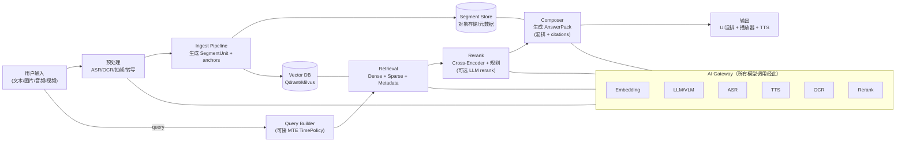

## Moduoduo MM-RAG｜调研・对比・选型终稿 v1.1（合并版）

> 目标：把大模多多的 RAG 升级为**企业级多模态证据引擎**，可处理 **文本 / 图片 / 音频 / 视频**，并以**图文视频混排 + 语音（ASR/TTS）**的方式回答用户问题。  
> 核心原则：系统不仅"能回答"，而是**可证明地回答**（证据链为一等公民，可审计、可复现、可私有化部署）。  
> 术语与协议（`SegmentUnit` / `AnswerPack` / 审计字段等）请参考：`moduoduo-mm-rag-engineering-selection-v1.0.md` 与 `moduoduo-mm-rag-prd-v1.0.md`。

---

## 0. 一句话定位（战略表达）

> 大多数 RAG 产品解决“能回答”。  
> Moduoduo 解决“**可证明地回答**”：每个关键结论都能落到 page/bbox/timecode 等证据锚点，并以混排方式呈现。

---

## 0. 一句话定位（战略表达）

> 大多数 RAG 产品解决"能回答"。  
> Moduoduo 解决"**可证明地回答**"：每个关键结论都能落到 page/bbox/timecode 等证据锚点，并以混排方式呈现。

---

## 1. 推演起点：我们到底在做什么（边界与非目标）

### 1.1 我们做的是：证据操作系统层（Evidence OS）

这是**知识证据基础设施**，必须具备：
- 片段级多模态检索（segment-level multimodal retrieval）
- 协议化证据输出（AnswerPack：混排 + citations）
- 可视化证据绑定（bbox/timecode 可点可跳）
- 可审计 / 可复现（trace + replay）
- 模型可插拔（所有模型调用经 AI Gateway）
- 私有化可部署（企业内网）

### 1.2 我们明确不做（暂时）

- 不把"重型一体化 RAG 平台产品（UI/工作流全家桶）"当核心（可在上层实现）
- 不把"云厂商 SaaS 知识库"当核心（可作为能力来源/对比对象）
- 不追求端到端"视频原始流直接喂模型就全懂"的幻想：企业落地里**视频必须片段化 + 可回放引用**

### 1.3 产业分层定位（你为什么不该只卷"引用"）

核心差异不在"有没有引用"，而在：
- 引用是否是**可执行锚点**（bbox/timecode 一键定位/播放）
- 引用是否能被**系统强约束**（no-evidence-no-claim）
- 输出是否是**协议**（任何 UI/一体机可消费），而非某个产品 UI 的展示功能

简化分层（用于对外叙事与内部定位）：

```text
L6 证据操作系统层（Evidence OS）  ★ Moduoduo 目标层
L5 多模态RAG引擎层（部分企业自研）
L4 RAG 工作流平台层（RAGFlow/Dify/FastGPT/Coze…）
L3 云厂商知识库层（百炼/千帆/火山…）
L2 向量数据库层（Milvus/Qdrant…）
L1 模型能力层（LLM/VLM/ASR/OCR/Embedding…）
```

---

## 2. 五条不变约束（否则必崩）

1) **证据锚点强约束**：关键结论必须引用 `SegmentUnit`；没有证据就明确"无结果/不确定"，禁止编造。  
2) **多模态统一结构化**：任何资料先转成 `SegmentUnit`，再谈检索/生成。  
3) **协议输出**：对外输出必须是 `AnswerPack`；渲染层只消费协议，不消费"自由文本"。  
4) **模型调用全经 AI Gateway**：embedding/llm/rerank/asr/tts/ocr 统一接入、成本与替换可控。  
5) **私有化优先工程形态**：向量库、索引、审计与证据存储可在内网跑；第三方 API 可作为可选加速器。

---

## 3. 两个协议，把系统钉死

### 3.1 `SegmentUnit`（统一所有模态的证据片段）

任何可被引用的东西，都必须是 `SegmentUnit`：
- **content**：文本 / 图像描述 / 音频转写片段 / 视频片段描述
- **anchors（可执行证据锚点）**：
  - 文档：`page + bbox`
  - 图片：`bbox + image_id`
  - 音频：`timecode + audio_id`
  - 视频：`timecode + video_id + (可选)keyframe_id`
- **metadata**：`source_id, tenant_id, permissions, language, t_event/t_publish/t_ingest/t_valid_* ...`

### 3.2 `AnswerPack`（混排输出协议）

对外输出必须结构化（渲染层无脑消费）：
- `text_blocks[]`：文本段落（可带引用标记）
- `image_cards[]`：图片卡片（bbox/来源/OCR 高亮）
- `video_cards[]`：视频卡片（timecode/封面帧/跳转播放）
- `audio_cards[]`：音频卡片（timecode/转写/可播放）
- `citations[]`：引用列表（指向 SegmentUnit）
- `voice`：TTS 策略（是否流式、分段、音色等）

---

## 4. 跨模态证据"一等公民"如何实现（可落地实现路径）

一句话：**先把多模态变成"可检索、可引用、可回放"的 SegmentUnit，再让检索/生成只消费 SegmentUnit，最后用 AnswerPack 把证据锚点变成可点击/可播放的 UI 行为。**

### 4.1 四步落地（A → D）

- **A）数据层：证据对象统一**
  - 任何证据都必须是 `SegmentUnit`，并且 anchors 可执行（page/bbox/timecode）。

- **B）入库层：多模态切片 + 上锚点**
  - 图片：OCR → `ocr_text + bbox`；图像 embedding → `image` SegmentUnit
  - 音频：ASR（带 timecode）→ 句/停顿切片 → `audio_segment` SegmentUnit
  - 视频：抽帧 + OCR + 音轨 ASR（带 timecode）→ 2–5 秒语义切片 → `video_segment` SegmentUnit
  - 文档：结构化解析 + OCR → `text/table/image` SegmentUnit（page/bbox）

- **C）检索层：多路召回，但统一回到 SegmentUnit**
  - query（文本）→ 文本向量 + BM25 + metadata → SegmentUnit 列表
  - query（图片）→ 图像向量 + OCR 文本召回 → SegmentUnit 列表
  - query（视频/音频）→ 主要靠转写文本召回 +（可选）帧向量召回 → SegmentUnit 列表
  - rerank 后的输出仍然只是一组"可引用证据片段"。

- **D）输出层：AnswerPack 让证据"可执行"**
  - `image_card`：点击 → 打开图片并高亮 bbox
  - `video_card`：点击 → 播放 video_id 并跳转 timecode
  - `audio_card`：点击 → 播放 audio_id 并跳转 timecode
  - `citations`：用于审计与复现（SegmentUnit + anchors + 元数据）。

---

## 5. 最小正确架构（MRA：Minimum Right Architecture）



---

## 6. 多模态 RAG 拆解 + 框架/平台调研

### 6.1 三件事（选型总纲）

1. **多模态 Ingest（入库切片 + anchors）**：文档 page/bbox、图片 bbox、音频 timecode、视频 timecode（必须片段化）
2. **检索与重排（可控可审计）**：Dense + BM25 + Metadata + Rerank（Cross-Encoder 默认，LLM rerank 可选）
3. **输出与呈现（协议化混排 + 语音）**：AnswerPack + citations + Moduoduo Voice（ASR/TTS）

### 6.2 多模态 Ingest 要点（各模态必须产出 anchors）

| 模态 | 要点 | 产出 |
|------|------|------|
| 文档 | 结构化解析 + OCR | `text/table/image` SegmentUnit（page/bbox） |
| 图片 | OCR + 视觉 embedding | `image` SegmentUnit（bbox） |
| 音频 | ASR（句级/词级 timecode） | `audio_segment` SegmentUnit（timecode） |
| 视频 | 抽帧 + OCR + 音轨 ASR + 2–5 秒语义切片 | `video_segment` SegmentUnit（timecode + keyframes） |

### 6.3 LlamaIndex vs LangChain

- **LlamaIndex**：更利于"内核化"（索引/检索/QueryEngine 抽象清晰）
- **LangChain**：更利于"编排化"（工具/工作流更强，但证据协议与可复现需要你补）

结论：**内核优先参考 LlamaIndex 的抽象方式**，编排对接你的 Agent-Flow。

### 6.4 平台型（RAGFlow / Dify / FastGPT / Coze）

平台优势是快，但通常把"引用"做成 UI 展示；你要的是：bbox/timecode **可执行锚点**、AnswerPack **协议输出**、审计/复现。结论：可做上层应用壳，不建议当 Evidence OS 核心依赖。

### 6.5 云厂商知识库（百炼/千帆/火山）定位

它们能加速 MVP，但常差一层：混排协议、证据锚点深度、可审计可复现链路。结论：可作为 Phase 1 加速器；核心护城河仍由你自研证据 OS 承担。

---

## 7. 与 Moduoduo Voice 的集成（ASR/TTS）

- **ASR**：输出带 timecode 的转写 → 直接用于入库与实时检索
- **TTS**：消费 `AnswerPack.voice`（建议流式），与 `text_blocks` 对齐分段，边播边渲染

---

## 8. 时间策略：与 MTE 的连接点

多模态场景更依赖时间（timecode / publish/ingest）。建议查询侧接入 `MTE TimePolicy`：
- `intent` → KB/Web/并行路由
- `freshnessDays` → metadata filter / recency downrank
- `guardrails` → 无结果不编造、时间基准约束

---

## 9. 推荐组合（不绑定厂商）

- **证据 OS 自研**：视频片段化（timecode）+ 证据锚点（page/bbox/timecode）+ AnswerPack + 审计复现
- **AI Gateway**：多供应商可插拔（embedding/LLM/VLM/ASR/TTS/OCR/rerank）
- **Ingest**：Docling + PaddleOCR + ffmpeg + ASR（经 Gateway）
- **Vector DB**：Qdrant（轻量）或 Milvus（更大规模）

---

## 10. 选型推导：三条路线（A/B/C）

> 决策原则：先把"证据 OS 的护城河"做出来，再决定模型是第三方还是本地化。

### A）推荐 MVP：第三方多模态 API + 你自研证据 OS

你自研：SegmentUnit/AnswerPack/审计、视频片段化与 anchors；第三方（经 Gateway）：多模态理解/生成（至少图文），ASR/TTS 可先用商业。

### B）推荐中期：混合（解析+索引本地化）+ 商业 API（关键环节）

本地化：解析/OCR/抽帧/向量库/部分 embedding；商业保留：高精生成或高精 rerank（按需开关）。

### C）全开源/私有化优先：全链路自建

适用：极严合规，接受更长周期与算力成本。

### 10.1 决策矩阵（建议用它拍板）

| 维度 | A：第三方 API + 证据 OS | B：混合本地化 + 商业关键环节 | C：全开源全链路 |
|---|---:|---:|---:|
| **MVP 速度（快）** | 5 | 3 | 1 |
| **初期工程成本（低）** | 4 | 2 | 1 |
| **效果上限（高）** | 5 | 4 | 3 |
| **私有化/内网可用（强）** | 2 | 4 | 5 |
| **合规可控（强）** | 2 | 4 | 5 |
| **长期单位成本（低）** | 2 | 4 | 4 |
| **运维复杂度（低）** | 4 | 3 | 1 |
| **供应商锁定风险（低）** | 2 | 4 | 5 |

### 10.2 默认推荐

- **默认走 A**：最快把"多模态证据链 + 混排 + 语音"跑通，形成可复现的工程骨架与数据资产。
- **当满足以下任意条件，转向 B**：成本压力明显；客户要求"内网可用/数据不出域"；已证明业务价值需做毛利与可控性。
- **当满足以下任意条件，走 C**：极严合规（数据/模型都不能出域）；愿意为"完全可控"支付更长周期与更高算力/运维成本。

---

## 11. Roadmap（把推演落成工程）

- **MVP（2–4 周）**：入库（文档/图片/音频/视频）→ SegmentUnit → 检索融合 → AnswerPack 混排 → ASR/TTS 串起来  
- **增强（4–8 周）**：视频切分更稳、rerank 更准、time-aware downrank、审计可复现（回放按钮可用）  
- **企业化（8–12 周）**：权限/多租户、离线降级、成本控制、指标与回归集、灰度与回滚

---

## 12. 需要你拍板的 6 个决策点（确定即可开工）

1) **部署优先级**：私有化优先？还是先用第三方 API 快速验证？  
2) **第一优先场景**：图片问答 / 视频回放问答 / 音频资料问答，哪一个先打穿？  
3) **证据强度**：是否要求"每段结论都必须 citations"？还是"关键结论必须"？  
4) **延迟预算**：端到端目标（500ms/1s/3s）？是否必须流式？  
5) **权限与合规**：多租户/分级权限/审计保留周期/脱敏要求？  
6) **成本上限**：单次请求/每月预算，用于决定 LLM rerank 与多模态 API 的使用策略。

---

# 市场调研（平台对比与选型参考）

## 一、全球 RAG 产品技术分层图（Moduoduo 位于最高层）

```
╔════════════════════════════════════════════════════════════════════╗
║                         L6  证据操作系统层                         ║
║        （Evidence Operating System / MultiModal Evidence OS）     ║
║                                                                    ║
║  ★ Moduoduo MM-RAG Engine                                         ║
║  • 多模态片段级检索（text/image/video）                            ║
║  • PDF bbox / Video timecode 证据定位                               ║
║  • 图文视频混排协议输出（AnswerPack）                               ║
║  • 可审计 trace/span/引用覆盖率                                     ║
║  • 模型可插拔（AI Gateway）                                         ║
║  • 可私有化部署                                                     ║
║                                                                    ║
║  ← 这是系统级能力，不只是知识库产品                                ║
╚════════════════════════════════════════════════════════════════════╝
                                ▲
                                │
╔════════════════════════════════════════════════════════════════════╗
║                         L5  多模态RAG引擎层                        ║
║  • 多路召回 + Rerank                                               ║
║  • 图像/视频 embedding                                             ║
║  • 结构化 chunk                                                    ║
║                                                                    ║
║  代表：部分企业自研引擎、研究型系统                                ║
║  特点：仍以"文本生成"为主，证据链弱                                ║
╚════════════════════════════════════════════════════════════════════╝
                                ▲
                                │
╔════════════════════════════════════════════════════════════════════╗
║                        L4  RAG 工作流平台层                        ║
║  • 知识库 + 检索 + LLM 拼接                                        ║
║  • 应用工作流编排                                                   ║
║                                                                    ║
║  代表：RAGFlow / Dify / FastGPT / Coze                             ║
║  特点：产品化强，协议输出弱，证据链弱                                ║
╚════════════════════════════════════════════════════════════════════╝
                                ▲
                                │
╔════════════════════════════════════════════════════════════════════╗
║                       L3  云厂商知识库层                            ║
║  • 阿里百炼 KB                                                     ║
║  • 百度千帆 KB                                                     ║
║  • 火山引擎 KB                                                     ║
║                                                                    ║
║  能力：向量检索 + 模型生成                                         ║
║  特点：平台化强，但证据协议与混排输出不强调                         ║
╚════════════════════════════════════════════════════════════════════╝
                                ▲
                                │
╔════════════════════════════════════════════════════════════════════╗
║                       L2  向量数据库层                              ║
║  • Milvus / Qdrant / Pinecone / VikingDB                           ║
║                                                                    ║
║  能力：高性能向量检索                                              ║
║  特点：只做向量，不理解证据                                         ║
╚════════════════════════════════════════════════════════════════════╝
                                ▲
                                │
╔════════════════════════════════════════════════════════════════════╗
║                       L1  模型能力层                                ║
║  • Embedding Models                                                ║
║  • LLM                                                             ║
║  • Vision LLM                                                      ║
║  • ASR / OCR                                                       ║
║                                                                    ║
║  特点：能力基础，但不解决系统级证据链                               ║
╚════════════════════════════════════════════════════════════════════╝
```

### 分层解读

**L1 — 模型层**：大模型/embedding/Vision 都只是"能力原料"。

**L2 — 向量数据库层**：高并发、大规模、稀疏+稠密，但不理解"证据"。

**L3 — 云厂商知识库层**：提供 RAG 能力与 UI，但输出以文本为主，没有证据协议层。

**L4 — 产品型 RAG 平台**：RAGFlow/Dify/FastGPT/Coze 易用、易搭应用，但停留在"应用层"。

**L5 — 多模态 RAG 引擎层**：部分企业自研多路召回/Rerank，但通常没有协议输出、可审计链路、UI 证据绑定。

**L6 — 证据操作系统层（最高层）**：片段级多模态检索、协议化证据输出、可视化证据绑定、可审计可复现、模型可插拔、私有化可部署——"知识证据基础设施"而非"知识库产品"。

### 为什么这是最高层？

模型升级 ≠ 自动变成证据系统；向量数据库升级 ≠ 自动支持混排输出；平台升级 ≠ 自动支持 timecode/bbox。模多多把"证据"作为一等公民。

### 一句话战略表达

> 大多数 RAG 产品解决"能回答"。模多多解决"可证明地回答"。

---

## 二、阿里百炼 vs 百度千帆：具体选型建议

### 关键结论：两家的“平台知识库”本质上更像 **文本 RAG + 多模态解析**

也就是说：

* **文档/网页**：切片→向量→检索→生成
* **图片**：更多是 OCR/图片理解后变成文本切片；少数场景支持真正的多模态向量
* **视频**：多数情况下是 **转写/解析成文本**（ASR、摘要、元信息），然后按文本向量检索；**不是“视频向量语义检索”那种**（那通常要专门的视频 embedding）

---

### 阿里百炼平台知识库（更适合你“短视频多”快跑）

### 你会直接受益的点

* **支持从 OSS 导入音视频文件并进行解析**（这点对你非常关键：不用先自己搭一套视频解析入库流水线）。([阿里云帮助中心][1])
* 知识库类型里就明确有 **“音视频搜索类知识库”**（更贴合你的素材形态）。([阿里云帮助中心][2])

### 但你要知道的限制

* 在百炼知识库规格说明里：

  * “音视频搜索类知识库”用的还是 **text-embedding** 模型（说明它的视频检索主路径仍偏“转文本后检索”）。([阿里云帮助中心][2])
  * 真正用 **multimodal embedding** 的，是“图片问答类知识库”，且目前只写到支持 `multimodal-embedding-v1`。([阿里云帮助中心][2])

**适配你当前阶段的判断**：

> 你短视频多，且要“先跑起来能用”，百炼“音视频导入+解析”这一步会帮你省掉最多工程量，所以我会把它放第一优先级。([阿里云帮助中心][1])

---

### 百度千帆 AppBuilder 知识库（更适合你“文档/网页知识库做精做强”）

### 你会直接受益的点

* 对“文档解析/切片策略/知识增强”的可调空间比较大：支持**版面分析**、以及“文档图片解析（OCR 或图片理解 VLM）/图表/表格深度/公式解析”等解析策略开关。([千帆大模型平台][3])
* 支持 **API/SDK** 对知识库及切片做增删改查（更方便你接入 Moduoduo 的编排/自动化）。([百度智能云][4])

### 你要注意的点（对你短视频场景）

* 目前我从公开文档/社区说明里看到的主要是**文本文档、URL、数据类文件**的知识库流程与格式限制（doc/docx/pdf/ppt/pptx/txt 等），并没有像百炼那样明确写“音视频从对象存储导入解析”的知识库导入能力。([千帆大模型平台][5])

**适配你当前阶段的判断**：

> 如果你现在素材主要是“制度/方案/投标书/说明书/网页知识”，千帆知识库很好用；但若你“短视频为主”，你大概率还要自己补一层“视频→转写/摘要→入库”的流水线。

---

### 选型建议

### 你当前诉求（短视频多 + 内地 + 快跑）

**优先：阿里百炼知识库**

* 直接用它的“音视频导入解析 + 文本向量检索”先把链路跑通，满足“能检索到相关视频并在回答里带视频引用/时间点”的第一版。([阿里云帮助中心][1])

### 什么时候选千帆

* 当你的主战场是**企业文档知识库**（大量 PDF/Word/网页），且你需要更细的解析/切片/增强策略时，千帆更顺手。([千帆大模型平台][3])

---

### 重要提醒：你想要“图文视频混排呈现”，平台知识库还差一个“返回协议”

不管选哪家，你最好在 Moduoduo 侧统一一个检索返回结构，比如：

* `answer_text`
* `assets[]`:

  * 图片：`{type:"image", url, caption, source_doc}`
  * 视频：`{type:"video", url, start_ms, end_ms, cover_url, source_doc}`

百炼/千帆负责“召回内容”，而“如何把它们变成可展示的卡片并混排”放在你自己的 Agent-Flow / 前端层，会更可控（也更利于后面做可专利化的“呈现协议+检索编排”）。

---

如果你愿意，我可以按你“短视频多”的特点，直接给一套**落地到 Agent-Flow 的多模态 RAG 版本 1 方案**：

* 用百炼知识库跑通音视频检索
* 片段化（短视频切 2–5 秒片段）是否需要你自己做、怎么做最省成本
* 返回 timecode 的检索结果如何在 UI 混排展示（含卡片规范）

[1]: https://help.aliyun.com/zh/model-studio/rag-knowledge-base?utm_source=chatgpt.com "知识库-大模型服务平台百炼(Model Studio)-阿里云帮助中心"
[2]: https://help.aliyun.com/zh/model-studio/rag-knowledge-base-specifications?utm_source=chatgpt.com "知识库配额与限制-大模型服务平台百炼(Model Studio)-阿里云帮助中心"
[3]: https://qianfan.cloud.baidu.com/qianfandev/topic/686632?utm_source=chatgpt.com "利用千帆AppBuilder创建知识库 - 百度智能云千帆社区"
[4]: https://cloud.baidu.com/news/productNews_4accd301-fabc-4c67-b79f-05e2932a3a8e?utm_source=chatgpt.com "百度智能云千帆AppBuilder升级！企业级RAG发布，组件广场开放！ | 百度智能云"
[5]: https://qianfan.cloud.baidu.com/qianfandev/topic/361340?utm_source=chatgpt.com "文件存储不限量！AppBuilder知识库创建功能升级 - 百度智能云千帆社区"


---

## 三、百炼平台知识库 vs 自建：架构级对比


你现在在对比的是：

A️⃣ **直接用阿里百炼平台知识库（全托管）**
B️⃣ **LlamaIndex + 百炼Embedding + 自己做视频分段 + 接入Agent-Flow（半自研架构）**

再加一个问题：

C️⃣ **火山引擎有没有知识库？值不值得？**

我给你做一次“架构级别”的对比，而不是功能级别对比。

---

### 方案 A：直接用阿里百炼平台知识库（托管型 RAG）

## 架构形态

```
数据上传 → 百炼知识库
          ↓
      百炼检索
          ↓
      百炼LLM生成
          ↓
      返回答案
```

你做的事情：

* 上传数据
* 调API问问题

---

## 优点

* 🚀 极快上线
* 不用写分段/embedding/检索逻辑
* 有控制台
* 运维成本低

---

## 局限（对你来说很重要）

### 1️⃣ 你无法控制视频“分段逻辑”

百炼会：

* 自动做ASR
* 自动做文本切片

但你不能精细控制：

* 2秒切一段？
* 按镜头切？
* 关键帧是否单独embedding？
* 视频级 + 片段级双索引？

这些都不可控。

而你是做“系统级智能”，不是做一个问答机器人。

---

### 2️⃣ 返回结构不可控

百炼知识库返回的是：

* 文本答案
* 可能带source

但不会返回：

```
{
 video_url,
 start_ms,
 end_ms,
 cover
}
```

你没法做“视频片段卡片化播放”的那种高级UI。

---

### 3️⃣ 你被平台锁死

以后如果：

* 客户要求私有化
* 客户不让用阿里
* 你要接火山
* 你要做国产替代

迁移成本极高。

---

### 方案 B：LlamaIndex + 百炼 Embedding + 自建 Segment

这条路线架构变成：

```
数据 → 你的视频分段服务
       ↓
  百炼embedding
       ↓
  向量库存储（可换）
       ↓
  LlamaIndex检索编排
       ↓
  LLM合成
       ↓
  结构化返回（图文视频混排）
```

---

## 核心差别

| 对比点                     | 百炼平台知识库 | 你自建多模态RAG |
| ----------------------- | ------- | --------- |
| 上线速度                    | 快       | 中等        |
| 视频分段控制                  | 无法控制    | 完全控制      |
| 是否支持片段timecode返回        | 基本不支持   | 完全支持      |
| 是否能做双层索引（video+segment） | 不行      | 可以        |
| 可换embedding供应商          | 不行      | 可以        |
| 可私有化                    | 基本不行    | 可以        |
| 是否适合做平台底座               | 不适合     | 非常适合      |

---

### 火山引擎有没有知识库？

有。

火山引擎：

* 豆包模型
* VikingDB 向量数据库
* 应用构建能力
* 也有“知识库能力”

但它的定位更偏：

> 应用层知识库 + 向量数据库一体化

它的特点是：

* 向量库能力很强
* embedding性能好
* API友好
* 但视频“片段级智能检索”仍然是文本化为主

本质上跟百炼平台知识库一样：

👉 适合做“企业问答应用”
👉 不适合做“系统级多模态引擎”

---

### 真正本质区别（给你一句话）

#### 百炼知识库是一个“产品”

#### 你自建多模态 RAG 是一个“能力”

而你现在做的是：

> Moduoduo 作为 AI Infra 平台

你需要的是：

> 能力可组合、可扩展、可专利化、可嵌入

而不是：

> 一个问答平台

---

### 结合你当前阶段的建议

你现在的优先级应该是：

第一阶段（2~4周）
👉 用百炼 embedding API + 自建segment
👉 跑通“视频片段可检索 + UI可播放”

而不是：

👉 直接用百炼知识库托管

因为那样你会失去未来演进空间。

---

### 战略层面建议

从“模多多系统级智能”的角度：

你真正应该做的是：

```
Moduoduo-Multimodal-Retrieval Engine
```

这是你未来可以写专利的：

* 视频双层索引机制
* 多模态召回融合策略
* 片段级可视化返回协议
* Agent调用级RAG能力

而不是：

> 调一个知识库API

---

---

## 四、多模态 RAG 平台对比表（阿里百炼 vs 百度千帆 vs 火山引擎）


## 📊 多模态 RAG 平台对比表（阿里百炼 vs 百度千帆 vs 火山引擎）

| 对比维度                          | 阿里云百炼知识库             | 百度千帆知识库           | 火山引擎知识库             |
| ----------------------------- | -------------------- | ----------------- | ------------------- |
| **定位**                        | AI 模型集成的知识库 + 向量 RAG | 流程化、业务级知识库 + 自动更新 | 强向量库 + RAG 工作流引擎    |
| **是否支持 RAG**                  | ✔                    | ✔                 | ✔                   |
| **文本导入**                      | ✔（支持 PDF/Word 等）     | ✔                 | ✔                   |
| **图片导入 / OCR**                | ✔（基础视觉理解）            | ✔（版面 OCR + 图表解析）  | ✔（基础 OCR）           |
| **音视频导入**                     | ✔（视频转写 + embedding）  | ✔（视频/音频）          | ✔（视频 ASR + 切片）      |
| **网页 URL 导入**                 | ❌                    | ✔（支持自动更新频率）       | ❌（需自建）              |
| **定时自动更新**                    | ❌                    | ✔（天级/周期可配置）       | ❌（需自建）              |
| **文档结构深度解析**                  | 中（文本切片优先）            | ✔（版面 + 图表 + 表格）   | 中（基础切片/向量化）         |
| **多模态融合检索**                   | ✔（图 / 文）             | ✔（图 / 文 / 多模态增强）  | ✔（图 / 文 / 视频切片）     |
| **多路召回策略（Dense+Sparse）**      | 基础                   | 强                 | 支持稀疏+稠密混合           |
| **Rerank / 排序能力**             | ✔                    | ✔（增强策略）           | ✔                   |
| **生成回答（与大模型融合）**              | ✔（与通义/Qwen 系列）       | ✔（与大模型集成）         | ✔（与 Doubao 系列/模型服务） |
| **证据链卡片化输出**                  | ❌ 原生（需上层处理）          | ❌ 原生（需上层处理）       | ❌ 原生（需上层处理）         |
| **结构化证据（页码/bbox/timecode）支持** | ❌                    | ❌                 | ❌                   |
| **SDK / API 友好度**             | ✔ 丰富                 | ✔ 丰富              | ✔ 丰富                |
| **计费/凭证/审计**                  | ✔ 平台级                | ✔ 平台级             | ✔ 平台级               |
| **私有化部署可能性**                  | ✔（支持）                | ✔（支持）             | ✔（支持）               |
| **最佳适用场景**                    | 通用 RAG → 快集成         | 企业级知识库 + 自动网站更新   | 高并发/大规模向量检索 + 多媒体   |
| **学习成本 / 上手门槛**               | 中                    | 低                 | 中                   |
| **工程可控性（自定义深度）**              | 中                    | 中                 | 高                   |
| **整体综合能力（Score）**             | ⭐⭐⭐                  | ⭐⭐⭐⭐              | ⭐⭐⭐⭐                |

---

## 📌 一级能力对比分析

### 🧠 1. **数据源导入与自动更新能力**

* 🔹 **百度千帆**：

  * **最完善**：支持 **网页 URL 导入 + 自动定期更新**
  * 已包含网页解析（正文/表图/标题）
  * 自动 sync 是非常工程级、易用级能力

* 🟡 **阿里百炼**：

  * 支持文件/OSS/对象，但网页 URL 不原生
  * 需要你外部先抓取再导入

* 🟡 **火山引擎**：

  * 支持音视频/文档导入
  * 不支持网页自动抓取
  * 需你自己写 scheduler

---

### 👁️‍🗨️ 2. **多模态语义解析能力**

* ⭐ **千帆**：

  * 内置版面解析、图表识别、OCR + 图表连接
  * 图文章节级理解效果更准确
  * 易做”图表+段落“证据组合

* ⭐ **火山引擎**：

  * 强检索基础能力
  * 支持视频片段化（ASR + 切片）
  * 但版面结构化不如千帆细粒度

* ⭐ **百炼**：

  * 多模态 embedding 管理（有图像/视频 embedding）
  * 视觉 QA 类型支持
  * 版面/结构不是它重点

---

### 🔎 3. **检索 + 生成能力强度**

| 功能层             | 阿里百炼 | 百度千帆 | 火山引擎 |
| --------------- | ---- | ---- | ---- |
| Sparse 检索       | 基础   | 强    | ✔    |
| Dense 向量检索      | ✔    | ✔    | ✔    |
| Sparse+Dense 混合 | ○    | ✔    | ✔    |
| Rerank          | ✔    | ✔    | ✔    |
| Query Expansion | ○    | ✔    | ✔    |
| 多知识库并联          | ○    | ✔    | ✔    |
| 生成增强（智能合成）      | ✔    | ✔    | ✔    |

👉 解释

* 千帆在检索增强层更全面：能自动扩展 query、三元组增强、权重组合等。
* 火山引擎在“底座 + 检索引擎性能”上更强。

---

### 📈 4. **动态知识更新 & 定时任务能力**

| 功能          | 阿里百炼 | 百度千帆        | 火山引擎   |
| ----------- | ---- | ----------- | ------ |
| 网页 URL 定时抓取 | ❌    | ✔（每天/多周期可选） | ❌（无原生） |
| 新资料自动索引     | 手动   | 自动          | 需自写    |
| 增量更新        | 外部实现 | 内置          | 外部实现   |

👉 **千帆是唯一一个内置“周期自动更新机制”的平台**

---

### 🧱 5. **工程可控性对比**

| 项目                      | 阿里百炼 | 百度千帆 | 火山引擎 |
| ----------------------- | ---- | ---- | ---- |
| 可配置切分策略                 | ○    | ✔    | ✔    |
| 可自定义 embedding provider | ○    | ✔    | ✔    |
| 可自定义召回融合                | ○    | ✔    | ✔    |
| 可输出结构化证据协议              | ✘    | ✘    | ✘    |
| 最终要自己实现                 | 是    | 是    | 是    |

说明
三家都不原生输出**结构化的证据链协议**（segment + timecode + pdf bbox + video snippet），这还是需要你自己做。

---

## 📍 对你 1.0 / 2.0 的建议

### 🟡 第一阶段（快速上线版本）

如果你要**最少工程量做动态知识库**：

* **百度千帆**：借力其网页自动更新 + 文档解析
* 用其 API 做基础检索回答

这能让你在短时间有“可动态增量知识库 + RAG 问答”。

---

### 🟡 第二阶段（可控引擎 + 升级版）

如果你要做：

* **片段级证据链**
* **可审计链路**
* **结构化证据协议**
* **行业落地规则增强**

不建议只依赖平台。

方案：

```
爬取/定时更新（可借鉴千帆设计）
↓
入库到你自己的 MM-RAG 引擎
↓
SegmentUnit 结构化 + 多路召回 + Rerank + AnswerPack 输出
↓
Audit 上报
↓
前端混排渲染
```

---

## 🧠 三家最核心优势总结

| 平台   | 核心优势         | 核心局限            |
| ---- | ------------ | --------------- |
| 阿里百炼 | 与大模型集成度高     | 缺少网页自动更新/深度结构   |
| 百度千帆 | 自动网页抓取 + 强解析 | 结构化证据输出需自实现     |
| 火山引擎 | 向量检索性能强      | 缺少自动更新 + 深度文档结构 |

---

## 🏁 结论（直截了当地）

### ⭐ 最易做动态更新知识库：

👉 **百度千帆**

### ⭐ 最易做高性能基础 RAG 引擎：

👉 **火山引擎**

### ⭐ 最紧密结合大模型检索+生成：

👉 **阿里百炼**


---

## 五、多模态知识库平台对比表（含模多多多模态RAG）


---

## 📊 多模态知识库平台对比表（含 “模多多多模态RAG”）

| 对比维度              | 阿里云百炼知识库              | 百度千帆知识库            | 火山引擎知识库             | **模多多多模态RAG（你要做的）**                         |
| ----------------- | --------------------- | ------------------ | ------------------- | ------------------------------------------- |
| **定位**            | AI 模型集成知识库            | 应用级 KB + 自动更新      | 向量 RAG 引擎底座         | **通用多模态引擎 + 业务协议 + 可审计能力**                  |
| **是否支持 RAG**      | ✔                     | ✔                  | ✔                   | ✔                                           |
| **文本导入**          | ✔                     | ✔                  | ✔                   | ✔                                           |
| **图片导入 / OCR**    | ✔（基础）                 | ✔（强）               | ✔（基础）               | ✔（定制强 OCR + caption)                        |
| **音视频导入**         | ✔（视频 ASR / embedding） | ✔                  | ✔（视频 ASR + segment） | ✔（细粒度 2–5s + 可控 ASR + 核心截图）                 |
| **网页 URL 导入**     | ❌                     | ✔（自动周期采集）          | ❌                   | ✔（自建 crawler + 自动 diff 更新）                  |
| **定时自动更新**        | ❌                     | ✔（内置）              | ❌                   | ✔（内置任务管理 + diff/upsert）                     |
| **文档结构深度解析**      | 中                     | ✔（版面 + OCR + 图表解析） | 中                   | ✔（Docling + 图文绑定 + 表格结构）                    |
| **多模态融合检索**       | ✔                     | ✔                  | ✔                   | ✔（强融合策略）                                    |
| **多路召回策略**        | 基础                    | 强                  | 支持稀密+稀疏             | ✔（稠密 + 稀疏 + metadata + tag + business cues） |
| **Rerank / 排序能力** | ✔                     | ✔（增强策略）            | ✔                   | ✔（LLM rerank + cross-encoder）               |
| **生成回答集成**        | ✔                     | ✔                  | ✔                   | ✔（LLM AnswerPack + 证据约束）                    |
| **证据链卡片化输出**      | ❌                     | ❌                  | ❌                   | ✔（AnswerPack protocol 结构化输出）                |
| **结构化证据支持**       | ❌                     | ❌                  | ❌                   | ✔（PDF bbox + video timecode + image anchor） |
| **审计/Trace/Cost** | 平台级                   | 平台级                | 平台级                 | ✔（Audit SDK + Collector + trace/span 可复现）   |
| **可自定义切分策略**      | 中                     | 中                  | ✔                   | ✔（可插拔分段策略 + ASR/句子/semantic 切分）             |
| **可控召回融合权重**      | ✘                     | 部分                 | 部分                  | ✔（可业务/规则/learned 权重融合）                      |
| **多库并联检索**        | ✘/有限                  | ✔                  | ✔                   | ✔（跨域/跨项目/跨租户检索融合）                           |
| **前端混排协议**        | ❌                     | ❌                  | ❌                   | ✔（cards + blocks + citations）               |
| **模型可插拔性**        | 部分                    | 部分                 | 部分                  | ✔（embedding + LLM + reranker 可无缝替换）         |
| **私有化部署**         | ✔                     | ✔                  | ✔                   | ✔（平台级可控）                                    |
| **工程可扩展性**        | 中                     | 高                  | 高                   | ⭐⭐⭐⭐⭐（自定义强，可定制化最高）                          |
| **业务能力内嵌深度**      | 中                     | 高（低码/业务联动强）        | 中                   | ⭐⭐⭐⭐⭐（内嵌业务 triggers/handlers/agents）        |

---

## 🧠 各列说明与解读

### ✅ 阿里云百炼知识库

优点：

* 与阿里模型生态（Qwen/通义）集成紧密
* 支持多模态 embedding（视频/图片）
* RAG + 生成链路一体

限制：

* **不支持网页自动更新**
* **不输出证据结构化协议**
* 结构化图表理解不细粒

对你：适合“快速接入基础RAG”，不适合“强证据链 + 业务联动”。

---

### ✅ 百度千帆知识库

优点：

* **网页 URL 导入 + 自动更新机制**
* 强版面/图表/图像 OCR 解析
* 多模态与规则增强

限制：

* 证据卡片化与结构化协议需自实现
* 视频片段级 timecode 定位也需补足

对你：**数据源丰富 + 自动更新好用**，是数据入库层理想候选。

---

### ✅ 火山引擎知识库

优点：

* **向量库性能强**（VikingDB）
* 支持稠密+稀疏混合检索
* 良好的扩展性与大数据向量规模支撑

限制：

* 不支持网页自动更新
* 文档结构/图表解析偏基础
* 不输出结构化证据协议

对你：擅长做“**高并发大规模检索底座**”。

---

### ✅ 模多多多模态RAG（你要做的系统）

这是一个 **自定义引擎级能力**，不是某个产品：

| 核心目标               | 是否支持 |
| ------------------ | ---- |
| 片段级视频检索 + timecode | ✔    |
| PDF/Word 图文混排结构化   | ✔    |
| OCR + Caption 协同   | ✔    |
| 多路召回融合             | ✔    |
| 高精度 Rerank         | ✔    |
| AnswerPack 协议化输出   | ✔    |
| 可审计 跟踪 / Trace     | ✔    |
| 自动增量更新             | ✔    |
| 多知识库并联             | ✔    |
| 前端混排协议             | ✔    |
| 可插拔模型与引擎           | ✔    |

这是最“引擎级 + 可定制化 + 可业务嵌入”的版本，**相比三大平台，功能覆盖最广、可控性最高**。

---

## 📌 你做 vs 三个平台的差异总结

### 🎯 数据源可用性

* **千帆 > 百炼/火山**（支持自动网页更新）
* 但你可以把“网页自动更新”做成微服务组件直接接入任何底座

### 🎯 多模态检测/嵌入能力

* 各家都支持图像/视频/文本 embedding
* 但平台输出大多 **文本+向量**，没有证据协议化能力

### 🎯 结构化输入理解

* **千帆** 在版面/图表/表格层面最细
* 百炼/火山 在视频/图像层面更靠近模型 embedding

### 🎯 可审计 & 协议化输出

* 三家都**不原生**支持你想要的证据卡片协议 → 必须由你在微服务上做

### 🎯 可定制程度

* **火山引擎** 向量层最强
* **千帆** 数据源/解析最灵活
* **百炼** 与大模型集成最便捷
* **模多多RAG** 则在**协议 + 可审计 + 可业务内嵌 + 证据链**上领先

---

## 🧠 推荐你下一步的组合战略

如果按需求优先级排序：

### ⭐ 第一层（数据采集）

* 用 **千帆的 URL 抓取 + 自动更新** 作为“资料动态入库模块”

### ⭐ 第二层（向量存储 + 检索能力）

* 做一次对比验证：**火山引擎 VikingDB** + **Milvus / Qdrant**
  → 求性能与成本最优组合

### ⭐ 第三层（语义理解 + 多模态 embedding）

* 优先使用 **阿里百炼 / 火山 Doubao / 千帆模型** 作为 embedding provider（按能力/成本/延迟比选）

### ⭐ 核心层（你要做的引擎）

* **检索融合 + Rerank + AnswerPack + 审计 + 前端协议输出**

这样能把三家的优势组合起来，同时补齐他们的短板。

---

如果你想，我还可以把上面这张表“量化评分成 1–5 分卡”，并给出各平台在你目标系统 1.0 / 2.0 / 3.0 阶段的**选择优先级建议表**（一步到位到市场可用路线）。你需要这样的等级评分表吗？

---

## 六、模多多多模态 RAG 方案整合（v3 最终版）


---

## 七、能力对比总表（模多多 vs 云厂商 vs RAG 产品型平台）


### 能力对比总表（完整版）

> ✔ = 强支持
> ~ = 部分支持 / 需二开
> ✘ = 基本不支持

| 能力维度               | 模多多RAG | 阿里百炼 | 百度千帆 | 火山引擎 | RAGFlow | Dify | FastGPT | Coze |
| ------------------ | ------ | ---- | ---- | ---- | ------- | ---- | ------- | ---- |
| 基础文本RAG            | ✔      | ✔    | ✔    | ✔    | ✔       | ✔    | ✔       | ✔    |
| 多模态检索（图）           | ✔      | ✔    | ✔    | ✔    | ~       | ✔    | ~       | ✔    |
| 视频检索               | ✔（片段级） | ~    | ~    | ~    | ✘       | ✘    | ✘       | ~    |
| 视频 timecode 返回     | ✔      | ✘    | ✘    | ✘    | ✘       | ✘    | ✘       | ✘    |
| PDF bbox 定位        | ✔      | ✘    | ✘    | ✘    | ✘       | ✘    | ✘       | ✘    |
| 图文混排输出             | ✔      | ✘    | ✘    | ✘    | ✘       | ✘    | ✘       | ✘    |
| 图文视频混排输出           | ✔      | ✘    | ✘    | ✘    | ✘       | ✘    | ✘       | ✘    |
| Answer 协议化输出       | ✔      | ✘    | ✘    | ✘    | ✘       | ✘    | ✘       | ✘    |
| URL 自动更新           | ✔      | ✘    | ✔    | ✘    | ✘       | ✘    | ✘       | ✘    |
| 增量更新               | ✔      | ✘    | ✔    | ✘    | ✘       | ✘    | ✘       | ✘    |
| 多路召回（Dense+Sparse） | ✔      | ~    | ✔    | ✔    | ~       | ~    | ~       | ~    |
| Rerank             | ✔      | ~    | ✔    | ✔    | ~       | ~    | ~       | ~    |
| 审计 trace/span      | ✔      | ✔    | ✔    | ✔    | ✘       | ✘    | ✘       | ✘    |
| 多租户治理              | ✔      | ✔    | ✔    | ✔    | ~       | ~    | ~       | ~    |
| 模型可插拔              | ✔      | ~    | ~    | ~    | ~       | ~    | ~       | ✘    |
| UI内置               | ✘（引擎）  | ✔    | ✔    | ✔    | ✔       | ✔    | ✔       | ✔    |
| 工程可控性              | ⭐⭐⭐⭐⭐  | ⭐⭐   | ⭐⭐   | ⭐⭐⭐  | ⭐       | ⭐    | ⭐       | ⭐    |

---

### 产品定位差异（非常关键）

## 1️⃣ RAGFlow

定位：

> 文档知识库平台（产品型）

优点：

* 文档处理流程完善
* UI 可直接用
* 适合做企业知识库

问题：

* 重
* 二开难
* 不适合做“引擎级协议输出”
* 不强调视频
* 没有 bbox / timecode 概念

👉 更适合“产品交付”，不适合“底层引擎重构”。

---

## 2️⃣ Dify

定位：

> 应用开发平台 + 工作流 + 知识库

优点：

* 多模态检索增强
* 生态成熟
* 易做应用

问题：

* 证据链不可控
* 输出基本是文本
* 没有结构化混排协议
* 审计能力弱

👉 更像“应用层”，不是“检索引擎层”。

---

## 3️⃣ FastGPT

定位：

> 企业知识库 + 私有化部署

优点：

* 简单好用
* 部署容易
* 文本知识库成熟

问题：

* 多模态弱
* 无视频片段支持
* 无结构化证据链
* 输出文本为主

👉 更适合企业 FAQ。

---

## 4️⃣ Coze（字节）

定位：

> Bot 应用构建平台

优点：

* 多模态模型能力强
* 生态丰富
* 易做应用

问题：

* 知识库不是核心
* 无协议输出
* 无可审计检索链
* 视频片段不可控

👉 更偏“应用搭建”，不是底层 RAG 引擎。

---

### 真正的本质区别

| 维度   | 产品型RAG   | 模多多RAG             |
| ---- | -------- | ------------------ |
| 目标   | 快速做知识库应用 | 构建可嵌入多端的检索引擎       |
| 输出   | 文本为主     | 协议化混排 blocks       |
| 视频   | 当文本处理    | 片段级 timecode 证据    |
| PDF  | 当文本块     | page + bbox 定位     |
| 图文   | 分离       | 绑定成证据包             |
| 审计   | 基本无      | trace + span + 覆盖率 |
| 可复现  | 无        | 可复现输入              |
| 可视证据 | 弱        | 强                  |

---

### 你真正做的是哪一层？

RAG 技术栈分三层：

```
L3 应用层（UI/对话平台）
L2 检索与融合层（RAG引擎）
L1 数据解析层（Parser/OCR/ASR）
```

RAGFlow / Dify / FastGPT / Coze
→ 主要在 L3 + 部分 L2

三大云厂商
→ L2 + L1 + 平台能力

模多多
→ 专注 L2（引擎）+ 协议输出 + 审计

---

### 工程选型表（加上 RAG 产品类）

| 维度         | RAGFlow   | Dify     | FastGPT | Coze  | 模多多 |
| ---------- | --------- | -------- | ------- | ----- | --- |
| 是否建议 fork  | ❌ 不建议（太重） | ❌        | ❌       | ❌     | N/A |
| 可作为组件      | 文档处理      | workflow | 简易UI    | Bot接口 | N/A |
| 可作为引擎底座    | ❌         | ❌        | ❌       | ❌     | ✔   |
| 视频支持扩展难度   | 高         | 高        | 高       | 高     | 可控  |
| 二开维护成本     | 高         | 中        | 中       | 高     | 可控  |
| 是否适合你做协议输出 | ❌         | ❌        | ❌       | ❌     | ✔   |

---

### 战略判断

你如果用：

* RAGFlow → 你会被产品结构限制
* Dify → 你会被应用层限制
* FastGPT → 你会被文本模型限制
* Coze → 你会被 Bot 生态限制

而你想做的是：

> “模多多多模态证据检索引擎”

这是一个不同层级。

---

### 最终判断（非常直白）

如果你不做：

* timecode
* bbox
* 图文绑定
* AnswerPack 协议
* 审计

那你和他们没有本质区别。

如果你做了这些：

> 你是在做“可嵌入的多模态证据引擎”，不是在做知识库。
