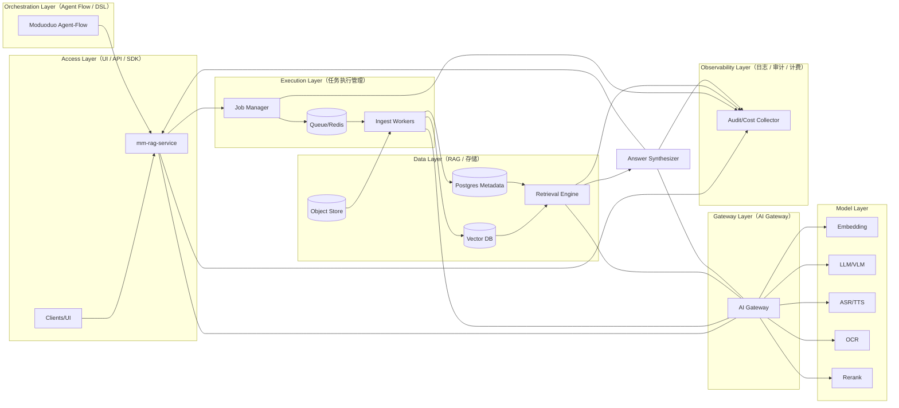

# Moduoduo MM-RAG 工程选型说明书

## Engineering Selection & Technical Decision Document v1.0

------------------------------------------------------------------------

# 1. 文档目标

本文件用于明确 Moduoduo MultiModal Evidence
Engine（MM-RAG）在工程实现层面的技术选型决策，涵盖：

-   多模态解析层
-   Segment 数据结构层
-   向量数据库选型
-   检索与融合策略
-   Rerank 模型策略
-   生成与约束机制
-   协议输出设计
-   AI Gateway 集成
-   审计体系
-   私有化部署策略

本文件基于此前全部架构讨论整理。

------------------------------------------------------------------------

## 附录（工程交付物）

-   DB Schema（Postgres）：`appendix/mm-rag-db-schema-v1.0.md`
-   OpenAPI 3.0：`appendix/mm-rag-openapi-v1.0.yaml`

# 2. 总体架构原则

1.  模型可插拔（通过 AI Gateway）
2.  引擎独立于 UI
3.  证据链为一等公民
4.  私有化部署优先
5.  多模态统一结构化
6.  可审计与可复现

------------------------------------------------------------------------

## 2.1 Minimum Right Architecture（MRA：最小正确架构）

MM-RAG 不追求“平台全家桶”，而追求“**引擎内核能力**”稳定可复用：先把证据片段（`SegmentUnit`）与混排输出（`AnswerPack`）钉死，再让检索/生成/渲染都只消费协议。

（如果你的 Markdown 预览不支持 Mermaid，可直接看这个 SVG 图）：


SVG 版本（如需无损放大）：`appendix/assets/mm-rag-mra.svg`

ASCII（工程组件与依赖方向）：

```text
[Client/UI/AgentFlow] -> [mm-rag-service (OpenAPI)]
                          |-> [Ingest Job Manager] -> [Queue] -> [Workers]
                          |-> [Vector DB] + [BM25/Hybrid]
                          |-> [Metadata DB (Postgres)]
                          |-> [Object Store (OSS/MinIO)]
                          |-> [Audit/Cost Collector]
                          \-> [AI Gateway] -> [LLM/VLM/ASR/OCR/Embedding/Rerank Providers]
```

Mermaid（分层结构，便于对齐平台 Infra）：



## 2.2 内核化 vs 编排化（框架取舍）

工程结论（与 `RAG碎片.md` 推演一致）：

-   **内核优先参考 LlamaIndex 的抽象**（索引/检索/QueryEngine 更利于“内核化”）
-   **编排对接你自己的 Agent-Flow/DSL**（而不是把 LangChain/RAGFlow 当内核）

不建议整套引入重型平台（例如 RAGFlow）作为 MM-RAG 引擎内核：二开维护与耦合成本高，且“协议化混排输出 + 可复现”通常不是其一等公民。

## 2.3 可插拔点（Adapters / Ports）

为了保持模块可替换与环境可迁移，建议显式划分适配器边界：

-   **Parser Adapter**：Docling/PaddleOCR/视频解析器（ffmpeg + ASR）可替换
-   **Model Adapter**：统一经 AI Gateway（embedding/LLM/VLM/ASR/OCR/rerank）
-   **VectorStore Adapter**：Milvus/Qdrant/VikingDB 可替换
-   **MetadataStore Adapter**：Postgres（默认）可替换
-   **ObjectStore Adapter**：OSS/MinIO（默认）可替换
-   **Audit Adapter**：Audit SDK + Collector（平台统一）可替换

## 2.4 服务形态与接口风格

推荐落地为“**独立 MM-RAG 微服务**”，对外提供稳定 OpenAPI（供 UI/Agent-Flow 调用），内部通过异步任务管线完成解析入库。

-   **HTTP API**：OpenAPI 3.0（便于 SDK/网关/审计接入）
-   **异步入库**：Job + Worker（避免大 PDF/视频阻塞）
-   **技术栈建议（MVP）**：Python + FastAPI（API）+ Celery/RQ（Worker）+ Redis（队列/缓存）+ Postgres（元数据与状态机）

# 3. 多模态解析层选型

## 3.1 文档解析（PDF / Word）

### 推荐方案

-   Docling 作为结构化解析核心

### 原因

-   支持版面结构提取
-   表格识别能力较强
-   可获取页码与结构层级
-   可扩展 bbox 提取

### 不选择原因

-   纯 PDF 文本提取库（如简单 PDF 解析）无法支持图文绑定

------------------------------------------------------------------------

## 3.2 OCR 选型

### 推荐方案

-   PaddleOCR（本地部署）

### 原因

-   国内可用
-   License 风险低
-   支持 bbox 输出
-   可用于图片与视频关键帧

------------------------------------------------------------------------

## 3.3 视频解析

### 推荐方案

-   商业 ASR（经 AI Gateway）
-   语义级切分（2\~5 秒）
-   关键帧抽取 + OCR

### 原因

-   timecode 是证据链核心
-   视频必须片段化处理

------------------------------------------------------------------------

## 3.4 视频入库成本控制（v1 策略）

短视频场景如果“全量多模态 embedding”会迅速成本爆炸，v1 推荐：

-   **只对 `text_repr` 做 embedding**：ASR +（可选）摘要/caption 融合为片段文本表征
-   片段大小 **2~5 秒**，但必须有“静默合并/短句合并”规则避免碎片爆炸
-   入库限流：按 `tenant/project` 做并发限制 + 配额（分钟数/天）

# 4. Segment 层设计

## 4.1 SegmentUnit 统一结构

必须统一：

-   text
-   image
-   table
-   video_segment

### 原则

-   所有数据必须转换为 SegmentUnit
-   每个 segment 必须包含 evidence anchor（page/bbox/timecode）

------------------------------------------------------------------------

## 4.2 SegmentUnit 建议字段（工程落地）

目标：任何可被引用的东西，都必须是 `SegmentUnit`，并且 anchors 是“可执行锚点”（bbox/timecode 一键定位/播放）。

```json
{
  "segment_id": "seg_xxx",
  "asset_id": "ast_xxx",
  "type": "text | image | table | video_segment",
  "text_repr": "段落/OCR/ASR/Caption/摘要 的统一检索表征",
  "anchors": {
    "doc": { "page": 1, "bbox": [0.1, 0.2, 0.8, 0.3] },
    "image": { "image_id": "img_xxx", "bbox": [0.1, 0.2, 0.8, 0.3] },
    "audio": { "audio_id": "aud_xxx", "timecode_ms": [12000, 20000] },
    "video": { "video_id": "vid_xxx", "timecode_ms": [12000, 20000], "keyframe_id": "kf_xxx" }
  },
  "links": {
    "prev_text_segment_id": "",
    "next_text_segment_id": "",
    "nearby_segment_ids": []
  },
  "metadata": {
    "source_id": "src_xxx",
    "tenant_id": "t1",
    "project_id": "p1",
    "permissions": ["doc:read"],
    "language": "zh",
    "t_publish": "2026-01-01T00:00:00Z",
    "t_ingest": "2026-01-02T00:00:00Z",
    "t_event": "2026-01-01T00:00:00Z"
  },
  "is_active": true
}
```

## 4.3 版本、幂等与软删除（避免重复/脏库）

-   **asset_hash + asset_version**：上传文件计算 `sha256/etag` 写入 `asset_hash`；hash 不变则不重复跑解析/embedding；hash 变化则 `asset_version += 1`
-   **segment 的稳定 ID**：推荐 `segment_id = hash(asset_id + anchor + content_hash)`，保证 upsert 可控
-   **软删除与回滚**：替换/删除资料时元数据标记 `is_active=false`；检索默认过滤 `is_active=true`

## 4.4 图文混排绑定（links）

工程上必须保存“图/表/关键帧”与“解释段落”的邻近关系（`nearby_segment_ids` 等），否则 AnswerPack 很难稳定输出“图文混排证据包”。

## 4.5 入库任务管线（异步 Job）

入库建议采用任务状态机：

`PENDING → PARSING → EMBEDDING → INDEXING → DONE / FAILED`

最小接口（v1 足够用，便于前端“一键更新”）：

-   `POST /v1/uploads/presign`：获取预签名直传地址（大文件视频必须直传）
-   `POST /v1/ingest`：触发入库（支持 `mode=upsert` 与解析 options）
-   `GET /v1/ingest/{job_id}`：查询进度/失败原因/segment 产出数
-   `GET /v1/ingest/{job_id}/events`（可选）：SSE 事件流
-   `POST /mmrag/search`：返回 Segment hits（含 anchors/metadata）
-   `POST /mmrag/answer`：返回 AnswerPack（混排卡片可直接渲染）

# 5. 向量数据库选型

## 5.1 可选方案

  数据库     优点             缺点
  ---------- ---------------- ----------------------
  Milvus     成熟、可扩展     运维复杂
  Qdrant     轻量、易部署     规模较大时性能需验证
  VikingDB   高性能、托管型   与云厂商绑定较强

## 5.2 推荐策略

-   私有化优先：Qdrant 或 Milvus
-   高并发 SaaS：VikingDB

------------------------------------------------------------------------

# 6. 检索策略选型

## 6.1 必须支持

-   Dense Retrieval
-   Sparse Retrieval（BM25）
-   Metadata 过滤
-   时间范围过滤（视频）

## 6.2 融合策略

推荐：

-   RRF（Reciprocal Rank Fusion）
-   TopK 合并 + 去重

------------------------------------------------------------------------

## 6.3 Multi-Recall（多路召回）的默认组合

默认稳态组合（可审计、可回归）：

-   **Dense**：向量召回（文本/视觉/多模态 embedding，按需开关）
-   **Sparse**：BM25（关键词兜底与强约束）
-   **Metadata Filter**：`tenant/project/permissions/source/time-window`
-   **融合**：RRF 或 TopK merge + 去重；视频命中建议做“相邻片段合并”（连续 timecode 合并）

# 7. Rerank 策略

## 推荐

-   Cross-Encoder 作为第一阶段
-   LLM rerank 作为高精度模式

## 原因

-   仅 Dense 检索 recall 不稳定
-   Rerank 可提升 precision

------------------------------------------------------------------------

# 8. 生成策略

## 原则

-   禁止无证据生成
-   强制引用覆盖率
-   引用必须来自 SegmentUnit

------------------------------------------------------------------------

# 9. AnswerPack 协议选型

## 目标

输出必须为结构化协议，而非纯文本。

支持：

-   text blocks
-   image_card（含 bbox）
-   video_card（含 timecode）
-   citations

------------------------------------------------------------------------

## 9.1 AnswerPack 关键点（面向渲染层的稳定协议）

AnswerPack 的目标是“渲染层无脑消费”，因此建议最少包含：

-   `blocks[]`：markdown/quote 等文本块
-   `image_cards[]`：带 bbox 高亮信息
-   `video_cards[]`：带 timecode，可直接 seek 播放片段
-   `audio_cards[]`：带 timecode，可直接播放片段
-   `citations[]`：指向 SegmentUnit（用于审计与复现）
-   `voice`：TTS 策略（是否流式、分段、音色等）

# 10. AI Gateway 集成策略

## 所有模型调用必须通过 Gateway

包括：

-   Embedding
-   LLM
-   Rerank
-   ASR
-   OCR

## 原因

-   模型可插拔
-   成本统一统计
-   多供应商统一调度
-   私有模型接入

------------------------------------------------------------------------

# 11. 审计体系选型

必须记录：

-   trace_id
-   span_id
-   query
-   检索命中 segment 列表
-   引用覆盖率
-   模型调用成本

支持可复现。

------------------------------------------------------------------------

## 11.1 可复现（Replay）与评测（Eval）

为了满足政务/司法/教育交付级要求，审计不仅是“记录”，还要支持“复现与回归”：

-   **策略版本**：检索/融合/rerank/生成提示词等配置版本号
-   **证据快照**：`segment_id + anchors + metadata` 快照标识（或 hash）
-   **输入输出 hash**：用于争议处理与一致性校验
-   **离线评测指标**：Recall@K、Precision@K、引用覆盖率、无证据生成率
-   **在线 A/B**：按租户/项目灰度，支持回滚

# 12. 私有化部署策略

## 部署组件

-   mm-rag-service
-   vector-db
-   metadata-db（Postgres）
-   object-store（OSS/MinIO）
-   queue（Redis）
-   audit-collector
-   ui-service
-   ai-gateway

容器化部署，支持内网运行。

------------------------------------------------------------------------

# 13. 不建议选型

-   不建议 fork 重型产品（RAGFlow）
-   不建议依赖 SaaS 知识库作为核心
-   不建议纯文本 RAG 架构

------------------------------------------------------------------------

# 14. 总结

Moduoduo MM-RAG 工程核心在于：

-   统一多模态结构
-   证据链协议输出
-   AI Gateway 抽象模型层
-   私有化可部署
-   可审计能力

该系统属于：

> 多模态证据检索操作系统级工程架构
