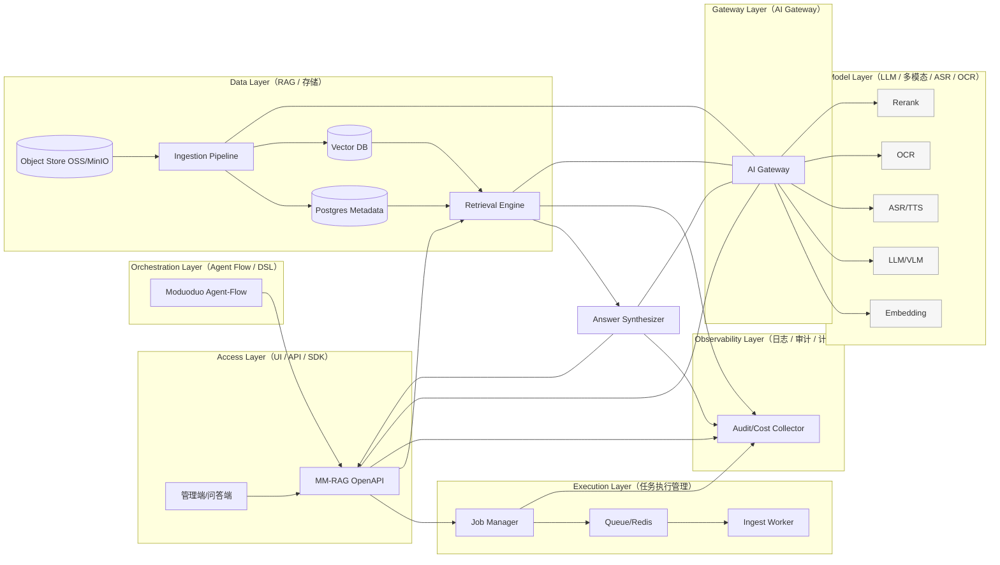

# Moduoduo MultiModal Evidence Engine（MM-RAG）

## 产品需求文档（PRD）+ 技术路线说明 v1.0

------------------------------------------------------------------------

# 1. 项目概述

## 1.1 项目背景

当前主流 RAG 系统普遍存在以下问题：

-   仅支持文本检索
-   视频仅转为纯文本使用
-   PDF 不支持精确定位（无 bbox）
-   输出仅为纯文本
-   无图文视频混排能力
-   无结构化证据链
-   模型不可插拔
-   无完整可审计能力

在政务、司法、教育等场景中，系统不仅要"能回答"，更要：

-   可证明
-   可追溯
-   可审计
-   可私有化部署

------------------------------------------------------------------------

## 1.2 产品定位

构建一个：

> 可私有化部署的多模态证据检索引擎\
> 支持图文视频混排输出 + 证据链定位 + 模型可插拔

对外名称：

> **Moduoduo MultiModal Evidence Engine（MM-RAG）**

------------------------------------------------------------------------

## 1.3 产业分层定位（Evidence OS）

MM-RAG 的定位不是“知识库产品”，而是“**多模态证据引擎 / Evidence OS**”：输出必须可一键验证与回放（page/bbox/timecode），并支持全链路可审计、可复现。

简化分层（用于对外叙事与内部边界）：

```text
L6 证据操作系统层（Evidence OS）  ★ MM-RAG 目标层
L5 多模态RAG引擎层（部分企业自研）
L4 RAG 工作流平台层（RAGFlow/Dify/FastGPT/Coze…）
L3 云厂商知识库层（百炼/千帆/火山…）
L2 向量数据库层（Milvus/Qdrant…）
L1 模型能力层（LLM/VLM/ASR/OCR/Embedding…）
```

# 2. 产品目标

## 2.1 核心目标

1.  支持文本 / 图片 / 视频 / PDF / Word / 网页导入
2.  支持图文视频混排输出
3.  支持 PDF bbox 定位
4.  支持视频 timecode 片段引用
5.  支持模型可插拔（通过 AI Gateway）
6.  支持私有化部署
7.  支持审计链路（trace/span/cost）
8.  支持动态更新（URL 自动 diff）

------------------------------------------------------------------------

## 2.2 非目标与边界（v1.0）

-   不做“平台型知识库产品全家桶”（控制台/运营/全套工作流平台）：MM-RAG 输出为协议（`AnswerPack`），上层可由任意 UI/Agent-Flow 消费。
-   不把模型能力绑定到单一厂商：所有模型调用必须走 AI Gateway（embedding/LLM/VLM/ASR/OCR/rerank）。
-   视频 v1 以“**ASR + 关键帧/OCR + 2~5 秒片段化 + timecode**”为主，不强依赖稀缺的视频语义 embedding。

## 2.3 落地路线（A/B/C）

-   A）**默认推荐（MVP）**：第三方多模态能力（经 AI Gateway 可插拔）+ 自研证据 OS 骨架（SegmentUnit/AnswerPack/审计复现/视频片段化）。
-   B）**中期演进（Hybrid）**：当成本/合规/规模压力出现，解析/embedding/向量库逐步本地化；LLM rerank/高精生成按需开关。
-   C）**强合规（全开源）**：仅在“数据/模型都不能出域”且接受更长周期与更高算力/运维成本时选择。

## 2.4 关键约束（需求澄清项）

-   **证据强度**：是否要求“每段结论都必须 citations”，还是“关键结论必须”。
-   **延迟预算**：端到端目标（500ms / 1s / 3s），是否必须流式输出。
-   **权限与合规**：多租户/分级权限/审计保留周期/脱敏要求。
-   **成本上限**：单次请求与月预算上限，用于决定 LLM rerank、多模态 API 的默认开关策略。

# 3. 用户角色

  角色         需求
  ------------ ------------------------
  企业管理员   管理知识库、权限、更新
  业务用户     多模态问答
  政务客户     私有化、安全、可审计
  开发者       API 嵌入与调用

------------------------------------------------------------------------

# 4. 功能模块设计

## 4.1 数据接入模块

-   文件上传（PDF / Word / 图片 / 视频）
-   URL 导入
-   批量导入
-   定时更新
-   增量更新（diff + upsert）

统一转换为 `SegmentUnit`。

------------------------------------------------------------------------

## 4.1.1 工程交付物（附录）

-   DB Schema（Postgres）：`appendix/mm-rag-db-schema-v1.0.md`
-   OpenAPI 3.0：`appendix/mm-rag-openapi-v1.0.yaml`

### 动态更新与增量入库（v1 必做）

“一键上传自动更新”必须是异步任务管线，而非同步阻塞：

-   **Upload**：支持文件直传或 OSS/MinIO 预签名直传（大文件视频必须直传）
-   **Ingest Job**：异步解析任务（PDF/Word/图片/短视频）
-   **Upsert Index**：增量写入（向量库 upsert + 元数据 upsert），支持覆盖/删除旧版本
-   **Ready Event**：完成后通知前端（轮询 / Webhook / SSE）

版本与幂等要求（避免重复与脏库）：

-   `asset_hash`：对上传文件计算 `sha256`（或 `etag`），相同 hash 不重复入库
-   `asset_version`：同名但 hash 变化时版本递增
-   `segment_id`：必须稳定可复用，推荐 `hash(asset_id + anchor + content_hash)`
-   软删除：替换/删除资料时，旧 segment 标记 `is_active=false`，查询默认只检索 `is_active=true`

## 4.2 多模态解析模块

### 文档解析

-   Docling 结构化提取
-   标题层级识别
-   表格结构识别
-   图文绑定
-   页码记录
-   bbox 坐标保存

### 图片解析

-   PaddleOCR
-   Caption 生成
-   与正文段落绑定

### 视频解析

-   ASR 转写
-   2\~5 秒语义切分
-   关键帧抽取
-   timecode 记录

------------------------------------------------------------------------

## 4.3 Segment & Index 模块

### SegmentUnit 示例

``` json
{
  "segment_id": "",
  "type": "text | image | video_segment | table",
  "text_repr": "",
  "page": 0,
  "bbox": [],
  "timecode": [0, 0],
  "links": {"nearby_segment_ids": []},
  "metadata": {
    "source_id": "",
    "tenant_id": "",
    "project_id": "",
    "permissions": [],
    "language": "",
    "t_publish": "",
    "t_ingest": "",
    "t_event": ""
  }
}
```

支持：

-   Dense embedding（经 AI Gateway）
-   BM25 稀疏索引
-   metadata 过滤
-   标签过滤

------------------------------------------------------------------------

## 4.4 检索模块

-   Dense Retrieval
-   Sparse / BM25
-   Metadata 过滤
-   时间范围过滤（视频）
-   time-aware downrank（可接入 MTE `TimePolicy` 做 freshness/时间窗策略）
-   RRF 融合
-   Cross-Encoder / LLM Rerank

------------------------------------------------------------------------

## 4.5 生成模块

-   基于 evidence 生成
-   强制引用约束
-   禁止 hallucination
-   citation 强绑定

------------------------------------------------------------------------

## 4.6 AnswerPack 协议输出

``` json
{
  "answer": "",
  "blocks": [
    {"type": "text"},
    {"type": "image", "bbox": []},
    {"type": "video", "timecode": [12, 20]}
  ],
  "citations": [],
  "voice": {"enabled": false, "streaming": true}
}
```

支持图文视频混排与证据定位。

------------------------------------------------------------------------

## 4.7 UI 层设计

### 管理端

-   知识库管理
-   文件上传
-   更新状态
-   向量索引状态
-   审计查看

### 问答端

-   混排渲染
-   证据可视化
-   视频跳转
-   引用列表

------------------------------------------------------------------------

## 4.8 审计系统

记录：

-   trace_id
-   span_id
-   query
-   检索命中列表
-   引用覆盖率
-   成本统计
-   模型调用记录

### 可复现（Replay）要求（产品硬门槛）

除基础审计字段外，必须满足“可回放与可复现”：

-   **策略版本**：检索/融合/rerank/生成提示词等配置版本号（支持回滚）
-   **证据快照**：引用到的 `segment_id + anchors + metadata` 的快照标识（或 hash）
-   **输入输出 hash**：用于一致性校验与争议处理
-   **回放入口**：允许基于同一 `trace_id` 复跑并对比差异（用于回归与审计）

------------------------------------------------------------------------

## 4.9 AI Gateway 集成

统一模型调用接口：

-   /gateway/embedding
-   /gateway/chat
-   /gateway/rerank
-   /gateway/asr
-   /gateway/ocr

优势：

-   模型可插拔
-   多供应商统一调度
-   成本统一统计

------------------------------------------------------------------------

# 5. 系统架构

MM-RAG 采用“引擎内核 + 可插拔适配器 + 可观测治理”的最小正确架构（MRA：Minimum Right Architecture）。

（如果你的 Markdown 预览不支持 Mermaid，可直接看这个 SVG 图）：


SVG 版本（如需无损放大）：`appendix/assets/mm-rag-mra.svg`

ASCII（部署组件与依赖方向）：

```text
[Access/UI/SDK] -> [MM-RAG API Service]
                   |-> [Ingest Workers + Queue]
                   |-> [Vector DB] (dense/sparse/hybrid)
                   |-> [Metadata DB] (assets/segments/ACL/jobs)
                   |-> [Object Store] (pdf/image/video/keyframe)
                   |-> [Audit Collector] (trace/span/cost/replay)
                   \-> [AI Gateway] -> [LLM/VLM/ASR/OCR/Embedding/Rerank Providers]
```

Mermaid（分层架构，面向平台对接）：



支持容器化部署。

------------------------------------------------------------------------

# 6. 技术路线

## Phase 1（MVP，2 周）

-   文件上传
-   预签名直传（OSS/MinIO）
-   异步 ingest job（状态机：PENDING → PARSING → EMBEDDING → INDEXING → DONE/FAILED）
-   Docling 解析
-   PaddleOCR
-   视频 ASR
-   2~5 秒视频片段化（timecode + cover）
-   Dense 检索
-   基础生成
-   最小 AnswerPack（markdown + image_card + video_card + citations）
-   轻量审计（trace_id + 核心字段）

## Phase 2（增强版，3~4 周）

-   Dense + Sparse
-   Rerank
-   URL diff 更新
-   AnswerPack 协议
-   审计记录
-   Audit SDK + Collector（平台化沉淀）
-   配额/限流（视频分钟数/天、并发）

## Phase 3（产品级，2 个月+）

-   多知识库
-   多租户
-   性能优化
-   评测体系
-   API SDK
-   证据 Viewer（PDF bbox 高亮、视频 timecode 回放、图片 bbox 高亮）
-   回归集 + 在线 A/B（可复现闭环）

------------------------------------------------------------------------

# 7. 性能指标

  指标           目标
  -------------- ---------
  P95 响应时间   \< 3 秒
  Recall         \> 0.85
  引用覆盖率     \> 95%
  无证据生成率   \< 1%（或严格拒答）
  Precision@K    持续优化（配合 rerank 与评测集）
  视频定位误差   \< 2 秒
  文档定位精度   \> 95%
  索引新鲜度     受控（可配置 URL diff / 定时更新）
  成本可控       单次请求成本可估算、可审计、可限额

------------------------------------------------------------------------

# 8. 战略定位

MM-RAG 是：

> 可嵌入式多模态证据检索操作系统

区别于传统知识库产品，具备：

-   模型可插拔
-   证据链协议输出
-   图文视频混排能力
-   可审计
-   私有化部署能力
