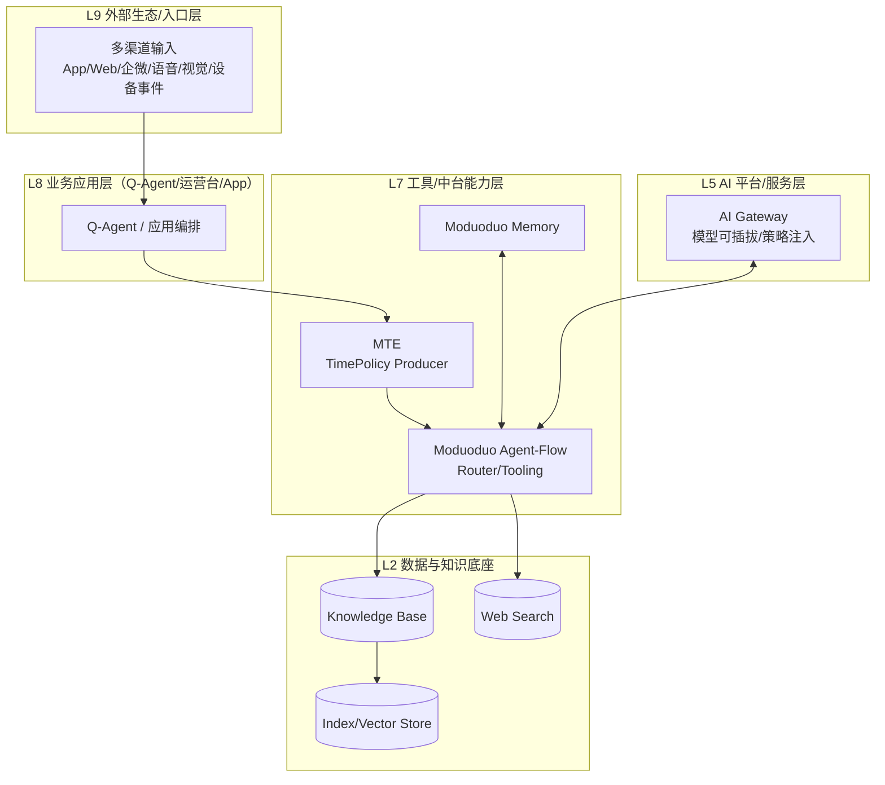
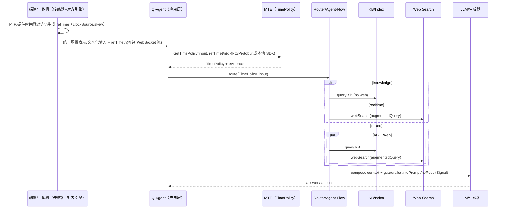
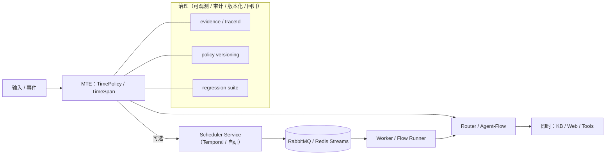
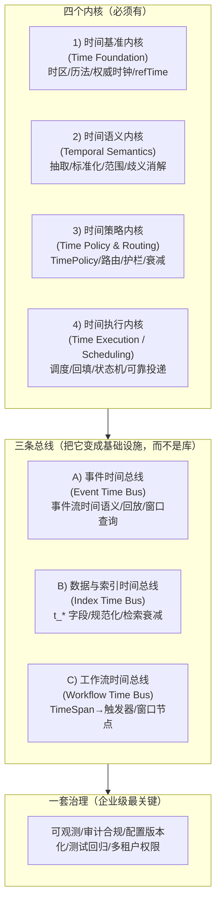

## MTE（Moduoduo Time Engine）优化升级方案（对齐「大模多多架构」与 Q-Agent 五模态一体机）v0.2

> 依据材料  
> - 大架构总图：`大模多多架构/2025 Big Moduoduo.png`  
> - 一体机规格：`Q Agent/Q-Agent-AI数智人一体机技术规格参考20251223.pdf`（“五模态 + 时空对齐 + 云边端协同 + 断网降级 + <500ms 文本端到端”等）
>
> 本文目标：把 MTE 从“单文件工具函数”升级为**平台级时间策略能力**，既能服务 RAG/Agent-Flow，也能与一体机的“多模态时空对齐引擎（PTP+硬件时间戳）”严丝合缝。

---

## 1. 结论先行：MTE 在你体系里的正确定位

**MTE = Time Policy Middleware（时间策略中间件）**，它不替代一体机的“时间同步/多模态对齐引擎”，而是：

- **承接“自然语言时间语义”**（今年/最近/本周/节日/口语模糊词…）
- **输出可执行的策略对象 `TimePolicy`**（路由、鲜度、后缀粒度、护栏、证据）
- **把策略喂给下游**：RAG 检索/重排、Agent-Flow 工具选择、Memory 记忆写入、以及离线降级策略

一句话：**对齐“时空对齐引擎”的统一时间戳（物理时间），再补齐“语言时间语义”的可执行策略（语义时间）。**

---

## 1.1 架构图（ASCII + Mermaid）

### ASCII 总览（你一眼看清边界）

```text
                ┌──────────────────────────────────────────────────────────┐
                │                 大模多多（企业 AI 基础设施）              │
                └──────────────────────────────────────────────────────────┘

  多渠道输入/设备事件
  (App/Web/企微/语音/视觉/传感器)
            │
            ▼
  ┌─────────────────────┐     物理时间基准（PTP/硬件时间戳）
  │  时空对齐引擎（端侧） │──────────────┐
  │  time-sync + align   │              │  refTime (iso/clockSource/skew)
  └─────────────────────┘              ▼
            │                    ┌─────────────────────────┐
            ├────────文本化/统一表示──►│   MTE（语义时间策略） │
            │                    │  TimePolicy Producer     │
            │                    └──────────┬──────────────┘
            │                               │ TimePolicy
            ▼                               ▼
  ┌─────────────────────┐          ┌─────────────────────────┐
  │ Router / Agent-Flow  │◄─────────│  Guardrails / Evidence  │
  │ KB/Web/Tools 决策    │          └─────────────────────────┘
  └──────────┬──────────┘
             │
     ┌───────┴─────────┐
     ▼                 ▼
  ┌───────┐        ┌────────┐
  │  KB   │        │  Web    │   (离线/断网 → fallback/cached)
  └───┬───┘        └───┬─────┘
      ▼                ▼
        ┌──────────────────────────┐
        │ Rerank/Fusion（含时间降权） │
        └──────────┬───────────────┘
                   ▼
          ┌──────────────────────┐
          │ LLM/TTS/渲染/动作输出 │
          └──────────────────────┘

  （可选）调度执行：另起 Scheduler Service（Temporal/自研），消费同一 TimePolicy/TimeSpan
```

### Mermaid ①：在大架构的“分层落点”



### Mermaid ②：端到端消息流（对齐 gRPC/Protobuf + Streams/Queue + refTime）



### Mermaid ③：MTE（语义策略）与 Scheduler（执行）拆分（企业级形态）



---

## 1.2 企业级时间引擎参考模型（4 个内核 + 3 条总线 + 1 套治理）

把“时间引擎”当成**时间领域的基础设施层**：它的职责不是“解析日期”这么单点，而是让企业内部的 **AI / 数据 / 任务 / 记忆 / 检索** 在同一套**时间语义**与**执行语义**上对齐。

### Mermaid：企业级时间引擎（4 + 3 + 1）



---

### 1）四个内核（必须有）

#### 1. 时间基准内核（Time Foundation）
解决“大家用的到底是不是同一个时间”的问题。

- **统一时区/历法**：UTC 存储 + 展示时区转换；支持业务时区（如 `Asia/Shanghai`）、夏令时、闰秒策略（企业通常忽略闰秒，但必须定义）。
- **权威时钟源**：NTP/PTP、硬件时间戳（你的 Q-Agent 走 PTP+硬件时间戳），输出 `clockSource/clockSkewMs` 用于审计。
- **请求级 refTime**：同一条链路（一次对话/一次工作流）固定 `refTime`，避免跨秒/跨日漂移。

> 你现有 MTE 的 **Injectable Clock** 是这个内核的雏形；下一步是把它扩展为“全链路约束”（包括 Router/检索/生成/记忆写入）。

#### 2. 时间语义内核（Temporal Semantics）
解决“人类说的时间”与“文本里的时间”如何变成可计算结构。

- **NL 时间解析**：绝对/相对/模糊/节日/口语（HeidelTime / SUTime / Duckling / chrono 这类）。
- **范围/多点表达**：从 `Date | null` 升级为：
  - `TimeSpan { start, end, points, granularity, confidence }`
- **时间类型体系**：`t_event / t_publish / t_valid_from/to / t_ingest`（用于 RAG 与数据治理）。
- **歧义消解**：缺年、缺时区、模糊词（“最近”“上周末”）要有规则与置信度。

> 你目前覆盖“语义时间的一部分 + 中文业务词表”，但 **TimeSpan（范围/多点）** 与 **t_* 字段体系**是下一台阶。

#### 3. 时间策略内核（Time Policy & Routing）
时间不只是解析出来，还要变成“可执行决策”。这是你现在最接近企业级基础设施的部分。

- **TimePolicy 生成**：结构化输出 `intent / freshness / suffixGranularity / guardrails / evidence`。
- **路由与工具选择**：KB/Web/并行；离线降级；是否允许“实时”回答；是否需要回放/查询日志。
- **窗口控制与时间衰减**：硬过滤 + downrank（企业更稳，少误杀）。
- **提示词护栏**：`timePrompt`、`noResultSignal`、注入位置策略（`system/user_head`）。

> 你现在的 MTE ≈ 这个内核的 **最小可用版本（MVP）**：核心价值在“可执行的 TimePolicy + 中文语义优先级”。

#### 4. 时间执行内核（Time Execution / Scheduling）
当企业把“AI 变成运营系统”时，时间引擎必须能“让事情在未来发生”。

- **调度与回填**：Cron/日历表达式、interval、backfill、pause/resume。
- **可靠投递语义**：at-least-once / exactly-once（常用：幂等键 + 状态机）。
- **状态机与持久化**：Pending/Running/Succeeded/Failed/Cancelled + 重启恢复。
- **SLA/超时/熔断/重试**：一体机规格里也明确强调超时熔断与缓存。

> 不建议把这块直接塞进“轻量 MTE”。更常见的企业做法是：**MTE 负责“语义与策略”，另起 Scheduler Service 负责执行**，但共享同一套 `TimePolicy/TimeSpan` 协议（见上面的 Mermaid ③）。

---

### 2）三条总线（把它变成“基础设施”，而不是库）

#### A. 事件时间总线（Event Time Bus）
- 统一事件流里每条消息的时间字段与语义（source time / ingest time）。
- 适配 Kafka/Pulsar/Redis Streams 等。
- 支持回放与时间窗口查询（“刚才/今天/最近几天发生了什么”）。

#### B. 数据与索引时间总线（Index Time Bus）
- 数据入库时统一填充 `t_*` 字段并做规范化（Time Normalizer）。
- RAG 检索时支持时间过滤/衰减。
- 支持“最新策略/有效期策略”的一致执行。

#### C. 工作流时间总线（Workflow Time Bus）
- 将 `TimeSpan` 变成 workflow 的触发器/窗口节点。
- 与 Temporal / Argo / Airflow 或自研调度对接。

---

### 3）一套治理（企业级最关键，决定能不能长期用）

- **可观测性**：`traceId` 串联 策略→检索→生成；指标（无结果率、过期引用率、时间幻觉投诉率）。
- **审计与合规**：回答使用的时间依据、策略证据链（`evidence`）、数据有效期。
- **配置与版本化**：词表/节日表/规则包版本；灰度发布；回滚。
- **测试体系**：时间相关回归集（你已有 24 组样例雏形，企业级应扩到几百/几千）。
- **多租户与权限**：不同租户不同日历、工作日、时区、有效期策略。

---

### 4）落到你现在的项目：最推荐的拆分（保持实时预算）

- **MTE（保持轻量）**：专注“时间语义 + TimePolicy 输出 + 护栏 + evidence + downrank”，目标 `<5ms`。
- **Time Normalizer（数据侧）**：逐步引入 `t_event/t_publish/t_valid/t_ingest` 标准化。
- **Scheduler Service（执行侧）**：要企业级任务/回填/可靠性再单独建（可用 Temporal 省大量工程量）。
- **统一协议**：`TimePolicy + TimeSpan + TimeFields`（JSON/Protobuf 等价）。

## 2. Q-Agent 一体机对 MTE 的硬约束（从 PDF 反推）

从规格里能抽出几条对 MTE 直接生效的工程约束：

- **强实时预算**  
  - 文本对话端到端 `<500ms（LLM + RAG）`  
  - 视觉互动 `<300ms（YOLO+VLM）`、VLM 深度理解按需 `<800ms`  
  - 这要求 MTE 的决策必须是 **确定性、低开销、可缓存**（规则/词表优先，避免额外 LLM 路由调用）。

- **多模态时空对齐（PTP+硬件时间戳）**  
  - 规格明确：统一时间戳、PTP 精准时间协议 + 硬件时间戳  
  - MTE 必须支持“**统一参考时间源 refTime**”，并能在策略里标注 `clockSource`、`timezone`，确保同一请求链路一致。

- **消息流与协议栈**  
  - gRPC + Protobuf（低延迟 RPC）+ WebSocket（实时流）  
  - Redis Streams（实时） + RabbitMQ（任务队列）  
  - MTE 的输出需要可被这些管道无损传递：**JSON（日志/可读）+ Protobuf（高速）双格式等价**。

- **断网降级与恢复**  
  - L1：云不可用 → 边缘模型接管  
  - L2：实时推理失败 → 响应缓存库  
  - MTE 需要提供“**路由建议 + 可降级策略**”：当 `needWeb=true` 但网络/云不可用时，明确 fallback（KB、缓存、提示模板）。

- **动态更新窗口**  
  - 48h（国内）/96h（全球）完成模型替换  
  - MTE 的词表/节日表/规则包也应该具备同样的“策略热更新”机制（至少支持版本化加载）。

---

## 3. MTE v0.2 的升级目标（最小改动，最大收益）

### 3.1 输出从 `{type,freshnessDays,searchQuery}` 升级为 `TimePolicy`（协议优先）

把 MTE 的核心输出统一成结构化协议（详见你仓库内专利材料包中 schema 草案）：

- **intent**：`knowledge | realtime | mixed`
- **routing**：`needKB/needWeb` 与 `mode`
- **freshnessDays**：窗口天数（多词命中取最大）
- **suffixGranularity**：`none | ym | ymd`（以及未来扩展周/季度）
- **guardrails**：`timePromptEnabled/noResultSignalEnabled/injectionLocation`
- **evidence**：`confidence + reasons + matches(命中词表项)`
- **refTime**：`timezone + iso + clockSource + (可选)clockSkewMs`

关键点：下游（RAG/Agent-Flow/Memory）只认 `TimePolicy`，**不依赖 TS 实现细节**。

### 3.2 全链路“同一请求共享 refTime”（把 detectTimeIntent 也纳入 Injectable Clock）

当前实现里 `isWithinWindow/parseDate/timePrompt` 支持 `clock`，但 `detectTimeIntent()` 内部直接 `now()`。

v0.2 建议：所有导出函数都接受 `clock?: () => Date` 或直接接收 `refTime` 结构，保证：

- 同一次对话/同一次工具链调用内：**策略、检索过滤、prompt 注入使用同一时间点**
- 与一体机 PTP/硬件时间戳对齐时：refTime 由“时空对齐引擎”提供（不是各模块自己 new Date）。

### 3.3 从“硬过滤”升级为“硬过滤 + 时间衰减降权”（减少误杀）

一体机强调实时性与稳定性；Web 结果时间表达不规范时，“硬过滤”会误杀并导致无结果（进而触发编造风险）。

v0.2 建议把 `isWithinWindow()` 抽象为两段策略：

- **windowHardBlock**：仅在“解析置信度高 + 明确超窗很久”才阻断
- **windowDownrank**：解析不确定或时间表达粗粒度时，输出 `recencyScore` 给重排融合

这样既保留新鲜度约束，又减少误杀导致的“无结果”。

---

## 4. 对齐一体机“五模态时空对齐引擎”：MTE 需要新增的接口语义

一体机规格给了一个“场景理解统一表示”的范式（带 timestamp、persons、objects、events…）。这意味着：

### 4.1 MTE 必须认识两种时间

- **物理时间（Physical Time）**：传感器对齐后的统一时间戳（PTP+硬件时间戳），用于日志、回放、事件关联
- **语义时间（Semantic Time）**：用户话语里的“今年/最近/下周二/节日”等，映射成窗口与策略

> MTE 的输出应当把这两者桥接起来：`refTime`（物理基准）+ `TimePolicy`（语义策略）。

### 4.2 建议新增 `TimePolicy.context`（给多模态管道使用）

在 `TimePolicy` 中增加一个可选 `context`（不影响你现有文本场景）：

- `context.eventTime`：当前事件的物理 timestamp（来自对齐引擎）
- `context.sessionId/traceId`：用于跨 Redis Streams / gRPC 链路追踪
- `context.subjectId`：如 personId（“谁在说话/谁在移动”）用于个性化记忆写入与权限

这使得 MTE 不止用于“问答”，还能用于：
- “刚才那个人说了什么？”（回放检索窗口=几分钟）
- “今天谁来过？”（事件时间窗口=一天）
- “最近这几天有人靠近吗？”（多模态事件检索窗口=3天）

---

## 5. 嵌入大模多多架构的推荐落点（按层落地）

结合总图分层（外部生态→业务应用→工具/中台→Agent/运行时→Gateway→数据底座），建议：

### 5.1 业务应用层（Q-Agent / 运营台 / App）
- 作为**入口前置**：每次用户输入先生成 `TimePolicy`
- 输出进入“路由器/Agent-Flow”，决定 KB/Web/工具调用

### 5.2 Agent/中台能力层（Moduoduo Agent Flow / Memory）
- **Agent-Flow**：把 `TimePolicy` 当作标准上下文变量（类似 `authContext`）
- **Memory**：记忆写入时记录 `t_event/t_ingest` 与 `TimePolicy.intent`，支持时间感知检索

### 5.3 AI Gateway / 推理层
- MTE 本身不依赖模型，但要能读取平台能力：是否支持 system role、是否离线、当前延迟预算
- 允许 `guardrails.injectionLocation` 动态选择（system/user_head）

---

## 6. v0.2～v0.5 路线图（按对一体机收益排序）

### v0.2（策略协议化 + 时钟一致性 + 降权）
- `TimePolicy` 真正成为唯一输出
- `detectTimeIntent` 支持 injected clock/refTime
- `unknownDateBehavior` 支持 `allow/downrank/block`
- `recencyScore`（供重排融合）
- 规则热更新的版本字段（哪怕先只落日志）

### v0.3（把时间解析从“单点”升级为“范围/多点”，匹配事件与任务编排）
- `parseTimeSpan()`：支持 “从…到…” “截至…” “持续到…”
- 多时间表达：输出 `points[]` 与 `start/end`
- 节日表改为“数据包 + 版本化”（便于 48h/96h 节奏更新）

### v0.4（Time Normalizer：把时间从“问句”扩展到“内容入库/事件流”）
- 统一时间字段：`t_event/t_publish/t_valid_from/t_valid_to/t_ingest/timezone`
- 对多模态事件（persons/objects/events）落盘时标准化时间元数据

### v0.5（可观测 + 回归集 + A/B）
- 关键指标：`intent` 分布、needWeb 比例、无结果率、超窗误杀率、用户追问率
- 回归集：用你现成的 24 组样例扩到 200+（覆盖真实业务语料）
- A/B：downrank vs hard-block 的效果对比（尤其 Web 搜索结果）

---

## 7. 面向一体机协议栈的“接口建议”（不强制实现，但建议写进规范）

### 7.1 gRPC/Protobuf（低延迟）
建议给 `TimePolicy` 定一个 Protobuf message（字段与 JSON 一一对应），用于：
- Q-Agent ↔ 边缘算力塔 ↔ 云端微服务
- 低延迟路径（<500ms）上减少 JSON 解析成本

### 7.2 Redis Streams / RabbitMQ（实时流 / 任务队列）
- 实时流（Streams）携带 `TimePolicy` 的关键字段（intent、freshnessDays、refTime、traceId）
- 任务队列（RabbitMQ）携带“窗口/到期时间/重试策略”（未来如果你把“调度/提醒”纳入时间引擎更合适）

---

## 8. 你可以立刻做的 5 个“最省力”升级动作（强烈建议）

1. **把 MTE 的对外输出统一成 TimePolicy（先 TS 内部也行）**  
2. **所有函数接收同一 `clock/refTime`（包含 detectTimeIntent）**  
3. **把 isWithinWindow 升级为 `hardBlock + downrank` 两段式**  
4. **把 `evidence` 固化**（命中词表项、规则关卡、置信度），用于可观测与专利举证  
5. **为离线/降级提供明确策略字段**：`routing.fallback`（云不可用→边缘→缓存→提示模板）

---

## 9. 需要你确认的一件事（决定 MTE 的“端侧职责边界”）

一体机规格里强调“多模态时空对齐引擎”已经负责 PTP+硬件时间戳。你需要明确：

- **MTE 是否只做“语义时间策略”**（推荐：保持轻量、<5ms）
- 还是要把“时间同步/调度/提醒”也纳入（会变成平台级服务，需要更多持久化/队列/状态机）

推荐路径：**MTE 先只做语义时间策略 + TimePolicy 输出**；调度类能力另起 `Time Scheduler Service`（但消费同一个 TimePolicy/TimeSpan 协议），避免 MTE 变重影响一体机实时预算。

