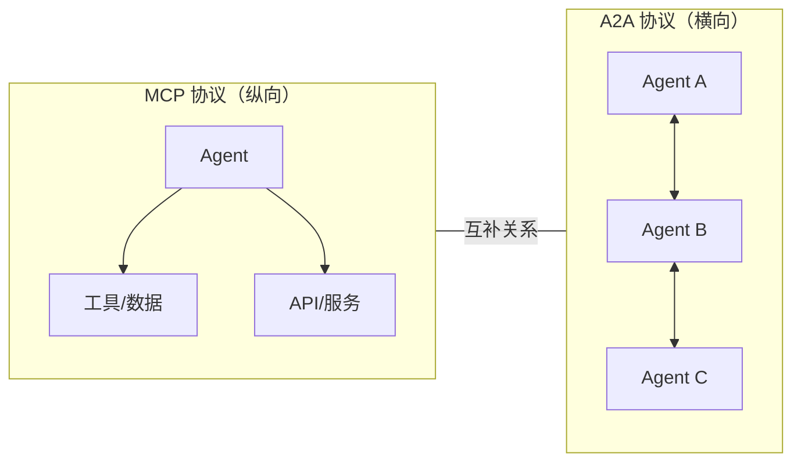
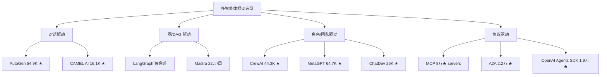

# Multi-Agent AI 全球竞品与市场深度研究报告

> **生成日期**：2026-03-04  
> **数据截止**：2026-03 初  
> **所有数据均标注来源，可验证**

---

## 一、Multi-Agent AI 市场规模与增长

### 1.1 全球市场规模

| 年份 | 市场规模 | 来源 |
|------|----------|------|
| 2024 | ~$5.4B | Alpha & Asset Newsletter / RAYSolute |
| 2025 | $7.6B - $11B | Grand View Research / RAYSolute |
| 2026 | ~$8.0B（Multi-Agent 子领域） | EIN Presswire |
| 2030 | $25.5B - $50.3B | EIN Presswire / Alpha & Asset |
| 2034 | ~$199B（Agentic AI 整体） | RAYSolute Q1 2026 Report |

**CAGR（复合年增长率）**：
- Multi-Agent System 细分：33.6% - 48.4%（来源：Grand View Research / HTF Market Insights）
- Agentic AI 整体：40% - 46%（来源：RAYSolute）

### 1.2 AI Agent 领域融资情况

| 指标 | 数据 | 来源 |
|------|------|------|
| 2024 AI Agent 融资总额 | $3.8B | Alpha & Asset Newsletter |
| 2025 AI Agent 融资总额 | ~$6.7B | Alpha & Asset Newsletter |
| 2025 全球 AI 融资总额 | $211B - $226B（占 VC 总额 47-48%） | CB Insights / AI Funding Tracker |
| 2025 全球 VC 融资总额 | $425B - $469B | CB Insights |

**标志性融资事件（2025-2026）**：

| 公司 | 金额 | 轮次 | 估值 | 投资方 | 来源 |
|------|------|------|------|--------|------|
| **Temporal** | $300M | Series D | $5B | a16z, Lightspeed, Sapphire, Sequoia, Tiger Global | SiliconANGLE 2026-02 |
| **LangChain** | $125M | Series B | $1.25B | IVP, Sequoia, Benchmark, CapitalG | TechCrunch 2025-10 |
| **AnySphere（Cursor）** | - | - | $29.3B | - | RAYSolute Q1 2026 |
| **Cognition（Devin）** | - | - | $10.2B | - | RAYSolute Q1 2026 |
| **CrewAI** | $18M | Series A | 未公开 | Insight Partners, Andrew Ng, Sam Altman | The Agent Times |
| **DeepWisdom（MetaGPT）** | $31M + ¥2.2亿 | Series A+ | 未公开 | 蚂蚁集团、凯辉资本、金秋基金、百度风投 | 36Kr |
| **Mastra AI** | $13M | Seed | 未公开 | YC, Paul Graham, Gradient | Mastra Blog |

---

## 二、核心竞品详细数据

### 2.1 开源框架竞品矩阵

| 框架 | GitHub Stars | 创建时间 | 融资 | 核心功能 | 关键指标 |
|------|-------------|----------|------|----------|----------|
| **AutoGen (Microsoft)** | 54,897 ★ | 2023 | Microsoft 内部 | 多智能体对话、事件驱动架构、跨语言（Python/.NET） | v0.4 重写，异步架构 |
| **MetaGPT** | 64,731 ★ | 2023 | $31M+¥2.2亿 | 软件公司角色模拟、自动需求分析 | MGX 产品 70 万用户，ARR $1M+ |
| **CrewAI** | 44,285 ★ | 2023-10 | $18M Series A | 角色分工、任务编排、层级管理 | 月处理 4.5 亿 Agent，60%+ Fortune 500 |
| **Agno (Phidata)** | 38,400 ★ | 2023 | Pre-Seed + Venture | 多模态 Agent、快速实例化 | 周创建 100 万+ Agent |
| **ChatDev** | ~26,000-31,000 ★ | 2023 | 学术项目（OpenBMB） | 虚拟软件公司、零代码多 Agent 编排 | v2.0 MacNet 架构 |
| **FastGPT** | 27,184 ★ | 2023 | 未公开 | AI Agent Builder、可视化工作流 | 218 版本，双向 MCP |
| **Google A2A** | 22,172 ★ | 2025-04 | Google 内部 | Agent 间通信协议、Agent Card 发现 | 150+ 组织支持，v0.3 |
| **OpenAI Swarm** | 21,069 ★ | 2024 | OpenAI 内部 | 轻量编排、handoff 模式 | 已标记为实验性，迁移至 Agents SDK |
| **OpenAI Agents SDK** | 19,291 ★ | 2025-03 | OpenAI 内部 | 生产级多 Agent、guardrails、tracing | 65 版本，替代 Swarm |
| **Mastra AI** | ~12,500-21,600 ★ | 2024-10 | $13M Seed | TypeScript Agent 框架、工作流 | 22 万/周 npm 下载 |
| **CAMEL AI** | 16,136 ★ | 2023-03 | GitHub SOS Fund | 角色扮演、数据生成、Agent 社会模拟 | 收入 $990K，9 人团队 |
| **Anthropic MCP** | 7,376 ★（spec） / 80,037 ★（servers） | 2024-09 | Anthropic 主导 | 模型-工具标准化协议 | 1 万+ 活跃服务器，9700 万+月 SDK 下载 |
| **Agency Swarm** | 4,018 ★ | 2023-11 | 无外部融资 | OpenAI SDK 集成、自定义角色 | 社区驱动 |
| **Dify** | 130,000 ★ | 2023 | Series A（金额未公开） | 可视化工作流、RAG、插件生态 | 全球 Top 100 开源项目 |

### 2.2 各竞品详细分析

---

#### 2.2.1 AutoGen（Microsoft）

| 维度 | 数据 |
|------|------|
| **GitHub** | 54,897 Stars / Microsoft Research |
| **融资** | Microsoft 内部项目，无独立融资 |
| **核心功能** | 可对话 Agent、群聊模式、人机协作、事件驱动 |
| **技术架构** | v0.4 全面重写：异步事件驱动、跨语言（Python + .NET）、分布式 Agent 网络 |
| **定位** | 多智能体对话协作的基础设施层 |

> **来源**：GitHub microsoft/autogen; The Agent Times 2026-02; Microsoft Research Blog 2025-01

---

#### 2.2.2 CrewAI

| 维度 | 数据 |
|------|------|
| **GitHub** | 44,285 Stars / 5,200 Forks / 180 万月下载 |
| **融资** | $18M Series A（2024-10），Insight Partners 领投 |
| **投资人** | Andrew Ng、Dharmesh Shah（HubSpot CTO）、Sam Altman 家族基金 |
| **核心功能** | 角色定义、任务分工、层级管理、流程编排 |
| **用户量** | 月处理 4.5 亿 Agent，累计 14 亿次 agentic 自动化 |
| **企业采用** | 60%+ Fortune 500 使用 |
| **团队** | 30 人 |

> **来源**：The Agent Times 2026-02; CrewAI Blog; PitchBook

---

#### 2.2.3 LangGraph / LangChain

| 维度 | 数据 |
|------|------|
| **融资** | 累计 $160M（$10M Seed + $25M A + $125M B） |
| **估值** | $1.25B（2025-10） |
| **投资人** | IVP、Sequoia、Benchmark、CapitalG、Amplify |
| **核心功能** | 图状态编排、条件路由、时间旅行调试、持久化执行 |
| **用户量** | 月下载 9000 万，35% Fortune 500 |
| **企业客户** | Uber、LinkedIn、J.P. Morgan、Cloudflare、Replit |
| **LangSmith 增长** | 生产 traces 同比增长 12x |

> **来源**：TechCrunch 2025-10; LangChain Blog; Sequoia Capital

---

#### 2.2.4 Agno（原 Phidata）

| 维度 | 数据 |
|------|------|
| **GitHub** | 38,400 Stars |
| **融资** | Pre-Seed（Surface Ventures 领投）+ Venture 轮（2024-08）金额未公开 |
| **投资人** | Surface Ventures、Zero Prime Ventures |
| **核心功能** | 多模态 Agent、极速实例化（号称比竞品快 5000x）、知识库集成 |
| **用户量** | 周新建 100 万+ Agent |
| **改名** | 2025-04 正式从 Phidata 更名为 Agno |

> **来源**：GitHub agno-agi/agno; Agno Blog; Crunchbase

---

#### 2.2.5 MetaGPT / DeepWisdom

| 维度 | 数据 |
|------|------|
| **GitHub** | 64,731 Stars / 8,147 Forks |
| **融资** | $31M（美元基金 Series A+）+ ¥2.2 亿（两轮人民币） |
| **投资人** | Mindworks Capital、蚂蚁集团、凯辉资本、金秋基金、百度风投 |
| **核心功能** | 软件公司角色模拟（PM→架构师→工程师→QA）、自动需求分析 |
| **产品** | MGX：ProductHunt #1，70 万注册用户，月访问 120 万，ARR $1M+ |
| **所在地** | 深圳 |

> **来源**：36Kr; Tracxn; Mindworks Capital; GitHub

---

#### 2.2.6 ChatDev

| 维度 | 数据 |
|------|------|
| **GitHub** | ~26,000-31,000 Stars |
| **融资** | 学术项目（清华大学 OpenBMB），无独立融资 |
| **核心功能** | 虚拟软件公司、多角色协作开发 |
| **v2.0 进展** | 2026-01 发布 ChatDev 2.0 "DevAll"：零代码多 Agent 编排、MacNet 架构、可视化拖拽 |
| **授权** | Apache-2.0 |

> **来源**：GitHub OpenBMB/ChatDev; YUV.AI

---

#### 2.2.7 CAMEL AI

| 维度 | 数据 |
|------|------|
| **GitHub** | 16,136 Stars / 1,796 Forks / 200 Contributors |
| **融资** | GitHub Secure Open Source Fund（2025）；收到并购要约（2025-04） |
| **核心功能** | 角色扮演对话、数据生成、Agent 社会模拟、RAG 管线 |
| **收入** | $990K（2025-06），9 人团队 |
| **关联项目** | OWL（19,150 Stars）、OASIS（2,523 Stars） |

> **来源**：GitHub camel-ai; GetLatka; CAMEL-AI Blog

---

#### 2.2.8 OpenAI Swarm → Agents SDK

| 维度 | Swarm | Agents SDK |
|------|-------|------------|
| **GitHub** | 21,069 Stars | 19,291 Stars |
| **状态** | 已标记实验性/教育性 | 生产就绪，活跃开发 |
| **核心功能** | handoff + 轻量编排 | guardrails、tracing、sessions、voice agent |
| **发布时间** | 2024 | 2025-03 |
| **版本** | 停止更新 | v0.10.4（2026-03） |

> **来源**：GitHub openai/swarm; GitHub openai/openai-agents-python

---

#### 2.2.9 Mastra AI

| 维度 | 数据 |
|------|------|
| **GitHub** | ~12,500-21,600 Stars |
| **融资** | $13M Seed（2025-10） |
| **投资人** | Y Combinator、Paul Graham、Gradient、Amjad Masad、Guillermo Rauch |
| **核心功能** | TypeScript Agent 框架、工作流编排、RAG |
| **用户量** | 22 万+/周 npm 下载，JavaScript 框架增速第三 |
| **团队** | 20 人（Gatsby 原班人马） |
| **企业客户** | SoftBank、Adobe、PayPal、Replit、Docker |

> **来源**：Mastra Blog; Y Combinator

---

#### 2.2.10 Agency Swarm

| 维度 | 数据 |
|------|------|
| **GitHub** | 4,018 Stars / 1,009 Forks |
| **融资** | 无外部融资，社区驱动 |
| **核心功能** | 基于 OpenAI Agents SDK、自定义角色、Pydantic 验证、FastAPI 集成 |
| **版本** | v1.8.0（2026-02） |
| **创建者** | VRSEN (Arsenii Shatokhin) |

> **来源**：GitHub VRSEN/agency-swarm

---

## 三、协议层竞品

### 3.1 Google A2A（Agent-to-Agent）协议

| 维度 | 数据 |
|------|------|
| **GitHub** | 22,172 Stars / 2,263 Forks / 130 Contributors |
| **发布时间** | 2025-04-09 |
| **当前版本** | v0.3.0（2025-07） |
| **支持组织** | 150+ 组织 |
| **技术合作方** | Atlassian、Box、Cohere、Intuit、LangChain、MongoDB、PayPal、Salesforce、SAP、ServiceNow |
| **咨询合作方** | Accenture、BCG、Deloitte、McKinsey、PwC |
| **技术栈** | JSON-RPC 2.0 over HTTP(S)、Agent Card 发现机制、gRPC 支持（v0.3） |
| **实际部署** | Tyson Foods、Gordon Food Service（供应链协作） |
| **定位** | Agent 间通信标准，与 MCP 互补 |

> **来源**：Google Developers Blog 2025-04; Google Cloud Blog 2025-07; GitHub google-a2a/A2A

### 3.2 Anthropic MCP（Model Context Protocol）

| 维度 | 数据 |
|------|------|
| **GitHub（Spec）** | 7,376 Stars / 320 Contributors |
| **GitHub（Servers）** | 80,037 Stars |
| **发布时间** | 2024-11 |
| **SDK 月下载** | 9,700 万+（Python + TypeScript） |
| **活跃服务器** | 10,000+ |
| **采用平台** | ChatGPT、Cursor、Gemini、VS Code、Microsoft Copilot |
| **云平台支持** | AWS、Cloudflare、Google Cloud、Microsoft Azure |
| **治理** | 2025-12 捐赠给 Linux Foundation（Agentic AI Foundation） |
| **共建方** | Anthropic、Block、OpenAI、Google、Microsoft、AWS |
| **定位** | 模型-工具连接标准化协议（解决 N×M 集成问题） |

> **来源**：Anthropic Blog 2025-12; modelcontextprotocol GitHub; Applied Technology Index

### 3.3 A2A vs MCP 对比

```
┌─────────────────────────────────────────────────────────┐
│                   Agentic AI 协议栈                       │
├─────────────────────┬───────────────────────────────────┤
│   MCP（纵向连接）     │   A2A（横向连接）                   │
│                     │                                   │
│  Agent ──── Tools   │  Agent A ←──→ Agent B             │
│  Agent ──── Data    │  Agent B ←──→ Agent C             │
│  Agent ──── APIs    │  跨框架、跨组织通信                  │
│                     │                                   │
│ 解决：模型接工具      │ 解决：Agent 间协作                  │
│ 类比：USB 接口       │ 类比：HTTP 协议                     │
└─────────────────────┴───────────────────────────────────┘
```



---

## 四、中国市场竞品

### 4.1 Dify

| 维度 | 数据 |
|------|------|
| **GitHub** | 130,000 Stars / 20,300 Forks |
| **融资** | Series A（2024-08，金额未公开）；Delian Capital 等 |
| **核心功能** | 可视化工作流、Agent Node（ReAct）、插件生态 v1.0、RAG 管线 |
| **模型支持** | 100+ 模型提供商 |
| **定位** | 全球 Top 100 开源项目，生产级 Agentic 工作流平台 |

> **来源**：GitHub langgenius/dify; SkyWork; Jimmy Song Blog

### 4.2 FastGPT

| 维度 | 数据 |
|------|------|
| **GitHub** | 27,184 Stars / 150 Contributors / 218 Releases |
| **核心功能** | AI Agent Builder、Planning Agent、可视化工作流、双向 MCP |
| **技术特点** | RPA 节点、知识库系统、模板系统、Agentic RAG |
| **最新版本** | v4.14.7.2（2026-02） |

> **来源**：GitHub labring/FastGPT; fastgpt.io

### 4.3 Coze（扣子）

| 维度 | 数据 |
|------|------|
| **所属** | 字节跳动 |
| **多Agent模式** | 支持主 Agent + 最多 100 个 Mini-Agent 协同 |
| **核心功能** | 零代码多 Agent 编排、独立提示词/插件/工作流配置 |
| **全局跳转** | 支持 5 个全局跳转条件节点 |
| **工作流** | 全代码工作流开发、API 集成 |

> **来源**：Coze 开发者文档; 腾讯云开发者社区

### 4.4 中国大厂布局

| 公司 | AI 投入 | Agent 策略 | 用户规模 | 来源 |
|------|---------|-----------|----------|------|
| **字节跳动（豆包）** | 2026年计划投入 ¥1600 亿 | 国民级 AI 超级入口，春晚合作，硬件（Ola Friend 智能眼镜） | MAU 2亿+，DAU 破亿 | 科技先生 2026-02 |
| **阿里巴巴（通义千问）** | 未公开 | AgentKit 框架，接入淘宝/高德/支付宝/阿里健康 | MAU 1亿+ | 科技先生 2026-02 |
| **百度（文心一言）** | 未公开 | 130 万活跃智能体，文心 5.0，垂直专业领域 | - | 科技先生 2026-02 |
| **腾讯** | 未公开 | 智能体开发平台，零代码多 Agent 协同，混元 T1 | 客服独立解决率 37%→84% | 腾讯新闻 2025-05 |

```
┌──────────────────────────────────────────────────────────┐
│              中国多智能体市场格局（2026）                    │
├──────────┬──────────┬──────────┬──────────┬──────────────┤
│ 字节豆包   │ 阿里千问   │ 百度文心   │ 腾讯混元   │ 开源平台    │
│ C端流量   │ 商业生态   │ 专业垂直   │ 企业服务   │            │
│ 2亿MAU   │ 1亿MAU   │ 130万Agent │ 零代码协同  │            │
│          │          │          │          │            │
│ Coze扣子  │ AgentKit │ 文心智能体  │ 云智能体   │ Dify       │
│          │          │          │ 开发平台   │ FastGPT    │
└──────────┴──────────┴──────────┴──────────┴──────────────┘
```

---

## 五、行业标准与趋势

### 5.1 2025-2026 年关键事件时间线

| 时间 | 事件 | 意义 |
|------|------|------|
| 2024-11 | Anthropic 发布 MCP | 开启模型-工具标准化时代 |
| 2025-01 | AutoGen v0.4 发布 | 全面重写，异步事件驱动架构 |
| 2025-03 | OpenAI 发布 Agents SDK | 生产级多 Agent 框架取代 Swarm |
| 2025-04 | Google 发布 A2A 协议 | Agent 间通信标准化 |
| 2025-04 | Phidata 更名 Agno | 专注 Agent 基础设施 |
| 2025-05 | 腾讯上线智能体平台 | 大厂零代码多 Agent |
| 2025-07 | A2A v0.3 发布 | 加入 gRPC、安全签名 |
| 2025-09 | LangGraph 1.0 Alpha | 图编排正式稳定版 |
| 2025-10 | LangChain Series B $125M | 估值 $12.5 亿，独角兽 |
| 2025-12 | MCP 捐赠 Linux Foundation | 成为行业级基础设施标准 |
| 2026-01 | ChatDev 2.0 发布 | MacNet 零代码多 Agent |
| 2026-02 | Claude Opus 4.6 | 原生多 Agent Teams |
| 2026-02 | GPT-5.3-Codex | 自举式模型，SWE-Bench 77.9% |
| 2026-02 | Temporal $300M Series D | Agent 基础设施估值 $50 亿 |
| 2026-02 | Meta 收购 Manus $2B | 大模型厂入场 Agent 赛道 |

### 5.2 Gartner 预测

| 预测 | 时间线 | 来源 |
|------|--------|------|
| 40% 企业应用含任务特定 Agent | 2026 年底 | Gartner via RAYSolute |
| 此前占比 <5% | 2025 | Gartner |
| 40% Agentic AI 项目面临失败风险 | 2027 | Gartner |
| 62% 企业正在实验 Agent | 2026 | RAYSolute Q1 2026 |
| 仅 2% 实现规模化部署 | 2026 | RAYSolute Q1 2026 |

### 5.3 框架选型趋势



---

## 六、「MECE 任务分解 + 递归执行 + 可视化任务图」架构在行业中的位置

### 6.1 行业对标分析

这一架构模式（**MECE 分解 → DAG 任务图 → 递归执行**）正成为 2025-2026 年多智能体系统的核心范式之一，以下是行业中的直接对标：

| 系统/论文 | 核心机制 | 与该架构的关系 | 来源 |
|-----------|----------|---------------|------|
| **ROMA** | Atomizer→Planner→Executor→Aggregator 递归循环 | 直接对标：递归分解+原子性判断+并行执行 | RefFT 2025 |
| **ReAcTree** | 层级 Agent 树，动态扩展，控制流节点 | 高度相似：树状任务图+递归子目标 | arXiv 2511.02424 |
| **ReDel** | 递归委托+事件日志+交互回放可视化 | 直接对标：递归+可视化 | arXiv 2408.02248 |
| **CORPGEN (Microsoft)** | DAG 任务结构+多时间尺度规划 | 高度相似：DAG+层级分解，性能提升 3.5x | Microsoft Research 2026-02 |
| **Flow** | AOV 图工作流+动态子任务分配 | 部分对标：图执行+并行优化 | arXiv 2501.07834 |
| **Agentic Lybic** | FSM 核心+DAG 规划+质量监控 | 部分对标：DAG+层级编排 | arXiv 2509.11067 |
| **LangGraph** | 显式 DAG 状态图+条件路由 | 基础设施层对标：图编排引擎 | LangChain |
| **CrewAI** | 层级团队+Manager Agent+任务依赖 | 实践层对标：层级分解 | CrewAI |

### 6.2 架构定位图

```
┌─────────────────────────────────────────────────────────────────┐
│                    多智能体架构演进光谱                            │
│                                                                 │
│  简单 ◄──────────────────────────────────────────────► 复杂     │
│                                                                 │
│  线性链式         对话协作        DAG/图编排      递归层级分解     │
│  ┌─────┐      ┌────────┐     ┌──────────┐    ┌──────────────┐  │
│  │Chain │      │Dialog  │     │  Graph   │    │ MECE+递归+   │  │
│  │调用  │      │多轮对话 │     │ 状态机   │    │ 可视化任务图  │  │
│  └─────┘      └────────┘     └──────────┘    └──────────────┘  │
│                                                                 │
│  OpenAI       AutoGen        LangGraph        ROMA/ReAcTree/  │
│  Swarm        CAMEL          Mastra           CORPGEN/         │
│                              CrewAI           ★ QAgent ★       │
├─────────────────────────────────────────────────────────────────┤
│  特征: 固定流程  │ 灵活但松散  │ 显式依赖管理 │ 最高复杂度管控   │
│  适用: 简单任务  │ 探索性任务  │ 生产级工作流 │ 企业级复杂决策   │
└─────────────────────────────────────────────────────────────────┘
```

### 6.3 该架构的差异化优势

| 特性 | 行业主流 | MECE 递归架构 |
|------|---------|--------------|
| 任务分解方式 | 预定义流程 / LLM 自由分解 | MECE 原则保证不重不漏 |
| 执行模式 | 顺序/并行二选一 | 递归展开，自适应并行 |
| 可观测性 | 日志/trace | 实时可视化任务图（DAG） |
| 复杂度管控 | 依赖开发者手动设计 | 自动递归直到原子任务 |
| 失败恢复 | 重试/回滚 | 子树级别精确重试 |

### 6.4 行业结论

**「MECE 任务分解 + 递归执行 + 可视化任务图」位于多智能体架构光谱的最右端（最高复杂度管控）**。这一模式：

1. **学术前沿认可**：ROMA（递归元 Agent）、ReAcTree（层级 Agent 树）、CORPGEN（Microsoft Research）等 2025-2026 论文都在验证此架构
2. **尚未被产品化**：目前没有成熟的开源框架将 MECE + 递归 + 可视化三者完整结合
3. **市场窗口存在**：
   - LangGraph 提供图引擎但不自动分解
   - CrewAI 提供层级但不递归
   - MetaGPT 有角色但无 MECE 原则
4. **企业刚需**：Gartner 预测 40% 企业应用将含 Agent，但 40% 项目面临失败——根因是**复杂任务管控不足**，正是此架构解决的问题

---

## 七、竞品 GitHub Stars 排行榜（可视化）

```
GitHub Stars 排行（2026-03）
━━━━━━━━━━━━━━━━━━━━━━━━━━━━━━━━━━━━━━━━━━━━━━━━━━

Dify              ████████████████████████████████████████  130,000
MCP (Servers)     ████████████████████████████             80,037
MetaGPT           ███████████████████                      64,731
AutoGen           ████████████████                         54,897
CrewAI            █████████████                            44,285
Agno              ███████████                              38,400
FastGPT           ████████                                 27,184
ChatDev           ████████                               ~28,000
A2A               ██████                                   22,172
OpenAI Swarm      ██████                                   21,069
OpenAI Agents SDK █████                                    19,291
CAMEL AI          ████                                     16,136
Mastra            ███                                    ~17,000
MCP (Spec)        ██                                       7,376
Agency Swarm      █                                        4,018
```

---

## 八、数据来源索引

| # | 来源 | 类型 | URL/描述 |
|---|------|------|----------|
| 1 | Grand View Research | 市场研究 | grandviewresearch.com |
| 2 | HTF Market Insights | 市场研究 | htfmarketinsights.com |
| 3 | EIN Presswire | 市场研究 | einpresswire.com |
| 4 | The Agent Times | 行业媒体 | theagenttimes.com |
| 5 | TechCrunch | 科技媒体 | techcrunch.com |
| 6 | CB Insights | VC 数据 | cbinsights.com |
| 7 | PitchBook | VC 数据 | pitchbook.com |
| 8 | Tracxn | VC 数据 | tracxn.com |
| 9 | Crunchbase | VC 数据 | crunchbase.com |
| 10 | GitHub | 开源数据 | github.com（各仓库） |
| 11 | Google Developers Blog | 官方博客 | developers.googleblog.com |
| 12 | Google Cloud Blog | 官方博客 | cloud.google.com/blog |
| 13 | Anthropic News | 官方博客 | anthropic.com/news |
| 14 | Microsoft Research Blog | 官方博客 | microsoft.com/en-us/research/blog |
| 15 | LangChain Blog | 官方博客 | blog.langchain.com |
| 16 | CrewAI Blog | 官方博客 | blog.crewai.com |
| 17 | Mastra Blog | 官方博客 | mastra.ai/blog |
| 18 | Agno Blog | 官方博客 | agno.com/blog |
| 19 | RAYSolute Q1 2026 Report | 行业报告 | raysolute.com |
| 20 | Alpha & Asset Newsletter | 行业分析 | beehiiv.com |
| 21 | AI Funding Tracker | 融资数据 | aifundingtracker.com |
| 22 | 36Kr | 中国科技媒体 | 36kr.com |
| 23 | 科技先生 | 中国科技媒体 | techsir.com |
| 24 | 腾讯新闻 | 中国媒体 | news.qq.com |
| 25 | SiliconANGLE | 科技媒体 | siliconangle.com |
| 26 | Sequoia Capital | VC 博客 | sequoiacap.com |
| 27 | arXiv | 学术论文 | arxiv.org（ROMA/ReAcTree/ReDel/Flow/Lybic） |
| 28 | Microsoft Research (CORPGEN) | 学术 | marktechpost.com |
| 29 | GetLatka | 收入数据 | getlatka.com |
| 30 | Applied Technology Index | 行业分析 | appliedtechnologyindex.com |

---

> **免责声明**：本报告所有数据来源于公开可查的媒体报道、官方博客、GitHub 公开数据和行业研究报告。GitHub Stars 为动态数据，以查询时间点为准。市场预测数据来自第三方研究机构，不同机构口径可能存在差异。融资数据以公开披露为准，部分公司融资金额未公开。
