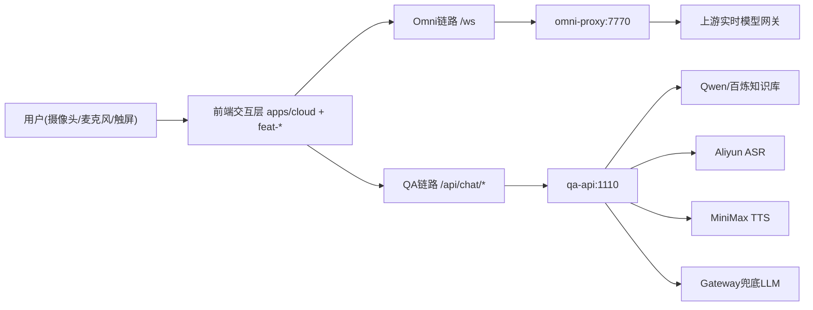
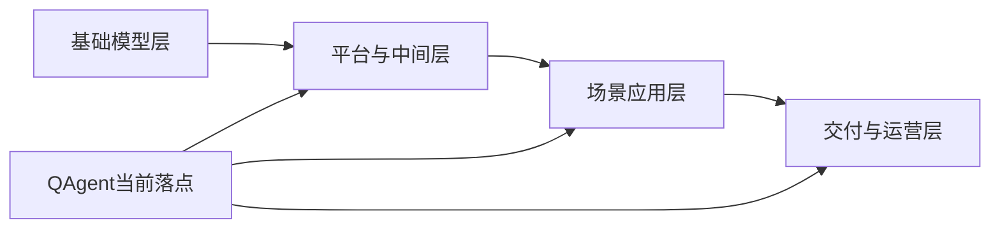

# QAgent 现状功能链路与技术资产盘点（用于技术路线图/BP）

更新时间：2026-03-04  
盘点范围：`D:\MProgram\Mcode\QAgent` 当前代码与部署配置（非远期规划稿）

---

## 0. 执行摘要（给 BP 可直接引用）

QAgent 当前已形成「可运行的多模块交互系统底座」，并在文旅场景下完成了核心体验闭环：  
- **实时多模态对话链路**：前端摄像头/麦克风 -> Omni WebSocket 代理 -> 上游实时模型，具备音视频并发、自动降级（vision 可关闭）、会话引导与稳定性策略。  
- **知识问答链路**：前端全双工会话（ASR + RAG SSE + TTS）-> `qa-api` 多引擎路由（Qwen 知识库 / 百炼 / 网关兜底），并有明确的防幻觉策略与固定口径保护。  
- **沉浸式内容链路**：知识图谱（3D + 手势）和两款体感游戏已实现完整玩法状态机与音视频反馈。  

从“平台化”角度看，项目已经沉淀出一批可复用能力（实时会话框架、TTS/ASR/RAG 统一适配、时间语义引擎、触屏大屏稳定性策略、模块化功能包），可直接作为后续多场景 Agent 产品的 L1/L2 复用层。

---

## 1. 当前已实现能力（按真实代码口径）

> 说明：以下以“代码可运行/已接线”为准，不按 v1.0 远期文档口径统计。

### 1.1 已落地功能清单

1) **Omni 实时视频交互（已落地）**  
- 前端：`feat-omni` 的 `FifthPage` + `useRealtimeConnection`  
- 后端：`services/omni-proxy`（Python aiohttp）  
- 协议：浏览器 WebSocket -> `/ws` -> 上游实时模型  
- 能力点：音频上行、视频帧上行、实时转写、流式语音回放、会话 primer、防重复连接、断连清理、vision 能力协商。

2) **QA 多模态知识问答（已落地）**  
- 前端：`feat-qa` 的 `HistoryPage` + `useQAConnection`  
- 后端：`services/qa-api`（Express + TS）  
- 协议：`/api/chat/rag`（SSE）、`/recognize`（ASR）、`/synthesize-stream`（TTS）  
- 能力点：实时 ASR 优先 + 批式回退、RAG 流式返回、句级 TTS 队列、多轮上下文、来源引用回传、阶段状态回传。

3) **非遗文化知识图谱（已落地）**  
- 前端：`CulturePage` 复用原生 JS 图谱引擎  
- 能力点：3D 图谱、手势交互（捏合/双手旋转缩放/张手退出）、知识弹窗、自动讲解、欢迎语+BGM。

4) **精品图鉴（已落地）**  
- 前端：`GalleryPage` 动态扫描图集目录 + 分类浏览 + 全屏查看器。

5) **AI 游戏模块（已落地）**  
- 游戏大厅：`GameHomePage`（含 180 秒无操作回退）  
- 游戏1：接福袋（完整状态机 + 多道具 + 连击 + 成就 + TTS 结算）  
- 游戏2：妈祖灵签（欢迎/生肖/目的/上香/摇签/解签完整流程 + TTS + 雷达图）。

6) **触屏大屏运行稳定性（已落地）**  
- 超时回退、白屏检测、Kiosk 启动参数、容器自动重启策略、交互防误触策略（来自部署与更新日志）。

7) **工程化与部署（已落地）**  
- Monorepo（pnpm workspace）+ Docker Compose（3 服务）  
- Nginx 单入口（6660），反向代理 WS 与 QA API  
- Windows/Unix 启动脚本。

### 1.2 明确“未落地/占位”模块

- `feat-photo`：页面占位（TODO，尚未接入真实拍照后端）。  
- `feat-py`：页面占位（TODO，尚未接入体感皮影后端）。  
- `services/admin-api`：仅 package 占位描述，未见业务实现。  
- `photo-api/capture`：在架构文档中出现，但当前仓库未见对应服务实现目录。

---

## 2. 现网级链路梳理（完整业务流）

## 2.1 系统总体链路（ASCII）

```text
[用户(摄像头/麦克风/触屏)]
          |
          v
[前端交互层 apps/cloud + feat-* 页面]
          |
          +----------------------------+
          |                            |
          v                            v
[Omni链路: /ws]                 [QA链路: /api/chat/*]
          |                            |
          v                            v
[omni-proxy:7770]               [qa-api:1110]
          |                            |
          v                            +--> [Qwen/百炼知识库]
[上游实时模型网关]               +--> [Aliyun ASR]
                                       +--> [MiniMax TTS]
                                       +--> [Gateway兜底LLM]
```

## 2.2 系统总体链路（Mermaid）



---

## 3. 关键功能的端到端链路（可直接写进技术路线图）

### 3.1 Omni 实时对话链路

1. 用户进入 `FifthPage`，本地先开摄像头预览。  
2. 页面发起 `ws://.../ws` 到 `omni-proxy`。  
3. `omni-proxy` 与上游实时模型建立 WS，并下发 `proxy.capabilities`。  
4. 前端先发音频帧，再按能力发视频帧（满足上游时序约束）。  
5. 上游返回 transcript/audio delta；前端边播边渲染文本。  
6. 连接异常、权限异常、设备占用均有可视化错误反馈 + 清理逻辑。

**技术价值**：实现了“低延迟多模态会话骨架”，后续接任何实时模型只需改代理层与 session 参数。

### 3.2 QA 问答链路（语音全双工）

1. 用户点击播放进入会话，`useQAConnection` 启动实时 ASR。  
2. 实时 ASR 不可用时自动回退到 VAD + 批式 `/recognize`。  
3. 文本问题发往 `/api/chat/rag`，服务端以 SSE 流式回传 `status/content/references`。  
4. 前端句级切分内容并调用 `/synthesize-stream` 实时播报，支持打断。  
5. 后端根据配置选择知识库源：Qwen/百炼；异常或无答案触发网关兜底。  
6. 服务端内置固定口径问答（位置/票价）避免关键事实幻觉。

**技术价值**：形成“ASR-RAG-TTS 可插拔编排模板”，可复用到导览、客服、讲解、教育问答等。

### 3.3 知识图谱链路（手势交互）

1. `CulturePage` 加载知识图谱 JSON 与 3D 画布。  
2. HandOverlay 输出手部关键点。  
3. 手势状态机驱动视角控制、节点选择、弹窗讲解、退出逻辑。  
4. 讲解期间控制 BGM 暂停/恢复，形成完整沉浸体验。

**技术价值**：把“视觉交互”从传统点击升级为“空间手势交互”，具备展陈场景差异化优势。

### 3.4 游戏链路（状态机化体感交互）

1. 游戏首页进入目标游戏。  
2. 游戏内部以明确状态机推进（校准/引导/主玩法/结算）。  
3. 手势识别 + 音效 + TTS + 视觉反馈闭环。  
4. 超时自动回退，保障一体机无人值守稳定运行。

**技术价值**：沉淀了“体感玩法引擎化经验”（校准、容错、节奏控制、结果播报）。

---

## 4. 技术优势（对外可讲）

1) **模块化架构可演进**  
`feat-*` 功能包 + `services/*` 解耦，支持“功能增量上新”而不是大重构。

2) **多模型/多供应商容灾能力**  
知识问答支持多后端策略与 fallback，降低单供应商风险。

3) **交互链路完整，非 Demo 级**  
从识别、推理到播报、超时回退、异常处理都具备闭环。

4) **大屏/文旅实战特性明显**  
Kiosk、防误触、白屏恢复、自动回退，这些是真实场景刚需能力。

5) **可复用技术资产已成型**  
时间语义引擎、文本清洗、实时连接 Hook、QA 会话 Hook、统一样式/UI 组件。

---

## 5. 技术价值（可写 BP 的“护城河”表达）

### 5.1 商业价值映射

- **交付效率**：Monorepo + 功能包复用，支持多项目快速复制。  
- **稳定运营**：超时回退/自恢复机制降低现场运维成本。  
- **体验差异化**：语音 + 视频 + 手势 + 游戏化，形成高停留与可传播体验。  
- **可持续增长**：同一底层可扩展更多主题内容（地方文化、博物馆、教育馆、品牌馆）。

### 5.2 技术沉淀价值

- 实时会话引擎（音视频与文本统一会话）  
- QA 编排引擎（ASR/RAG/TTS 编排）  
- 交互状态机模式（游戏与导览可复用）  
- 内容中台雏形（知识库、图谱、图鉴、签文模板）

---

## 6. 技术债务（分级）

### P0（建议优先）

1. **文档与代码存在分叉**：部分架构文档与当前实际路由/应用形态不一致（如 cloud 侧实现更轻）。  
2. **关键能力分散实现**：`useRealtimeConnection` 在不同目录存在近似实现，后续维护成本高。  
3. **服务边界与规划差距**：`photo-api/capture/admin-api` 尚未实装，影响“全链路五模态”叙事闭环。

### P1（中期）

1. **可观测性不足**：缺统一指标（会话时延、ASR 成功率、fallback 触发率、TTS 失败率）。  
2. **自动化测试不足**：复杂状态机（游戏/手势）缺系统化回归。  
3. **配置治理待加强**：多环境变量依赖外部人工配置，缺一键验证与健康巡检脚本。

### P2（优化）

1. **UI/交互资产体积较大**：资源加载与缓存策略仍有优化空间。  
2. **类型边界可继续收敛**：JS/TS 混合模块可逐步补齐类型声明。  
3. **平台抽象可继续上提**：会话、音频、超时、错误恢复可进一步沉淀为统一 SDK。

---

## 7. 可作为“平台层”复用的能力清单（重点）

1) **Realtime Session 层**  
- 统一处理 WS 会话、音视频帧、重连、打断、primer、能力协商。

2) **QA Orchestration 层**  
- 统一处理 ASR -> RAG SSE -> TTS 的全双工对话编排与回退。

3) **Model Gateway Adapter 层**  
- 屏蔽 Qwen/百炼/自有网关差异，支持策略切换。

4) **Time & Content Safety 层**  
- 时间语义引擎 + 文本清洗 + 固定口径问答，降低幻觉与错误播报风险。

5) **Interaction Runtime 层**  
- 统一超时回退、无操作检测、Kiosk 运行守护、白屏恢复。

6) **Feature Packaging 层**  
- `feat-*` 标准化功能包模式，支持按场景拼装不同“行业 Agent 应用”。

---

## 8. 给技术路线图/BP的建议写法（可直接套用）

### 阶段表述建议

- **阶段A（已完成）**：多模态交互底座打通（Omni + QA + 图谱 + 游戏）  
- **阶段B（在途）**：补齐 photo/py/admin 服务，统一会话与观测平台  
- **阶段C（放大）**：平台化输出到多行业场景，形成可复制交付产品线

### 核心叙事建议

“QAgent 不是单点功能，而是已具备复用价值的‘交互 Agent 平台雏形’：  
底层统一会话和模型编排，中层沉淀可复用能力，上层按行业快速装配场景应用。”

---

## 9. 结论

当前 QAgent 已具备：  
- 可运行、可部署、可演示、可扩展的核心技术闭环；  
- 对外可讲清楚的技术价值与差异化优势；  
- 可进一步平台化沉淀的明确资产路径。  

下一步若以“平台产品化”为目标，应优先做三件事：  
1) 对齐文档与真实实现；  
2) 收敛重复实现并统一能力层；  
3) 用可观测与测试体系把“可演示”升级为“可规模化交付”。

---

## 10. 竞争位置判断：全球视角与中国视角

## 10.1 产业位置图（ASCII）

```text
[基础模型层]
  OpenAI / Google / Anthropic / 阿里云通义 / 百度文心 / 讯飞星火 ...
            |
            v
[平台与中间层]
  模型网关 / RAG编排 / 实时会话 / Agent框架 / 行业知识库
            |
            v
[场景应用层]
  文旅导览 / 展馆讲解 / 数字人互动 / 体感娱乐 / 商业空间运营
            |
            v
[交付与运营层]
  一体机部署 / Kiosk守护 / 内容更新 / 运维监控 / 数据闭环

QAgent当前落点：平台与中间层 + 场景应用层（文旅）+ 交付运营层（初步）
```

## 10.2 产业位置图（Mermaid）



---

## 11. 全球视角：优势、短板、所处位置

### 11.1 优势（Global）

1. **场景闭环强于纯模型演示**  
相较于很多“只展示模型能力”的方案，QAgent 已经把交互、内容、部署和现场稳定性串成可运行链路。

2. **多模态体验完整**  
具备“语音 + 视频 + 手势 + 游戏化”的融合交互，体验层面接近国际头部的线下体验产品范式。

3. **对模型厂商相对中立**  
QA 链路已有多源接入与 fallback 机制，天然有利于后续做成本、性能和可用性优化。

4. **真实交付导向**  
有大屏/Kiosk 稳定性治理经验，这一点在国际上也是从“Demo”迈向“商业化”的关键分水岭。

### 11.2 短板（Global）

1. **平台化深度仍早期**  
目前仍偏“项目工程能力”，距离标准化 PaaS（多租户、权限、计费、可观测）还有明显距离。

2. **数据网络效应未形成**  
尚未看到大规模会话数据闭环、自动评估与持续优化机制，这会影响长期壁垒深度。

3. **国际生态与渠道弱**  
全球化商业化通常依赖伙伴生态（云、SI、硬件、ISV），当前 QAgent 仍以单项目穿透为主。

### 11.3 所处位置（Global）

在全球视角，QAgent 更接近：  
- **“行业交互 Agent 解决方案商（vertical solution）”早中期阶段**，  
而非通用基础模型平台玩家。  

一句话：**不是跟 OpenAI 这种基础模型公司正面竞争，而是基于多模型能力做线下场景产品化的“最后一公里”竞争。**

---

## 12. 中国视角：优势、短板、所处位置

### 12.1 优势（China）

1. **文旅线下场景适配度高**  
中国文旅项目强调“可感知、可互动、可运营”，QAgent 的链路天然匹配这种需求。

2. **本地化语音与内容表达更贴近业务**  
固定口径、知识库和文化内容结构化处理，适合快速复制到地方文旅/博物馆等项目。

3. **工程落地能力突出**  
部署、回退、自恢复、触屏体验等工程细节，对中国甲方来说是“能不能上线”的核心指标。

4. **成本可控空间较大**  
通过模型切换、fallback、本地化部署策略，具备较好的成本优化潜力。

### 12.2 短板（China）

1. **平台标准化能力需补齐**  
中国市场竞争会快速从“能做”进入“规模复制”，这要求更强的标准化交付与平台能力。

2. **品牌与渠道壁垒尚弱**  
与头部云厂商/大集成商相比，品牌认知、渠道触达和大项目中标能力仍需建设。

3. **产品线深度不足**  
photo/py/admin 等模块尚未完整闭环，影响“全栈交互 Agent 平台”的市场叙事完整度。

### 12.3 所处位置（China）

在中国视角，QAgent 当前更像：  
- **“文旅智能交互中台 + 方案交付团队”的成长期产品**。  

一句话：**已经越过“概念验证”，正在从“单项目成功”走向“可复制商业化”。**

---

## 13. 未来方向（建议 12-24 个月）

### 方向A：从“项目制”升级为“平台制”

- 统一会话中台（Omni/QA/Game 的连接、日志、策略统一）  
- 多租户项目管理（景区/展馆/活动模板化）  
- 观测与评测体系（时延、成功率、留存、满意度）

### 方向B：从“功能交付”升级为“运营闭环”

- 内容运营后台（知识库、话术、活动素材、A/B 测试）  
- 用户行为分析（热门问题、路径漏斗、转化率）  
- 自动优化（问题改写、答案纠偏、低质量会话回放）

### 方向C：从“文旅单场景”扩到“多行业模板”

- 文旅导览模板  
- 展馆讲解模板  
- 商业空间迎宾模板  
- 政务/教育互动服务模板

### 方向D：打造“软硬一体”护城河

- 标准硬件适配清单  
- 边缘部署策略（离线可用、弱网可用）  
- 现场运维工具（远程诊断、健康巡检、自动恢复）

---

## 14. 竞品公司与竞品格局（分层，不完全名单）

> 说明：这里采用“分层竞品”方法。QAgent 的真实竞争不只是一家公司，而是跨层竞争。

### 14.1 全球代表（按层）

1) **基础模型/多模态能力层**  
- OpenAI  
- Google DeepMind  
- Anthropic  
- Meta（开源生态侧）

2) **云与平台层（Agent/RAG/实时能力）**  
- Microsoft Azure AI  
- AWS AI  
- Google Cloud Vertex AI

3) **线下交互与数字人方案层（跨行业）**  
- 各类海外数字人/交互体验方案商（通常与系统集成商绑定）

### 14.2 中国代表（按层）

1) **基础模型与云平台层**  
- 阿里云（通义）  
- 百度智能云（文心）  
- 腾讯云（混元生态）  
- 科大讯飞（星火 + 语音能力）

2) **AI 视觉/数字人/行业方案层**  
- 商汤科技  
- 云从科技  
- 部分垂直数字人/展陈交互方案公司（区域性强、项目型明显）

3) **系统集成交付层**  
- 各地文旅信息化集成商、展陈工程公司、硬件集成商（往往是最终采购影响者）

---

## 15. 赛道“水位”判断（深度与拥挤度）

### 15.1 水位结论

- **市场需求水位：中高**（文旅/展馆/商业空间对互动体验需求持续增长）  
- **竞争拥挤水位：高**（方案公司多、同质化快）  
- **技术护城河水位：中**（只做前端体验门槛不高；“平台+运营+交付”一体化门槛更高）

### 15.2 真正难点（决定谁能活下来）

1. 不是“能不能做一个 Demo”，而是“能否 7x24 稳定跑”。  
2. 不是“能不能接一个模型”，而是“能否长期控制成本/时延/质量”。  
3. 不是“能不能上线一次”，而是“能否跨项目复制并持续运营”。

### 15.3 对 QAgent 的含义

QAgent 已经进入“有资格竞争”的水位，但下一阶段必须把优势从“功能体验”升级为“平台复用 + 运营效率 + 可复制交付”。

---

## 16. 一句话战略定位（可放 BP 首页）

**QAgent 的定位不是做通用大模型，而是做面向线下交互场景的“多模态 Agent 平台化产品”，以真实交付能力和可复制运营能力构建壁垒。**

