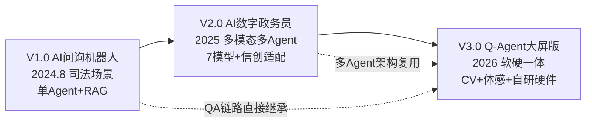
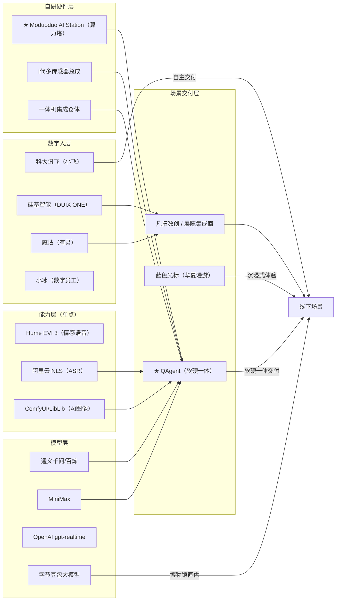

# QAgent 技术资产与平台复用盘点

> 基于源码逐文件审计 + 硬件实物核验 + 产品交付历史还原 | 2026-03-04（03-04 更新：补充 CV 引擎 & 皮影戏模块 & 自研硬件系统 & 司小宣V1/V2交付实况修正）
> 主仓库：`D:\MProgram\Mcode\QAgent` | 当前版本：v0.1.2
> CV 引擎仓库：`D:\MProgram\Moduoduo CV\PY\Moduoduo-PYX` | 已完成，待集成
> AI 拍照仓库：`D:\MProgram\Mcode\PYALL\PY0206\PiYing-piYing_ai_photo_optim_5sPreview_11styles_no_trainsition` | 已完成，待集成
> 硬件资料：`E:\Jzzg\模多多AI一体机\` | 含算力塔设计/实拍、2号机图纸、传感器总成、交付方案
> 司小宣产品资料：`E:\Jzzg\问询机器人\` | 含2024初代/2025迭代/产品资料打包/版权证书/运营报告

---

## 一、项目定位

面向政企线下场景的 **软硬一体** AI 数智人交互系统。产品代际演进：

| 代际 | 产品名 | 时间 | 场景 | 状态 |
|---|---|---|---|---|
| **V1.0** | AI 问询机器人「司小宣」 | 2024 年 8 月发布 | 司法局公共法律服务（陕西省蓝田县） | **已交付运营**，央媒《法治日报》报道，省级司法厅官方发布 |
| **V2.0** | AI 数字政务员「司小宣」 | 2025 年迭代 | 多模态+多模型+多 Agent 升级，支持政务云/信创/私有化部署 | **已交付运营**，多版本交付（标准/微定制/数智人/深度定制） |
| **V3.0** | Q-Agent 大屏文旅版 | 2026 年 | 文旅/金融线下大屏交互 | **2号机已交付**（汕尾文旅 4 台），**1号机跟进中**（香港中银订单） |

自研三大硬件模块：**Moduoduo AI Station（算力塔）+ I 代多传感器总成 + 一体机集成仓体**。
已交付落地项目：
- **司法场景**（V1→V2）：陕西蓝田·司法局小程序，2024 年 8 月首发，持续运营至今（含版权登记：国作登字-2025-F-00267290）
- **2号机**（V3，户外落地）：广东汕尾·凤山民俗文化旅游区（非遗皮影文化），86寸户外大屏，2026 年 1 月 31 日交付 4 台
- **1号机**（V3，室内壁挂）：香港铜锣湾·中国银行(香港) 470 项目，65寸 4K 触控屏，**跟进中订单**

当前已形成 **5 条完整可运行的业务链路**（其中皮影戏、AI 拍照两条链路已开发完成、待集成） + **1 套自研硬件系统** + **1 套生产级部署方案**。V1/V2 的政务问答能力是 V3 QA 链路的直接前身。

---

## 二、工程架构实况

### 2.1 仓库结构（pnpm monorepo）

```
QAgent/
├── apps/cloud/                  # 云端预览版前端（端口 7700，当前仅加载 Omni 页）
├── packages/                    # 功能包层（pnpm workspace）
│   ├── feat-start/              # 开机引导 & 待机页（页面1-4 + 转场动画1-4）
│   ├── feat-omni/               # Omni 实时视频交互（页面6）
│   ├── feat-qa/                 # 知识问答系统（页面8 + 3个子页面）
│   ├── feat-game/               # 体感游戏（页面10-12）
│   ├── feat-photo/              # AI拍照（QAgent 内占位，独立实现已完成待集成）
│   ├── feat-py/                 # 体感皮影戏（QAgent 内占位，Moduoduo-PYX 已完成待集成）
│   ├── ui/                      # 公共 UI 组件库
│   ├── lib/                     # 共享工具库（零依赖纯函数）
│   └── styles/                  # 全局样式 & CSS 变量
├── services/                    # 后端服务层
│   ├── omni-proxy/              # Omni 实时 WS 代理（Python/aiohttp，端口 7770）
│   ├── qa-api/                  # 知识问答 API（Node.js/Express，端口 1110）
│   └── admin-api/               # 后台管理（仅 package.json 占位）
├── tools/
│   ├── dev-workbench/           # 开发预览系统（端口 9990 + 页面流 6660）
│   └── scripts/                 # 一键启动脚本
├── deploy/                      # Docker Compose + Nginx + Kiosk 配置
└── public/                      # 共享静态资源（视频、图片、音频、模型）

# ── 外部仓库（已完成，待集成到 QAgent）──
Moduoduo-PYX/                    # CV 引擎 + 体感皮影戏（独立仓库）
├── engine/                      # CV 引擎核心（Pose + Hand + Face + Emotion）
│   ├── config/default.yaml      # 引擎配置（摄像头/模型/坐标/阈值）
│   └── src/                     # pose_tracker / hand_tracker / face_analyzer / tcp_sender
├── engine_adapter.py            # 主适配器（三模块融合 → 标准 JSON 输出）
├── moduoduo_cv_dashboard.py     # 全功能调试面板（骨骼+姿态+人脸+TCP+MJPEG）
├── moduoduo_cv_face.py          # 人脸表情轻量版
├── skeleton_data/               # 骨骼数据中继（TCP→WebSocket + 平滑/校验/坐标变换）
│   ├── skeleton_relay_server.py
│   ├── communication/           # tcp_receiver + websocket_server + message_formatter
│   └── processor/               # smoother + validator + coordinate_transformer
├── frontend/                    # React 19 + Unity WebGL 皮影戏前端
│   ├── src/components/          # ZodiacSelector / HandMusicPlayer / SkeletonOverlay
│   └── public/build/            # Unity WebGL 编译产物
├── start.ps1 / stop.ps1         # 一键启动/停止
└── requirements.txt
```

### 2.2 技术栈

> V3 技术栈（当前 QAgent monorepo）

| 层 | 技术 |
|---|---|
| 前端框架 | React 18 + TypeScript + Vite 6 |
| 样式 | 原生 CSS + CSS 变量 + Tailwind（游戏模块） |
| 计算机视觉（浏览器端） | MediaPipe Tasks Vision（HandLandmarker，用于游戏+知识图谱） |
| 计算机视觉（Python 端） | MediaPipe PoseLandmarker + HandLandmarker + FaceLandmarker + FER 情绪识别 + DeepFace（可选）|
| 游戏引擎 | Unity WebGL（皮影戏角色控制，编译为 Web 产物嵌入 React） |
| 音频合成 | Tone.js（中国古典乐器：古琴/琵琶/古筝/箫 + 打击乐） |
| 骨骼数据中继 | TCP（引擎→中继）+ WebSocket（中继→前端），含平滑/校验/坐标变换 |
| AI 图像生成 | ComfyUI 工作流驱动 + LibLib API + 兼容 OpenAI 接口，三 Provider 策略切换 |
| AI 拍照后端 | FastAPI + uvicorn + httpx（异步）+ Pillow |
| 3D 可视化 | three.js + 3d-force-graph |
| 后端 A（实时） | Python 3.11 + aiohttp（WebSocket 双向代理） |
| 后端 B（问答） | Node.js 20 + Express + TypeScript |
| 农历/节气 | lunar-javascript（后端时间引擎依赖） |
| 部署 | Docker Compose（3 容器）+ Nginx 反代 + Chrome Kiosk |
| 包管理 | pnpm 8+ workspace |

> V1/V2 技术栈（司小宣问询机器人→数字政务员，QAgent QA 链路的前身）

| 层 | 技术 |
|---|---|
| AI 基座模型 | 百度文心 ERNIE 4.5 系列（Turbo-128k / VL / X1） |
| RAG 知识库 | 3 套 RAG + 1 套 Knowledge Graph（司法/政策法规/政策解读/信息公开） |
| Agent | 5 Agent 协同调度（多模型路由 + 上下文融合） |
| 语音 | 百度 ASR（含方言识别）+ TTS |
| 法律领域模型 | 法律领域小模型（专项微调） |
| 前端 | uni-app / H5 / Web 三端 |
| 部署 | 华为云 Flexus ECS + ELB + WAF + DCS Redis + AZA |
| 信创适配 | 鲲鹏/飞腾/麒麟全栈国产，等保三级 |

### 2.3 产品代际演进（V1→V2→V3）

#### V1.0「AI 问询机器人·司小宣」（2024.8 — 2024.12）

- **场景**：陕西蓝田·司法局，搭载于微信小程序，为群众提供公共法律服务
- **技术栈**：LLM + RAG + Agent + TTS + ASR（单 Agent 架构）
- **AI 基座**：百度文心 ERNIE 系列
- **部署**：华为云 Flexus ECS + Nginx + Docker + EIP
- **交付形态**：小程序/H5/Web 三端
- **里程碑**：
  - 2024.8 深圳全球通用人工智能大会发布
  - 2024.8 深圳展会展出
  - 2024.10 下乡宣传推广（田间地头公共法律服务）
  - 2024.11 蓝田公共法律服务中心落地
  - 2024.12 地方电视台报道
  - 2025.01 《法治日报》第 04 版报道、陕西省司法厅官方公众号发布
- **同期衍生**：安小居（安居集团·保障房咨询）、银小服（银行业问询）

#### V2.0「AI 数字政务员·司小宣」（2025.3 — 2025.12）

- **架构升级**：多模态 + 多模型 + 多 Agent
- **模型矩阵**：同时调用 7 个模型
  - ERNIE 4.5 Turbo-128k（长文本）
  - ERNIE 4.5（基座）
  - ERNIE 4.5 Turbo-VL（图文混合）
  - ERNIE X1（复杂推理）
  - ASR 语音模型 + TTS 语音模型
  - 法律领域小模型
- **能力矩阵**：1 个 IP · 2 个页面 · 3 种模态 · 5 个 Agent · 3 套 RAG · 1 套 Knowledge Graph · N 个工具插件
- **信创适配**：兼容鲲鹏/飞腾/麒麟信创软硬件栈，支持政务云/专网/私有化/终端搭载 4 种部署模式
- **交付版本**：标准版 / 微定制版 / 数智人版 / 深度定制
- **部署架构**：WAF + ELB 负载均衡 + ECS × 2 + DCS Redis + AZA（可用区冗余）
- **里程碑**：
  - 2025.3 迭代功能需求确认、UI 第一稿
  - 2025.3 接入 DeepSeek-R1 测试
  - 2025.4 Agent 能力测试
  - 2025.5 产品发布会、九章之光演讲（"软硬件安可 + 多智能融合"）
  - 2025.5 全新 UI 上线（手机端 + Web 端）
  - 2025.7 扩展场景：AI 党建、AI 街道社区
  - 2025.9 版权登记获批（国作登字-2025-F-00267290）
  - 2025.12 全年运营报告
- **线上体验**：sixiaoxuan.com
- **延伸产品线**（基于同一底座）：
  - AI 党建（2025.7）
  - AI 街道社区（2025.7）
  - AI 数字政务员报价单（标准/微定制/数智人/深度定制 4 级定价）

#### V3.0「Q-Agent 大屏交互版」（2026.1 — 至今）

- **场景跃迁**：从移动端→65/86 寸线下大屏，增加体感交互、数智人、CV 引擎
- **技术栈**：React 18 + TypeScript + pnpm monorepo + Python CV + 自研算力塔硬件
- **AI 基座**：切换至 Qwen-Omni-Realtime / Moduoduo-Pro 网关 + 阿里云百炼 RAG + MiniMax TTS
- **新增能力**：实时多模态视频对话、体感皮影戏、AI 风格化拍照、手势音乐、知识图谱
- **硬件首次集成**：自研算力塔 + 传感器总成 + 一体机仓体
- **交付**：2号机（汕尾文旅 × 4 台已交付），1号机（香港中银 470 跟进中）

#### 代际关系图



### 2.4 自研硬件系统（已量产交付）

整机架构为 **云/边/端** 三层协同：

```
┌─────────────── 云 ──────────────┐  ┌──────────── 边（算力塔）────────────┐  ┌──────── 端（一体机）────────┐
│ ⚫ 大模型集群（Qwen/MiniMax/…） │  │ ⚫ 本地模型 / RAG 知识库             │  │ ⚫ 4K 高清摄像头（拍照）    │
│ ⚫ 全模态 API（TTS/ASR/VLM）    │  │ ⚫ 本地 TTS/ASR                      │  │ ⚫ RGB-D 深度相机（动捕）   │
│ ⚫ 超级 Agent / 联网搜索        │  │ ⚫ 动作捕捉 + 空间计算               │  │ ⚫ 8 阵列麦克风 ×2 组       │
│ ⚫ 实时数字人驱动               │  │ ⚫ 动效交互 / 实时高清渲染            │  │ ⚫ 定向声学播放              │
│ ⚫ ComfyUI 工作流 / 图像生成    │  │ ⚫ Docker + Nginx + Chrome Kiosk     │  │ ⚫ LCD 触控显示屏            │
└─────────────────────────────────┘  └─────────────────────────────────────┘  └─────────────────────────────┘
          ↕ WebSocket / HTTPS                    ↕ USB 3.0/3.2 / Type-C                 物理连接
```

#### 2.4.1 Moduoduo AI Station（算力塔，自研）

自主设计的边缘 AI 计算单元，**已完成 ID 设计 → 结构设计 → 打样 → 量产**，2号机配置已交付 4 台（汕尾文旅），1号机配置用于香港中银 470 项目（跟进中）。

| 组件 | 1号机配置（香港·高端） | 2号机配置（汕尾·量产） |
|---|---|---|
| **GPU** | Nvidia RTX 5880 Ada **48GB** ECC（14,080 CUDA 核心，显存带宽 960GB/s） | ASUS PRIME RTX 5080 **16GB**（10,752 CUDA 核心） |
| **CPU** | AMD Ryzen Threadripper 9960（Zen 5，4nm，24C/48T，基准 4.2GHz / 加速 5.4GHz，88 条 PCIe 5.0 通道，完整 AVX-512） | AMD Ryzen 9 9950X3D（Zen 5，4nm，16C/32T，基准 4.3GHz / 加速 5.7GHz，144MB L2+L3 缓存，3D V-Cache） |
| **主板** | ASUS Pro WS TRX50-SAGE WIFI（PCIe 5.0 / DDR5 / WiFi 7 / 10Gb+2.5Gb 双网口） | ASUS ProArt 系列（PCIe 5.0 / DDR5 / WiFi 7 / HDMI 2.1 / DisplayPort 1.4 8K@60Hz / USB4） |
| **内存** | 48GB DDR5 ECC | G.SKILL Trident Z5 Royal DDR5 **64GB**（32G×2，C28 EXPO） |
| **存储** | NVMe SSD | Samsung 990 PRO **2TB**（M.2 NVMe PCIe 4.0，读速 7450MB/s） |
| **散热** | 定制方案 | Noctua NH-D15 G2 HBC LBC（二代旗舰，8 热管回流焊，双塔风冷） |
| **机箱** | 自研铝合金机箱（244mm × 523mm × 567mm），金色阳极氧化表面 + moduoduo 品牌 LOGO | 同左（量产版为银色喷砂阳极氧化铝） |
| **外壳工艺** | CNC + 阳极氧化 + 六面网孔散热设计 + 模块化组装 | 同左 |

> **关键指标（PDF 技术规格书）：**
> - GPU 竖插 + PCIe 延长线，方便维护
> - TensorRT 量化加速（FP16→INT8），CUDA Graph 优化
> - 支持本地跑模型 + 空间计算 + 感知交互 + 端到端实时高清驱动 + 动捕 + 生成 + 高清渲染
> - 核心采购成本约 9 万元（京东价），vs 传统广告机主板 400 元——本质区别在于 AI 算力

#### 2.4.2 I 代多传感器总成（自研）

自主设计的多模态感知模组，**已完成结构设计 → 3D 打印手板 → 定型**，内嵌在屏幕上方。

| 传感器 | 型号 / 规格 | 接口 | 功能 |
|---|---|---|---|
| **4K 广角高清摄像头** | Sony IMX 4K/8K 广角模组 / Logitech Brio 4K（拆壳版） | USB 3.0 | 拍照、人脸识别、视觉理解 |
| **RGB-D AI 深目相机** | 奥比中光 Femto Bolt / Intel RealSense D455 | USB 3.2 Gen1 / Type-C | 骨骼动捕、靠近唤醒、空间计算、3D 点云 |
| **定向声学麦克风阵列** | 科大讯飞定制（8 麦克风阵列 × 2 组） | USB / I2S | AEC 回声消除 + 波束成形（数字人说话时自动过滤其声音，只听用户） |

> **传感器总成结构件：** 已完成 3D STP 建模 + BOM 清单 + 手板报价。含摄像头模组外壳、麦克风模组壳体、线材图纸（奥比中光深度相机 + 海康 4K 摄像机 + 声卡 16pin 连接 + USB 延长）。

#### 2.4.3 一体机整机

**1号机（室内壁挂型）**

| 参数 | 规格 |
|---|---|
| 定位 | 室内一体机，金融类高净值客户 |
| 屏幕 | 65寸 LCD 进口屏，4K 3840×2160，120Hz 刷新率 |
| 触控 | 高性能玻璃电容式触摸屏，报点率 240Hz+ |
| 安装 | 壁挂，整体厚度预留 75.3mm |
| 表面 | 表面钢化玻璃 |
| 散热/供电 | 独立散热、独立供电 |
| 认证 | 欧标 / 顶级配置，全套 RoHS 声明 |
| 落地项目 | 香港铜锣湾·中国银行(香港) 470 项目（**跟进中订单**，非已交付） |

**2号机（户外落地型）**

| 参数 | 规格 |
|---|---|
| 定位 | 户外一体机，文商旅类客户 |
| 屏幕 | 86寸户外 LCD 屏 |
| 整机尺寸 | 1590mm（宽）× 2280mm（高）× 680mm（深） |
| 屏幕有效区域 | 1066mm（宽）× 1895mm（高），离地 200mm |
| 结构 | 三层结构：正面第一层外壳 → 第二层屏幕 → 第三层仓体（管理仓 + 配电 + 空调 + 散热） |
| 散热 | 空调散热孔 + 侧面检修开门 |
| 连接 | 强弱电外接线孔、4G 天线、吊环安装孔 × 4 |
| 传感器位置 | 屏幕上方：感光遥控 + 扬声器 + 传感器 + 麦克风 |
| 认证 | 国标 / 中档配置，全套 3C + 出厂检验报告 |
| 工程图纸 | 完整六视图（主/左/右/后/俯/仰）+ 45° 正面/背面爆炸图 + 正面/背面结构拆解图 + 剖面及轴爆炸图 + 3D STP 文件 |
| 落地项目 | 广东汕尾·凤山民俗文化旅游区，2026 年 1 月 31 日交付 4 台 |

#### 2.4.4 系统软件栈（已锁版本）

算力塔运行 Windows 11 (AMD64)，软件版本锁定如下：

| 软件 | 版本 | 用途 |
|---|---|---|
| WSL2 + Ubuntu | 随 Windows 11 内置 | Linux 子系统 |
| Docker Desktop | 4.37.2 (179585) | 容器化部署 |
| Node.js | v20.19.5 | QAgent 前端 + qa-api |
| Python | 3.11.9 | CV 引擎 + omni-proxy + AI 拍照后端 |
| NuiTrack | v0.38.1 | 体感 SDK（Orbbec 深度相机驱动） |
| VS Code / Cursor | 最新版 | 远程开发 |
| 向日葵 + UU 远程 | 最新版 | 远程运维（向日葵主用 / UU 为梯子环境备用） |
| Clash Party | 1.9.1 | 网络代理（海外 API 调用） |

#### 2.4.5 性能指标（技术规格书标注）

| 指标 | 数值 |
|---|---|
| 文本对话端到端 | < 500ms（LLM + RAG） |
| 语音交互端到端 | 交付值 3-4s，实测首音返回 < 2s |
| 实时视觉识别 | < 300ms（YOLO + VLM 双层架构） |
| YOLO 单帧检测 | < 30ms |
| VLM 深度理解 | < 800ms（按需调用） |
| AI 智能拍照 | < 5s |
| 实时图像生成 | < 5s（文生图 / 图生图） |
| 数字人驱动渲染 | 30-60 FPS |
| 主动打招呼响应 | < 2s（从检测到开始说话） |
| 3D 深度感知 | < 300ms（RealSense + 点云） |
| 语音识别准确率 | > 95%（中文普通话） |
| 人脸识别准确率 | > 98% |
| 知识问答准确率 | > 90%（知识库内） |
| 意图识别准确率 | > 85% |
| 系统可用性 | > 99%（7×24 小时） |
| 平均无故障时间 | > 720 小时（30 天） |
| 故障恢复时间 | < 3 分钟（自动重启） |
| 基础模型动态更新 | 48 小时（国内）/ 96 小时（全球）完成最新模型更换 |

---

## 三、已实现的 5 条完整业务链路

### 链路 1：Omni 实时视频对话

```
用户摄像头+麦克风
    ↓ getUserMedia (video 640×480 + audio 16kHz)
浏览器 useRealtimeConnection Hook
    ↓ WebSocket ws://.../ws
omni-proxy (Python aiohttp, 端口 7770)
    ↓ WebSocket 转发 + session.update 注入
上游实时模型 (qwen3-omni-flash-realtime)
    ↓ 音频/文本 delta 回传
前端播放 (PCM16 → AudioContext 24kHz) + 文本渲染
```

**已实现的工程细节：**

- 双供应商支持：DashScope 直连 / Moduoduo 网关，通过 `OMNI_PROVIDER` 环境变量切换
- Vision 能力协商：`proxy.capabilities` 事件通知前端是否启用视频帧，上游拒绝 vision 时自动降级到纯音频
- 音频先行约束：严格遵守上游 API 要求——必须先发 `input_audio_buffer.append` 再发 `input_image_buffer.append`
- Primer 机制：连接建立后自动发送首句问候，防止上游超时断连；2.5 秒内无响应自动重试
- VAD 配置化：阈值、前缀填充、静音时长均可通过环境变量调整
- 生肖口型视频同步：12 套生肖视频，根据 Omni 说话状态 (`omniSpeakingStatus`) 控制播放/暂停
- 介绍视频 → 连接：播完生肖介绍视频 → 300ms 后显示口型视频 → 500ms 后自动发起 Omni 连接
- 唱歌检测：用户消息匹配"唱歌/听歌"等关键词时播放本地歌曲
- 完整资源清理：断连时停止所有 AudioContext、MediaStream、定时器

### 链路 2：QA 多模态知识问答

```
用户语音/点击
    ↓ 实时ASR (阿里云NLS WebSocket) 或 批式ASR (/api/chat/recognize)
    ↓ 或 气泡预设问题点击
前端 useQAConnection Hook
    ↓ POST /api/chat/rag (SSE 流式)
qa-api 路由层
    ├─ 简单问候 → 直接走 Gateway 兜底 LLM (qwen-plus)
    ├─ 场馆位置 → 固定口径直答（硬编码）
    ├─ 景区票价 → 固定口径直答（7项票价+电话，硬编码自官方公示图）
    └─ 知识问答 → Qwen 知识库 App / 阿里云百炼 App（SSE 流式）
        └─ 知识库无答案 → fallback 到 Gateway (qwen-plus)
    ↓ SSE 事件流 (status → content → references → [DONE])
前端句级TTS
    ↓ 每完成一句 → POST /api/chat/synthesize-stream
    ↓ MiniMax T2A v2 流式返回 MP3
    ↓ MediaSource 边收边播（不支持时整段下载播放）
用户说话 → 立即打断当前 TTS + 取消 RAG 请求 → 处理新问题
```

**已实现的工程细节：**

- 双知识库引擎：`KNOWLEDGE_BASE_TYPE=qwen` 走通义千问 App API / `=aliyun-bailian` 走百炼 App API，底层共用 `AliyunBailianService` 类
- 引用来源解析：支持 API 返回的 doc_references、AnswerReference.ItemList、联网搜索结果；API 无引用时从回答文本正则提取（`信息来自《...》`）；区分 knowledge/web 来源类型
- 文本清洗引擎（sanitize.ts）：移除引用标记 `##数字$$`、MCP 工具调用 JSON、假图链接、来源标注、emoji；自动排版（标题/列表/段落分行）
- 时间语义引擎（moduoduo-time-engine.ts，475 行）：
  - 唯一时间源 `now()`：固定 UTC+8，返回公历/农历/干支/节气/节日
  - 时间意图检测 `detectTimeIntent()`：分 knowledge/realtime/mixed 三类，每类对应不同的 prompt 注入粒度
  - 节日查表（2024-2035）：春节/元宵/妈祖诞辰/端午/中秋/重阳 等 12 个节日的精确公历日期，禁止模型自行推算
  - 按需注入：非时间问题只注一行日期（lite），时间问题注完整规则+节日速查表（full）
  - 三层日期解析：节日查表 → 正则（中文日期/ISO/相对时间）→ 口语模糊词（前一阵/大前天/这段时间等）
  - 鲜度判断 `isWithinWindow()`：用于过滤过期搜索结果
- ASR 双通道：优先阿里云 NLS 实时 WebSocket（边说边出字），失败时回退到批式 `/recognize`（录音 → WAV 16kHz → base64 → 一句话识别）
- TTS 双引擎：主用 MiniMax speech-2.8-turbo 流式；备用 Qwen3-TTS-Flash（`/synthesize-qwen` 路由）
- 全双工会话：VAD 检测语音起止 → 自动打断 TTS → 新问题处理；60 秒无输入自动退出会话
- NLS Token 接口：`/api/chat/nls-token` 为前端 WebSocket ASR 提供临时凭证 + 热词 vocabulary_id
- 防幻觉策略：system prompt 含 15 条规则（来源可信度分级、数据合理性检查、时效性标注、禁止跨地域数据拼凑等）

### 链路 3：体感游戏（2 款完整游戏）

**游戏 A — 接福袋（LuckyBagGame）：**

```
加载模型 → 校准左手 → 校准右手 → 校准双手 → READY → 60 秒游戏 → 结算
```

- MediaPipe HandLandmarker 追踪双手，控制竹篮水平位置
- 6 类掉落物：普通福袋/金福袋/元宝/莲花（+5s）/马（双倍10s）/中国结（扣分）
- 三阶段难度递进：热身(0-15s) → 一般(15-35s) → 狂暴(35-60s)
- 连击系统：combo 计数 + 10连击 1.5x 倍率
- 集福成就：5/9/15/20 个稀有福触发祝贺词
- TTS 播报结算：调用 qa-api 的 `/synthesize-stream`，温柔女声口播得分和福气寄语
- 福气寄语：调用 LLM 生成个性化寄语文本
- 校准超时：10 秒未识别自动重试，3 次失败返回游戏大厅
- 两段 BGM：校准阶段 + 游戏阶段各一首循环播放

**游戏 B — 妈祖灵签（MazuFortuneGame）：**

```
欢迎(视频) → 选生肖(12宫格) → 选目的(5项) → 上香(3次) → 摇签 → 解签结果
```

- 上香场景：PrayerTracker 检测双手合十 → 举起 → 放下 = 一炷香，重复 3 次
- 摇签场景：ShakeScene 检测握拳+上下摇动，4 阶段进度（轻微→加大→突出→即将落出）
- 60 支签文系统：每签含签诗四句、典故、5 维运势分数、吉方/吉时/幸运数
- 加权抽签：生肖亲和 ×3，求签目的匹配 ×2，等级概率分布（上上15%/上35%/中上30%/中20%）
- 14 段上香 TTS + 8 段摇签 TTS（本地 MP3 预录音频）
- AI 解签：调用 LLM 生成个性化解读 + TTS 播报（MiniMax Wise Women 声线）
- 结果页：卷轴展开动画 + 竖排签诗 + 印章等级 + 五运雷达图（recharts）+ 个性化解读
- 播放/暂停 TTS 按钮（支持暂停续播，30 秒暂停自动重置）

### 链路 4：体感皮影戏（Moduoduo-PYX，已完成待集成）

> 代码位置：`D:\MProgram\Moduoduo CV\PY\Moduoduo-PYX`
> 状态：**端到端可运行**，尚未合入 QAgent monorepo

```
摄像头（1280×720 @30fps）
    ↓ OpenCV 读帧
engine_adapter.py（三引擎融合）
    ├─ PoseTracker：MediaPipe PoseLandmarker → 33 关键点 → 16 Nuitrack 关节
    ├─ HandTracker：MediaPipe HandLandmarker → 21 点 × 双手 → 手势标签
    └─ FaceAnalyzer：MediaPipe FaceLandmarker + FER → 7 类情绪 + 年龄/性别（可选）
    ↓ 标准 JSON 帧（关节坐标 + 手势 + 情绪 + 姿态）
    ├─ MJPEG 视频流（:9002）→ 前端画面预览
    └─ TCP :9000 → skeleton_relay_server → WebSocket :9001
                                              ↓
                                     React 19 前端（:3007）
                                      ├─ SkeletonOverlay（骨骼叠加层）
                                      ├─ Unity WebGL（皮影戏角色联动）
                                      ├─ HandMusicPlayer（手势古典乐器）
                                      └─ ZodiacSelector（12 生肖角色选择）
```

**已实现的工程细节：**

**A. CV 引擎层（Python）**

- 姿态追踪（PoseTracker）：
  - MediaPipe PoseLandmarker，支持 lite（CPU）/ heavy（GPU）模型切换
  - 33 原始关键点 → 16 个 Nuitrack 格式关节（head/neck/torso/waist/shoulders/elbows/wrists/hips/knees/ankles）
  - 合成关节：neck（肩中点）、torso（肩髋中点）、waist（髋中点）、hand（腕部映射）
  - 虚拟 3D 坐标：归一化 2D → 毫米级虚拟空间（configurable virtual_depth_mm / virtual_width_mm）
  - 腿部遮挡降级：腿部不可见时自动 fallback 到固定参考值
  - 多人支持：最多同时追踪 configurable num_poses 人

- 手部追踪（HandTracker）：
  - 21 关键点/手，双手同时追踪
  - 手势识别：握拳（fist）→ 切换音色；手指独立状态 → 触发打击乐
  - 手部标签可视化：PIL + PingFang SC 字体渲染中文标签（音高/音量/音色/打击）
  - 左手控制琶音（音高=食指Y，音量=中指Y，握拳=切换音色）
  - 右手控制打击乐（拇指=大鼓，食指=堂鼓，中指=梆子，无名指=碰铃，小指=木鱼）

- 人脸情绪分析（FaceAnalyzer）：
  - FER（Facial Emotion Recognition）：识别 7 类情绪（angry/disgust/fear/happy/sad/surprise/neutral）
  - 可选 DeepFace 后台线程：年龄、性别推断
  - 15 帧指数加权平滑，消除闪烁
  - 亚洲面孔偏差校正（sad/neutral 概率修正）
  - 每 3 帧分析一次，控制 CPU 负载

- 姿态识别（11+ 种预设姿态）：
  - 举手、双手举起、T-Pose、腿弯曲、身体倾斜、双手叉腰
  - 鞠躬、单脚站立、跳跃、双手合十、侧身
  - 归一化坐标（分辨率无关）+ 姿态计数器 + 保持时长

**B. 数据中继层（skeleton_relay_server）**

- TCP → WebSocket 桥接：引擎 TCP :9000 → 中继处理 → WebSocket :9001 广播
- 数据处理管线：Smoother（平滑）→ Validator（异常点过滤）→ CoordinateTransformer（坐标变换）
- 性能监控：帧率/延迟/丢帧统计
- 完整测试覆盖：relay 和 processor 层有独立测试
- Unity 集成文档：`Unity_Integration_Guide.md` + `Unity_Guide.md` + `DATA_FLOW.md` + 示例 JSON

**C. 前端层（React 19 + Unity WebGL）**

- Unity 皮影戏角色控制：WebSocket 骨骼数据 → `SkeletonReceiver` → `ShadowPuppetController` → 关节映射驱动皮影角色
- 生肖角色选择：ZodiacSelector 12 宫格，选择后加载对应皮影角色
- 手势古典乐器（HandMusicPlayer，"空山·中国古典"）：
  - 五声羽调式 A2-C6 音域
  - 4 种合成器预设：古琴（PluckSynth）、琵琶（AMSynth）、古筝（FMSynth）、箫/笛（FMSynth 变体）
  - 5 种打击乐：大鼓（MembraneSynth）、堂鼓、梆子、碰铃（MetalSynth）、木鱼
  - 混响 + 延迟效果
- 骨骼叠加层（SkeletonOverlay）：关节点 + 连线 + 置信度热力图
- DataSidebar + ChartOverlay：调试面板

**D. 部署配置**

- `start.ps1` 5 种启动模式：全功能 / 仅 Dashboard / 仅人脸 / 中继+前端 / 仅前端
- `stop.ps1`：通过 PID 文件精确停止所有服务
- 引擎配置化（`engine/config/default.yaml`）：摄像头设备号/分辨率/帧率/镜像、模型精度、追踪人数、坐标映射参数、人脸分析间隔
- 中继配置化（`skeleton_data/config.yaml`）：TCP/WS 端口、平滑窗口、异常阈值、最小置信度
- 端口规划：9000(TCP) / 9001(WS) / 9002(MJPEG) / 3007(前端)

### 链路 5：AI 风格化拍照（已完成待集成）

> 代码位置：`D:\MProgram\Mcode\PYALL\PY0206\PiYing-piYing_ai_photo_optim_5sPreview_11styles_no_trainsition`
> 状态：**端到端可运行**，已接入 PiYing 生态，尚未合入 QAgent monorepo

```
用户站在大屏前
    ↓ 摄像头 MediaDevices API（前/后置可切换）
前端 Camera 组件（React 18 + Vite 5）
    ↓ 3 秒倒计时 → 拍照（最多 5 张）→ 选择最佳一张
前端 StyleSelector（11 种 AI 风格，按性别过滤）
    ↓ base64 图片 + 风格 ID
    ↓ WebSocket /api/generate/ws（渐进式）或 SSE /api/generate/stream（流式）
后端 FastAPI（端口 8000）
    ↓ ImageService → WorkflowManager → Provider 路由
    ├─ ComfyUIProvider → 云端 ComfyUI（:8188）工作流 JSON 驱动
    ├─ LibLibProvider → LibLib API（皮影专用风格）
    └─ ExternalAPIProvider → 兼容旧版 API
    ↓ 渐进式返回：预览图 → 精细化 → 最终高清图
前端 AIGeneratingPage（生成等待动画）→ ResultPage（结果展示+下载）
```

**已实现的工程细节：**

**A. 前端（React 18 + Vite 5）**

- 完整页面流：WelcomePage → Camera → PhotoGallery → StyleSelector → AIGeneratingPage → ResultPage
- 相机模块（useCamera Hook）：MediaDevices API，前/后置切换，3 秒倒计时拍照，音效反馈
- 最多 5 张照片管理：全屏查看（PhotoViewer）、删除、选择最佳一张进入生成
- 11 种 AI 风格选择：按性别（女/男/萌娃）过滤分类
  - Traditional：女新中式、男新中式写真
  - Retro：男复古港风
  - Festival：女喜庆新年写真、女文艺新年写真、小孩哥/小孩姐萌娃新年、男新年写真
  - Professional：女/男海马体写真、女证件照写真
- 渐进式生成体验：WebSocket 实时推送预览图 → 精细化 → 最终图（用户不用干等）
- 流式生成备选：SSE `/api/generate/stream` 推送进度百分比
- 竖屏 Kiosk 模式：`vertical-kiosk.css` 适配大屏竖屏布局
- 皮影叠加取景：ShadowPuppetOverlay 引导用户站位和构图
- 动画背景（AnimatedBackground）：Canvas 粒子效果
- 图片下载：支持 base64 和 HTTP URL 两种格式

**B. 后端（FastAPI）**

- 三种生成 Provider，策略模式切换：
  - `ComfyUIProvider`：通过工作流 JSON 驱动 ComfyUI（默认云端 `8.135.39.158:8188`，可切本地）
  - `LibLibProvider`：LibLib API 调用（皮影 shadow_puppet 风格专用）
  - `ExternalAPIProvider`：兼容旧版 OpenAI-style `/v1/images/edits` 接口
- WorkflowManager：加载 `workflows/config.yaml` + 模板 JSON，动态注入参数（图片/prompt/尺寸/种子）
- PromptTemplates：每种风格的专用 prompt 模板（中文/英文 prompt + 负向 prompt）
- ContentManager：管理风格元数据、参考图、分类信息
- 三种 API 端点：
  - `POST /api/generate`：单次生成，返回最终图
  - `GET /api/generate/stream`：SSE 流式，推送进度
  - `WebSocket /api/generate/ws`：渐进式，推送预览→精细→最终
- 风格 API：`GET /api/styles` / `/api/styles/{id}` / `/api/styles/categories` / `/api/styles/default`
- 静态文件服务：生成结果存储在 `workflows/outputs/`
- 健康检查：`GET /health`

**C. 工作流与风格配置**

- `workflows/config.yaml`：多 Provider 配置（云端/本地 ComfyUI URL、超时、重试）
- `workflows/content/styles.yaml`：11 种风格定义（ID/名称/分类/性别/prompt/参考图）
- `workflows/templates/*.json`：ComfyUI 工作流模板（汕尾写真/渐进式写真）
- `workflows/content/references/`：风格参考图

**D. 部署与集成**

- 端口：前端 3000（`AI_PHOTO_FE_PORT`）、后端 8000（`AI_PHOTO_BACKEND_PORT`）
- 已接入 PiYing 生态：
  - `piying.sh` 统一启动
  - PiYing-FE Server（:18081）反代 `/photo-app` → 3000、`/photo-api` → 8000
  - Central-controller `/aiphoto` 路由跳转
- `start.sh` / `stop.sh` 独立启停脚本

---

## 四、已实现的辅助能力

### 4.1 开机引导与页面流转（feat-start）

- 页面 1：开机加载（Logo 动画）
- 页面 2：开机视频
- 页面 3：设备自检
- 页面 4：待机页（12 生肖选择，ZodiacProvider 全局状态）
- 转场动画 1-4：生肖选择后 → Omni / QA / 游戏 各有独立转场视频
- 完整路由：`/idle → /transition → /omni → /transition2 → /qa → /transition3 → /game`

### 4.2 QA 子页面系统（feat-qa）

- EighthPage：布局壳 + QANavBar 左侧导航 + Outlet 子路由
  - `/qa/culture`：CulturePage — 3D 知识图谱 + 手势交互
  - `/qa/history`：HistoryPage — RAG 知识库全双工语音问答 + 生肖口型视频
  - `/qa/gallery`：GalleryPage — 图集分类浏览 + 全屏查看器
- 子页面 3 分钟无操作退回 QA 主入口（非直接退待机页，两层分离）

### 4.3 知识图谱（CV KnowledgeGraph）

- 原生 JS 引擎封装（graph.js + KnowledgePanel.js + HandOverlay.js）
- 3d-force-graph 渲染，knowledge.json 数据源
- 手势交互状态机：
  - 单手：食指定位 + 捏合选节点
  - 双手：中点拖拽旋转 + 间距缩放
  - 双手掌距 <0.08：鼓掌 → 进入自转模式
  - 张开手掌：退出弹窗/退出自转
  - 约 5 秒无手 → 自动退回远景
- KnowledgePanel：节点详情弹窗 + MiniMax TTS 自动语音播报 + 播报时暂停 BGM

### 4.4 公共 UI 组件库（@qagent/ui）

- TopBannerLogo / ReturnButton / PlayPauseButton
- ButtonNavBar（左侧功能导航）/ QANavBar（QA 子页导航）
- FloatingBubbles（3 个飘动提示气泡）
- VideoOverlay（全屏视频覆盖层）
- BubbleToast / ButtonToast（气泡提示 / 按钮锚定提示）
- ConversationDisplayLong（Omni 长对话框）/ ConversationDisplayQA（QA 卷轴对话框，含打字机效果）
- QABubbleImages（QA 预设问题气泡）
- LogoWithLoader（开机加载动画）
- ZodiacProvider + useZodiac（生肖全局上下文）

### 4.5 共享工具库（@qagent/lib）

- `time-engine.ts`：精简版时间引擎（前端用，无 lunar-javascript 依赖）
- `sanitize.ts`：RAG 回答清洗（前后端同构，与 qa-api 内部版本保持一致）

### 4.6 部署与运维

- Docker Compose 三容器：flow-frontend(Nginx:6660) + omni-proxy(7770) + qa-api(1110)
- 多阶段构建 Dockerfile（builder → nginx:alpine / node:20-alpine / python:3.11-slim）
- Nginx 配置：SPA fallback + WS 代理（1 小时超时）+ SSE 代理（关闭 buffering）+ 静态资源缓存策略
- Docker DNS 解析器（`resolver 127.0.0.11`）：允许后端不可用时 Nginx 仍能启动
- Docker Hub 镜像：moduoduo/q-agent-all / q-agent-omni / q-agent-qa
- Chrome Kiosk 启动命令（禁缩放/禁滑动返回/禁崩溃弹窗/允许自动播放）
- Kiosk 自启动脚本：轮询等待 Docker 就绪 → 启动 Chrome
- 崩溃恢复 4 层机制：应用层超时 → 前端白屏检测 → 容器 restart → 系统开机脚本

---

## 五、技术价值（可写入 BP）

### 5.1 已验证的核心能力

| 能力 | 说明 | 价值 |
|---|---|---|
| **2 年 3 代产品迭代** | V1（2024.8 司法单 Agent）→ V2（2025 多模态 7 模型）→ V3（2026 大屏体感+硬件），持续演进非一次性项目 | 产品化能力验证：有迭代→有用户反馈→有数据→能复制 |
| 实时多模态会话 | 音频+视频+文本同时流式交互 | 非 Demo 级，已跑通完整生命周期 |
| RAG 全双工语音问答 | ASR→RAG→TTS 边听边答边播（V1 司法场景即已上线运营） | 国内少见的线下全双工 RAG 实现，且有生产运营数据 |
| 防幻觉工程化 | 固定口径+来源分级+时间引擎+文本清洗 | 不是靠 prompt 碰运气，而是工程化防线 |
| **信创全栈适配** | V2 已通过鲲鹏/飞腾/麒麟适配，等保三级，政务云/专网/私有化 4 模式部署 | 政务市场准入门槛已跨过，竞品需从零补齐 |
| 体感交互引擎化 | 手势识别+状态机+校准+容错+音效+TTS | 可复制到任何需要手势交互的场景 |
| **全身体感 CV 引擎** | 姿态+手部+人脸+情绪四引擎融合，TCP/WS 中继到 Unity/Web | 国内极少见的纯 Web 技术栈实现全身体感 |
| **情绪感知** | FER 7 类情绪实时识别 + 15 帧平滑 + 亚洲面孔校正 | 可用于情绪驱动的交互逻辑（如情绪推荐、情绪反馈） |
| **AI 风格化拍照** | 11 种风格+渐进式生成+多 Provider 切换 | 文旅"留影"场景刚需，已有完整前后端 |
| **自研硬件全栈** | 算力塔（RTX 5080/5880 Ada + Zen 5）+ I 代传感器总成 + 一体机仓体，已量产交付 4 台（汕尾文旅） | 软硬一体交付壁垒，竞品多只做软件或只做硬件 |
| **云边端三层架构** | 云端大模型 + 边缘算力塔（本地推理/动捕/渲染）+ 端侧传感器采集 | 断网可降级，隐私合规，延迟可控 |
| 大屏生产级稳定性 | 超时/白屏/崩溃四层恢复，7×24 无人值守 | 文旅项目实际痛点的工程解 |
| **央媒+省级媒体背书** | 《法治日报》2025.01.03 报道、陕西省司法厅官方发布、地方电视台报道 | 政务类产品最有说服力的信任背书 |

### 5.2 独特技术资产

1. **Moduoduo Time Engine（MTE）**  
   475 行，解决 LLM 时间幻觉问题。含农历转换、节日查表（2024-2035 精确日期）、时间意图分类、按需注入、口语模糊词解析。这个在行业内极少见到工程化实现。

2. **RAG 文本清洗引擎**  
   处理百炼/通义等不同 RAG 引擎返回的脏数据：引用标记、MCP 工具调用残留、假图链接、来源标注、emoji，自动排版。让 RAG 回答可直接 TTS 播报，不会出现"根据当前系统时间""##3$$"等不可读内容。

3. **Vision 能力协商机制**  
   omni-proxy 自动探测上游是否支持 vision，支持则发视频帧，不支持则优雅降级。网关拒绝 vision 时自动重连到纯音频模式。这在实际落地中非常实用。

4. **句级 TTS 流水线**  
   RAG 流式返回 → 按句号/问号/感叹号切分 → 每句独立请求 TTS → 队列串联播放。实现"边生成边播报"，而非等全部生成完再播。

5. **Moduoduo CV Engine（多模态 CV 引擎）**  
   Pose（33→16 关节）+ Hand（21 点×双手）+ Face（情绪+年龄+性别）三引擎融合，单摄像头输入，标准 JSON 输出。TCP → WebSocket 中继管线含数据平滑/校验/坐标变换，可直接对接任何前端或游戏引擎。全 YAML 配置化（模型精度/追踪人数/坐标映射/分析频率），零代码切换场景参数。

6. **手势古典乐器引擎（HandMusicPlayer）**  
   五声羽调式音阶 + 4 种中国古典乐器合成（Tone.js）+ 5 种打击乐，纯手势控制无物理接触。在"非遗+科技"展陈场景中有独特卖点。

7. **AI 拍照多 Provider 工作流引擎**  
   策略模式切换三种图像生成后端（ComfyUI / LibLib / External API），YAML 配置化风格和工作流。渐进式 WebSocket 生成体验（预览→精细→最终），不干等。11 种预设风格含中国传统/节日/证件照/港风等，`styles.yaml` 可热配置新风格无需改代码。

8. **Moduoduo AI Station（自研算力塔）**  
   自主完成工业设计→结构设计→打样→量产的边缘 AI 计算单元。双配置线：高端版（Threadripper 9960 + RTX 5880 Ada 48GB，面向金融客户）和量产版（Ryzen 9 9950X3D + RTX 5080 16GB，面向文旅客户）。244mm × 523mm × 567mm 的紧凑机箱内塞入工作站级算力，CNC 铝合金阳极氧化外壳带品牌 LOGO。这不是"买台电脑装个软件"，而是从 ID 到结构到量产的完整硬件产品化。

9. **I 代多传感器总成（自研）**  
   自主设计的多模态感知模组。4K 摄像头 + RGB-D 深度相机 + 科大讯飞 8 阵列麦克风 ×2 组（AEC 回声消除 + 波束成形）集成于一体化壳体中。已完成 3D STP 建模 + BOM + 手板打样。核心价值：数字人说话时麦克风自动过滤其声音只听用户——这是线下交互的刚需能力。

10. **一体机整机工程化**  
    两款整机均已完成完整工程图纸（六视图 + 爆炸图 + 结构拆解图 + 剖面图 + 3D STP）、BOM、出厂检验报告、安全合格证。2号机含空调散热、4G 天线、吊环安装孔等户外级设计。传感器总成含完整线材图纸（深度相机/4K 摄像机/声卡 16pin/USB 延长线）。这套工程化资产可直接用于下一款机型的快速迭代。

---

## 六、技术债务（按优先级）

### P0 — 影响下一个项目复制效率

| 债务 | 现状 | 建议 |
|---|---|---|
| useRealtimeConnection 重复实现 | `packages/feat-omni/hooks/` 和 `apps/cloud/src/hooks/omni/` 各有一份近 900 行的实现，功能高度重叠 | 统一到 feat-omni 包，cloud 版通过 import 复用 |
| 时间引擎双版本 | `packages/lib/time-engine.ts`（精简版，192 行）和 `services/qa-api/src/lib/moduoduo-time-engine.ts`（完整版，475 行）并存 | 完整版提升到 packages/lib 并导出双入口 |
| sanitize.ts 双版本 | packages/lib 和 services/qa-api/src/lib 各一份，内容完全相同 | 删除 qa-api 内部副本，统一引用 @qagent/lib |
| Moduoduo-PYX 未集成 | 皮影戏 CV 引擎在独立仓库 `Moduoduo CV/PY/Moduoduo-PYX`，与 QAgent monorepo 完全分离，端口/配置/启动脚本独立 | 合入 QAgent 的 services/ 或 packages/，统一 Docker Compose 编排 |
| AI 拍照未集成 | React+FastAPI+ComfyUI 全栈已完成（11 种风格+渐进式生成），但 QAgent 内 feat-photo 仍是占位页面 | 将 AI-Photo 后端加入 Docker Compose，前端合入 feat-photo 或 iframe 嵌入 |
| 架构文档与实际不符 | v0.3 文档描述 apps/local 但实际不存在；v1.0 描述 core/gateway 但未实现 | 文档需标注"已实现/规划中"状态 |

### P1 — 影响规模化运营

| 债务 | 现状 | 建议 |
|---|---|---|
| 无可观测性 | 无统一指标（会话时延/ASR成功率/fallback触发率/TTS失败率） | 接入简单的指标上报（哪怕是日志结构化 → 文件 → 定期分析） |
| 无自动化测试 | 游戏/手势/QA 链路无回归测试 | 优先补 qa-api 的 API 测试和 sanitize/time-engine 的单元测试 |
| 硬编码业务数据 | 票价(7项)、位置信息、签文(60支)、TTS 引导音频 路径都在代码中 | 抽出为可配置数据源 |
| 前端资源体积大 | public/ 下视频/音频/模型文件直接打包 | 大文件考虑 CDN 或按需加载 |

### P2 — 优化体验

| 债务 | 说明 |
|---|---|
| CV KnowledgeGraph 无类型 | 原生 JS 模块用 `@ts-ignore` 引入 React，缺类型声明 |
| 游戏模块 inline style 多 | LuckyBagGame 和 MazuFortuneGame 大量 cqw 单位的 inline CSS |
| ChatPage 占位 | feat-qa 的 ChatPage 是空壳（`AI聊天服务即将上线...`），未实际使用 |

---

## 七、技术优势（对标竞品）

1. **不是模型公司，但比模型公司更懂线下交付**  
   线下 7×24 大屏的超时、白屏、崩溃恢复、防误触、Kiosk 全屏等工程细节，不是调个 API 就能搞定的。

2. **不是单一供应商绑定**  
   Omni 支持 DashScope / 自有网关切换；QA 支持 Qwen / 百炼 / Gateway 三级 fallback；TTS 支持 MiniMax / Qwen3-TTS 两引擎。

3. **不是 Demo，是带状态机的完整产品**  
   游戏有校准→引导→玩法→结算完整状态机；QA 有全双工会话管理（进入/退出/超时/打断）；手势有多帧确认/冷却/无手超时等容错逻辑。

4. **不是一个页面，是模块化可拼装的产品线**  
   feat-* 包可独立开发、测试、按需组合。apps/cloud 只引入部分包即可生成轻量版。

5. **不是只认手，是全身感知**  
   Pose（全身 33 关键点）+ Hand（双手 21 点）+ Face（情绪 7 类 + 年龄/性别）+ 11 种预设姿态识别。同类竞品多只做"语音+屏幕触控"或"单一手势"，QAgent 是"全身体感+情绪感知"。

6. **不是调用 API，是自建 CV 引擎**  
   CV 引擎全部本地运行（不调云端 API），延迟 <50ms/帧。摄像头画面不上传，天然满足隐私合规要求——这在政府/教育/医疗场景是硬性要求。

7. **不是买台电脑装软件，是自研硬件产品**  
   从 ID 设计到结构设计到量产，自研算力塔（Moduoduo AI Station）+ 传感器总成 + 一体机仓体。双配置线覆盖高端金融（Threadripper + RTX 5880 Ada 48GB）和量产文旅（Ryzen 9 + RTX 5080 16GB）。同类竞品要么只做软件（依赖第三方硬件），要么只做硬件（广告机厂商无 AI 能力）——能做到"从芯片选型到 GPU 竖插布局到 CNC 铝合金外壳到传感器线材设计到 Docker 编排"全栈自主的，在国内 AI 线下交互赛道极为少见。

8. **不是纸上谈兵，是 2 年 3 代连续交付**  
   V1/V2 司法场景（2024.8→2025 持续运营，央媒报道），V3 文旅场景（2号机 × 4 台已交付汕尾景区），金融场景（1号机·香港中银 470 跟进中）。从政务到文旅跨行业验证，具备可复制的交付能力和运营数据。

9. **不是没人用，是有真实运营数据和媒体背书**  
   司小宣自 2024 年 8 月上线运营至今，有完整的用户调用日志（2024.7—2025.3）、年度运营报告、央媒《法治日报》报道、省级司法厅官方发布、地方电视台报道。投资人可直接看到"跑了多久、服务了多少人"。

10. **不是只做一种交互，是从移动端到大屏的全场景覆盖**  
    V1/V2 做了微信小程序 + H5 + Web 三端移动交互；V3 做了 65/86 寸大屏体感交互。产品形态覆盖"掏出手机问→走进大厅看"的完整用户旅程，底层知识库和 Agent 能力共享。

---

## 八、可为平台层复用的资产（重点）

以下按"从当前项目中可提取、在下一个项目中零改动或少量改动即可复用"的标准筛选：

### 第一层：直接复用（零改动）

| 资产 | 位置 | 复用说明 |
|---|---|---|
| 时间语义引擎（MTE） | `qa-api/src/lib/moduoduo-time-engine.ts` | 任何需要时间感知的 RAG/Agent 系统可直接 import |
| 文本清洗引擎 | `qa-api/src/lib/sanitize.ts` | 任何 RAG 系统的回答后处理可直接用 |
| LLM 网关调用 + 流式转发 | `qa-api/src/lib/gateway.ts` | OpenAI 兼容格式的 SSE 流式代理，通用 |
| Nginx 反代配置 | `deploy/nginx-flow.conf` | WS 代理+SSE 代理+SPA fallback+缓存策略，模板化 |
| Docker 多阶段构建 | `Dockerfile.flow` + `qa-api/Dockerfile` | pnpm workspace 构建模式可直接复用 |
| 崩溃恢复四层机制 | 代码+配置中分散实现 | 超时/白屏检测/容器重启/Kiosk自启的模式可提取为通用方案 |
| CV 引擎核心 | `Moduoduo-PYX/engine/` | Pose+Hand+Face 三引擎，YAML 配置化，改 config 即可用于任何需要体感的场景 |
| 骨骼数据中继 | `Moduoduo-PYX/skeleton_data/` | TCP→WebSocket 桥接+平滑+校验+坐标变换，通用管线 |
| AI 拍照后端 | `AI-Photo/backend/` | FastAPI + 三 Provider 策略模式 + 工作流管理，改 styles.yaml 即可换风格 |
| AI 拍照前端 | `AI-Photo/src/` | 完整拍照流程（相机→选照→选风格→生成→结果），改 CSS 主题即可换肤 |

| 算力塔硬件 BOM + 结构图 | `E:\Jzzg\模多多AI一体机\算力塔部分\` | 双配置线 BOM（高端/量产），改 GPU/CPU 型号即可出新配置 |
| 传感器总成设计 | `E:\Jzzg\模多多AI一体机\传感器\` | 3D STP + BOM + 线材图纸，可直接用于下一款传感器模组 |
| 软件版本锁定清单 | `算力塔部分\软件安装清单.md` | Win11 + WSL2 + Docker + Node + Python + NuiTrack 全链路版本锁定 |
| 性能指标基线 | PDF 技术规格书 | 文本<500ms / 语音首音<2s / 视觉<300ms / 拍照<5s 等指标可写入新项目 SLA |

### 第二层：少量适配即可复用

| 资产 | 位置 | 适配点 |
|---|---|---|
| Omni WS 代理 | `omni-proxy/server.py` | 改 MODEL/SYSTEM_PERSONA/PROVIDER 即可接其他实时模型 |
| useRealtimeConnection | `feat-omni/hooks/` | 改 instructions/voice/primer 内容即可用于其他角色 |
| useQAConnection | `feat-qa/hooks/useQAConnection.ts` | 改 apiBase 和预设问题即可接其他知识库 |
| QA API 路由框架 | `qa-api/src/routes/chat.ts` | RAG+ASR+TTS 的路由模式可复用，改知识库配置和固定口径 |
| AliyunBailianService | `qa-api/src/services/aliyunBailianService.ts` | 百炼/通义 App API 的流式封装，改 appId 即可接其他应用 |
| 页面流转框架 | `tools/dev-workbench/` 的 PageFlow + DevApp | 改页面列表和路由映射即可组装新产品 |
| UI 组件库 | `packages/ui/` | 改主题色和 Logo 即可用于其他项目 |
| 手势古典乐器 | `Moduoduo-PYX/frontend/src/components/HandMusicPlayer.tsx` | 改音阶/乐器预设即可用于音乐教育/展陈 |
| CV Dashboard | `Moduoduo-PYX/moduoduo_cv_dashboard.py` | 改 UI 文字即可作为任何 CV 项目的调试面板 |
| Unity 皮影戏模板 | `Moduoduo-PYX/frontend/` + Unity WebGL build | 改角色模型+骨骼映射即可驱动其他角色 |
| ComfyUI 工作流模板 | `AI-Photo/backend/workflows/templates/` | 汕尾写真/渐进式写真工作流 JSON，可改 prompt 适配其他场景 |
| 风格配置 | `AI-Photo/backend/workflows/content/styles.yaml` | YAML 定义风格（名称/prompt/分类/性别/参考图），零代码加风格 |
| 一体机整机工程图纸 | `E:\Jzzg\模多多AI一体机\2号机参考\2号机结构图\` | 六视图+爆炸图+3D STP，改尺寸/屏幕型号可快速出新机型 |
| 算力塔机箱设计 | `算力塔部分\算力塔终极方案ppt截图\` | ID 设计+结构+爆炸图，改材质/配色可出新 SKU |

### 第三层：模式可复用（需重新实现但范式确定）

| 模式 | 说明 |
|---|---|
| 体感交互状态机 | 校准→引导→玩法→结算 的通用模式，可套用到任何手势交互场景 |
| 句级 TTS 流水线 | SSE 流式接收 → 句号切分 → 逐句 TTS → 队列播放，可用于任何需要"边生成边播报"的场景 |
| 固定口径防幻觉 | 特定问题（位置/价格/政策）绕过模型直答，可推广为"可信问答白名单"机制 |
| 多源 fallback | 知识库 → 通用 LLM → 兜底回复的三级降级模式 |
| 多模型路由调度 | V2 的 7 模型同时调用+上下文融合架构，可复用于任何多模型 Agent 编排 |
| 信创适配工程 | 鲲鹏/飞腾/麒麟栈适配+政务云部署+等保三级的工程经验和配置模板 |
| 政务知识库建设 | V1/V2 积累的司法政策法规/政策解读/信息公开制度的 RAG 训练+清洗方法论 |
| 大屏稳定性方案 | 超时分层回退 + 白屏自动恢复 + Kiosk 守护 |
| 手势 → 弹窗 → TTS → BGM 联动 | 知识图谱的交互编排模式，可移植到其他展陈场景 |
| CV 引擎 → 中继 → 游戏引擎 管线 | 摄像头 → Python CV → TCP → WebSocket 中继（平滑/校验/变换）→ Unity/Web 渲染的全链路模式 |
| 情绪感知 → 交互反馈 | 实时情绪分类+平滑+偏差校正的管线，可驱动情绪自适应交互 |
| 渐进式图像生成 | WebSocket 推送预览→精细→最终的三阶段模式，可用于任何 AI 图像生成场景 |
| 多 Provider 策略切换 | ComfyUI/LibLib/External API 三选一+fallback 的策略模式，可推广到任何需要多供应商切换的 AI 服务 |
| 算力塔双配置线 | 高端（Threadripper+5880Ada）/ 量产（Ryzen9+5080）的双配置线模式，可根据客户预算灵活选配 |
| 云边端三层降级 | 云端不可用→边缘模型接管→响应缓存库的 L1/L2 降级策略 |
| 软硬一体交付流程 | 从 ID 设计→结构设计→手板→量产→软件锁版→出厂检验→现场安装的全流程 |

---

## 九、模块集成状态（对路线图的影响）

| 模块 | 现状 | 对叙事的影响 |
|---|---|---|
| feat-py（体感皮影戏） | **已完成开发**（Moduoduo-PYX），QAgent 内 feat-py 仍为占位页面，需集成 | BP 可标注"已完成"，集成工作量约 1-2 周 |
| feat-photo（AI 拍照） | **已完成开发**（React 18 + FastAPI + ComfyUI/LibLib 三 Provider，11 种风格，渐进式 WebSocket 生成），QAgent 内 feat-photo 仍为占位页面 | BP 可标注"已完成"，集成工作量约 1-2 周（统一路由+Docker 编排+UI 风格统一） |
| **V1/V2 司小宣** | **已交付运营**（2024.8 上线至今，7 模型 + 5 Agent + 3 RAG + 信创适配） | QA 链路的前身，有真实运营数据 + 央媒报道，BP 可引用 |
| **硬件系统** | **已量产交付**（算力塔 + 传感器总成 + 一体机仓体，2号机 × 4 台已交付汕尾文旅） | BP 可标注"已交付"——这是最强的落地证明 |
| admin-api（后台管理） | 仅 package.json 占位 | 如果 BP 提"可运营"需标注规划中 |
| apps/local（本地完整版） | 架构文档中描述，仓库中不存在 | 当前只有 cloud 版 + dev-workbench 的页面流 |
| v1.0 双后端架构 | 架构文档 v1.0 详细设计了 FastAPI core + Flask gateway | 纯规划，零代码 |

> **重要提示：** 皮影戏和 AI 拍照的"已完成"是指核心功能已独立实现并可端到端运行，但尚未合入 QAgent monorepo。
> - **皮影戏**（Moduoduo-PYX）：Python CV 引擎 + TCP/WS 中继 + React/Unity 前端，含完整启停脚本和配置
> - **AI 拍照**：React + FastAPI + ComfyUI 工作流，11 种风格，渐进式生成，已接入 PiYing 生态
> - **硬件系统**：算力塔 + 传感器总成 + 一体机仓体，已通过汕尾文旅项目交付验证（4 台），香港中银 470 为跟进中订单
> - **V1/V2 司小宣**：已运营 1.5 年以上，有完整用户数据和媒体报道背书，QA/RAG/TTS 能力是 V3 的直接前身
> 
> 集成工作主要是：统一启动脚本、Docker 编排、路由对接、UI 风格统一。不是从零开发。
> 硬件已完成量产，后续新项目只需调整配置（GPU/CPU/屏幕尺寸）即可快速出货。

---

## 十、一句话总结

**QAgent 不是"一个项目"，而是一条 2 年 3 代持续迭代的产品线——V1 司小宣（2024.8，司法问询机器人，已运营 1.5 年+央媒报道）→ V2 AI 数字政务员（2025，7 模型 5 Agent 信创适配，多行业多版本交付）→ V3 Q-Agent 大屏版（2026，软硬一体 CV 体感，汕尾文旅 4 台已交付）。自研硬件底座（算力塔 + 传感器总成 + 一体机仓体）+ 全身体感 CV 引擎 + 多模态 Agent 矩阵构成核心壁垒。皮影戏和 AI 拍照已独立完成开发，集成到主仓库后即形成 5 大完整模块。香港中银 470 项目为跟进中订单。**

---

## 十一、竞争位置总览（基于 2026-03 公开信息）

### 行业坐标图

```
                           模型能力深度
                             ▲
                             │
     OpenAI gpt-realtime ●   │   ● Google Gemini Live
      (2025.8 GA,多模态)     │
                             │
     Hume EVI 3 ●            │         ● 字节豆包 (MAU 2.3亿, 7大博物馆)
      ($50M B轮,情感语音)    │
                             │     ● 阿里通义/百炼
     ─────────────────────── │ ──────────────────────────→ 场景交付能力
           纯模型/API        │          产品/解决方案
                             │
                             │ ● 科大讯飞 (情绪AI 1.6s, 多模态数字人"小飞")
                             │
               ● ElevenLabs  │     ● 商汤 (如影营销智能体, 学校AI讲解)
                             │
               ● Deepgram    │ ● 硅基智能 (递表港交所, 份额32.2%)
                             │
                             │ ● 魔珐 (智慧大屏 #1, 手势多模态)
                             │
                             │ ● 小冰 (10亿融资, 30万数字员工)
                             │
                             │     ★ QAgent (3代产品线+自研硬件+全身体感+信创适配, 司法/文旅已交付)
                             │
                             │ ● 蓝色光标 (华夏漫游沉浸式, AI收入24.7亿)
```

**QAgent 的位置：在"产品迭代深度+交互丰富度+软硬一体"维度上有差异化——3 代产品连续迭代（司法→政务→文旅大屏），自研硬件+全身体感+信创适配的组合独一无二，且已有司法+文旅双行业交付（金融跟进中）。但在"数字人形象+品牌渠道+规模化"维度上与中国头部玩家差距显著。**

---

## 十二、全球视角（基于 2026-03 公开信息）

### 12.1 全球优势

| 维度 | 优势描述 |
|---|---|
| **交互维度最丰富** | 全球范围内，能同时做到 音频+视频+手势+全身体感+情绪感知+游戏化+知识图谱+AI拍照 的产品极少。多数竞品只做其中 1-2 个维度 |
| **全身体感零专用硬件** | Pose 33 关键点 + Hand 双手 21 点 + Face 7 类情绪 + 11 种姿态识别，纯 Web/Python + 普通摄像头实现。全球同类方案多依赖 Kinect/Leap Motion/深度相机（如 Orbbec），QAgent 的 CV 引擎部署成本约为它们的 1/5 |
| **防幻觉工程化** | 时间引擎（含农历/节气/节日查表 2024-2035）+ 固定口径 + 文本清洗 + 来源分级的四层防线。全球 RAG 产品多仅靠 prompt 约束，工程化到这个程度的很少 |
| **供应商解耦** | Omni/RAG/TTS/AI 图像四条链路均支持多供应商切换，不绑定单一厂商。这在中国合规环境（数据不出境）下尤其重要 |
| **AI 拍照完整产品化** | 不是调 API 出图，而是完整的拍照→选片→选风格→渐进式 WebSocket 生成→结果展示的产品流程，含 11 种预设风格 + ComfyUI 工作流驱动 |
| **软硬一体自研** | 全球同类竞品多为"软件公司+第三方硬件"或"硬件厂商+外包软件"。QAgent 从算力塔 ID 设计、传感器总成结构、一体机仓体到全栈软件均自主完成，形成软硬一体壁垒。已通过户外级（3C）验证，金融级（RoHS）跟进中 |
| **2 年 3 代产品迭代** | V1（2024）→V2（2025）→V3（2026）连续迭代，有 1.5 年以上生产运营数据、央媒背书。全球初创团队中极少有这种"跑了再升级"的迭代深度 |

### 12.2 全球短板

| 维度 | 短板描述 | 差距量化 |
|---|---|---|
| **无自研模型** | 核心智能完全依赖第三方（Qwen/MiniMax），无法自主控制推理质量、延迟和成本 | OpenAI gpt-realtime 已 GA 并支持图像+音频+文本实时处理（2025.8）；Hume EVI 3 在情感表达上已被评为优于 GPT-4o |
| **无数字人形象** | 只有生肖口型视频，没有 2D/3D 数字人 | 科大讯飞"小飞"支持多形象切换+1.6s 情绪响应；硅基 DUIX ONE 支持 4K 视觉+毫秒级语音 |
| **单语言** | 所有 prompt/签文/固定口径/TTS 都是中文硬编码 | 全球化需 i18n 重构；OpenAI gpt-realtime 已支持中途语言切换 |
| **无多租户** | 一套部署 = 一个场景 | 缺平台层的租户隔离和配置热更新 |
| **无数据闭环** | 无用户行为采集→分析→优化的闭环 | 无运营 dashboard，无 A/B 测试 |
| **无离线能力** | 断网 = 全功能瘫痪 | 缺本地小模型 fallback |
| **CV 引擎未集成** | Pose+Hand+Face+Emotion 已完成但在独立仓库，主链路尚未用上 | 集成后可实现"情绪自适应对话"等高阶交互 |

### 12.3 全球所处位置

**结论：QAgent 在"交互内容丰富度""软硬一体自研""产品迭代深度（2 年 3 代，有运营数据+媒体背书）"三个维度领先多数竞品，但在"模型能力""数字人形象""商业规模"三个维度差距明显。**

具体对位：

- **vs OpenAI / Google**：他们提供原料（gpt-realtime 2025.8 GA，支持 WebRTC/WebSocket/SIP 三种接入方式），QAgent 是厨师。不在同一赛道。但需要注意：OpenAI 已发布 Agents SDK + 多 Agent 编排模式，正在向"半成品"方向走——挤压 QAgent 的中间件空间。
- **vs Hume AI**：Hume EVI 3（2025.5）已被评为情感表达优于 GPT-4o，10 万+自定义声音。QAgent 的情绪检测是视觉端（FER），Hume 是声学端（eLLM），方向不同但 Hume 更深。QAgent 的优势在"整合+场景交付"。
- **vs Soul Machines**：**已于 2026 年 2 月 5 日进入破产清算**（receivership）。说明纯"高端数字人"路线在商业上极难持续，验证了 QAgent"轻量+模块化"方向的合理性。
- **vs 线下集成商**：他们仍是 Unity/UE + 定制硬件 + 项目制。QAgent 的模块化中间件有成本和速度优势，但渠道能力差距大。

---

## 十三、中国视角（基于 2026-03 公开信息）

### 13.1 中国优势

| 维度 | 优势描述 |
|---|---|
| **政策强红利** | 2025.8 国务院《关于深入实施"人工智能+"行动的意见》、2025.11 国务院《新场景大规模应用实施意见》均明确推进"数字演艺、沉浸式体验、智能导游"建设。各省跟进落地（江西文旅大模型、江苏 VR 大空间等） |
| **交互内容差异化** | 国内数字人厂商（硅基/魔珐/小冰）聚焦"像不像真人"——但 QAgent 的体感游戏+皮影戏+知识图谱+AI 拍照组合在国内无直接竞品。这不是"做得更好"的问题，是"品类不同" |
| **模型成本红利** | 国产模型价格战红利（通义千问 qwen-plus 每百万 token 约 0.8 元，远低于 GPT-4o 的 $2.50），部署成本可控 |
| **全栈一体交付** | 国内甲方（景区/博物馆/政府）普遍不想对接多个供应商。QAgent 从前端到后端到部署的全栈能力，省去集成商中间环节 |
| **自研硬件已量产** | 算力塔、传感器总成、一体机仓体全部自研。已通过汕尾文旅 4 台交付验证（户外级 3C），香港中银 470 跟进中（金融级 RoHS） |
| **2 年 3 代产品线+央媒背书** | V1 司小宣问询机器人 2024.8 上线运营至今，央媒《法治日报》报道、省级司法厅官方发布、地方电视台报道。V2 升级为多模态 7 模型数字政务员（信创适配）。这不是"刚做出来的东西"，而是有 1.5 年运营数据 + 国家级媒体背书的成熟产品线 |
| **信创适配已过关** | V2 已通过鲲鹏/飞腾/麒麟适配，政务云/专网/私有化/终端搭载 4 种部署，等保三级。政务市场准入门槛已跨过 |
| **AI 拍照 = 文旅变现利器** | 景区游客最高频行为是拍照。11 种中国风格化写真可作为独立付费产品（参考海马体单张 39-99 元模式）或引流工具 |
| **非遗 IP 天然适配** | 体感皮影戏 + 农历/节气时间引擎 + 文化知识图谱，在"非遗活化"叙事下具有独特 IP 价值。成都杜甫草堂"梦回洛阳"、贵州"黄小西"等案例证明市场认可度高 |

### 13.2 中国短板（必须诚实面对）

| 维度 | 短板描述 | 竞品实际数据 |
|---|---|---|
| **无数字人形象** | 只有生肖口型视频。在中国市场"数字人"已成标配 | 科大讯飞"小飞"：多形象切换+声音复刻+1.6s 情绪响应；硅基 DUIX ONE：70 亿参数+4K 视觉+毫秒级语音；魔珐"有灵"：3D AI 数字人+手势多模态（**注意：魔珐也做手势交互了**）|
| **品牌与渠道差距巨大** | 没有大厂背书、渠道商网络、政府采购目录 | 硅基：累计融资超 10 亿元，递表港交所，腾讯持股 16.59%，市场份额 32.2%；小冰：10 亿元新融资（2024.11），30 万数字员工，6.6 亿在线用户；蓝色光标：AI 收入 24.7 亿（2025 前三季度），137 个 AI Agent，"华夏漫游"沉浸式产品已出海 |
| **案例仍有限** | 已交付 2 个场景（司法场景 V1/V2 运营 1.5 年+、汕尾文旅 V3 × 4 台），金融场景 1 号机跟进中 | 竞品动辄几十上百个。魔珐：祁门文旅+南京游轮；豆包：7 大国博；科大讯飞：圆明园+巴黎奥运。但司法场景的央媒背书+运营数据是大部分初创团队不具备的 |
| **巨头正在下场** | 字节豆包已直接服务博物馆场景 | 豆包 MAU 2.3 亿（2025 Q4），与 7 家国家级博物馆合作"即看即问即答"；数字人"非非"做非遗讲解。这与 QAgent 的场景高度重叠 |
| **团队规模制约** | 小团队无法同时推进多项目交付 + 平台化 + 新模块开发 | 大厂有独立交付团队+客户成功团队 |
| **缺乏运维能力** | 无远程监控、无运营 dashboard | 大厂有 SaaS 化监控+远程运维 |

### 13.3 中国所处位置（修正后）

**一句话：在"AI + 线下交互"赛道上，QAgent 是国内极少数实现"2 年 3 代产品连续迭代（V1 司法→V2 政务→V3 文旅大屏）+ 自研硬件全栈（算力塔+传感器+一体机）+ 多行业交付（司法+文旅，金融跟进中）+ 央媒背书 + 信创适配"的团队，交互内容丰富度和产品迭代深度在国内独一无二，但在数字人形象、商业规模、渠道网络上与头部差距是数量级的。**

```
┌────────────────── 中国 AI 线下交互市场分层（2026.3 修正）──────────────────┐
│                                                                            │
│  第一梯队（平台级 + 生态级）                                                 │
│    科大讯飞（自研模型+情绪AI+数字人+政府渠道+国际标准制定中）                    │
│    字节豆包 （MAU 2.3亿+7大国博合作+非遗数字人"非非"+春晚曝光）                │
│    百度文心（数字人平台+智能云+搜索流量入口）                                   │
│    腾讯云智能（语音+NLP+数字人 API+微信生态）                                  │
│    特征：有自研模型+海量用户+完整渠道+资金充裕                                  │
│                                                                            │
│  第二梯队（垂直龙头）                                                        │
│    硅基智能（递表港交所，份额32.2%，累计融资10亿+，30万+数字员工）                │
│    魔珐科技（智慧大屏#1，1.6亿美元融资，手势多模态交互，文旅落地中）              │
│    小冰（10亿融资，6.6亿用户，800ms端到端交互）                                │
│    特征：单一能力做到极致+已具规模+融资充裕                                     │
│                                                                            │
│  ═══════════════════════════════════════════════════════                    │
│                                                                            │
│  第三梯队（场景交付型 / 差异化玩家）                                           │
│    ★ QAgent / Moduoduo 在这里                                               │
│      优势：2年3代产品迭代（V1司法→V2政务→V3文旅大屏）                         │
│            软硬一体自研（算力塔+传感器+一体机仓体已量产交付）                   │
│            央媒背书+运营数据（法治日报报道+1.5年运营）                          │
│            信创适配已过关（鲲鹏/飞腾/麒麟+等保三级）                           │
│            交互维度最丰富（全身体感+情绪+游戏+皮影+拍照+知识图谱）              │
│            多行业验证（司法+文旅已交付，金融跟进中）                            │
│      劣势：案例规模仍小，无数字人形象，无品牌渠道，团队小                      │
│    蓝色光标（AI收入24.7亿，"华夏漫游"沉浸式，已出海）                          │
│    凡拓数创（传统展陈，项目制，AI弱）                                          │
│    特征：有差异化定位但规模待验证                                              │
│                                                                            │
│  第四梯队（传统集成商）                                                       │
│    各地展陈公司 / 系统集成商                                                  │
│    特征：Unity/UE + 外包，无 AI 自研，无复用                                  │
│                                                                            │
└────────────────────────────────────────────────────────────────────────────┘
```

**核心判断（修正）：**

- QAgent 从第三梯队向第二梯队跃迁的窗口期**比之前判断的更短，约 6-12 个月**
- 原因：字节豆包已在博物馆场景落地、魔珐已支持手势多模态、硅基正在 IPO——头部正在加速标准化
- **但** QAgent 的差异化仍然成立：没有任何竞品同时具备"2 年 3 代连续迭代 + 自研硬件 + 体感游戏 + 体感皮影戏 + AI 拍照 + 知识图谱 + 信创适配 + 央媒背书"这一组合
- **关键武器：** 央媒+省级媒体报道背书 + 1.5 年运营数据 + 信创适配 = 政务市场的"入场券"。这在同梯队的初创公司中极为稀缺
- **策略调整建议：** 不再追求"全面超越"，而是做"体感交互内容中间件"——让数字人厂商/集成商来调用 QAgent 的游戏/皮影/拍照模块，而不是自己做数字人

---

## 十四、未来方向（基于竞品最新动态修正）

### 14.1 战略路径选择（修正）

```
路径 A：垂直深耕（推荐首选）    路径 B：内容中间件（新增推荐）  路径 C：平台化
──────────────────────        ──────────────────────       ────────────
文旅 → 博物馆 → 商业            将体感游戏/皮影/拍照/          多租户 + 配置化
→ 教育                         知识图谱打包为独立模块          + SaaS 化运营面板
继续做全栈交付                   供数字人厂商/集成商调用
                               (API/SDK/iframe)

投入：小                        投入：中                      投入：中→大
见效：快（3-6个月）              见效：中（4-8个月）             见效：慢（8-14个月）
风险：低                        风险：中                       风险：中
壁垒：低（容易被抄）             壁垒：中（内容+体验积累）       壁垒：高（平台效应）
```

**修正建议：A + B 并行。**
- 路径 A 用于快速积累案例和收入
- 路径 B 是新增选项——把 QAgent 独特的"内容模块"（游戏/皮影/拍照/知识图谱）包装成可嵌入的 SDK/子应用，让硅基/魔珐/集成商的数字人大屏直接调用。这样不与大厂正面竞争"数字人"，而是成为"内容供应商"

### 14.2 近期可执行方向（6 个月内，优先级重排）

| 优先级 | 方向 | 具体内容 | 价值 |
|---|---|---|---|
| **P0** | 皮影戏+AI拍照集成 | 将两个已完成模块合入 QAgent monorepo | 5 大模块齐备，BP 叙事成立 |
| **P0** | 第 2 个场景落地 | 博物馆/商业/党建/教育任选一个 | BP 最核心证据 |
| **P1** | 数字人形象接入 | EchoMimic / MuseTalk / LivePortrait 开源方案，替换生肖口型视频 | 中国市场"无脸=无法卖"，不接数字人几乎无法 To-G/To-B |
| **P1** | 数据闭环 MVP | 结构化日志→简单 dashboard | 运营从 0 到 1 |
| **P2** | admin-api | 运营后台，场景配置不再改代码 | 平台化第一步 |
| **P2** | P0 技术债消解 | 统一 useRealtimeConnection、时间引擎、sanitize | 降低维护成本 |

### 14.3 中期战略目标（6-18 个月，基于竞品节奏修正）

| 目标 | 关键结果 | 紧迫性依据 |
|---|---|---|
| 3+ 行业场景落地 | 司法（已有）+文旅（已有）+ 金融（跟进中）+ 教育/党建至少再拿 1 个 | 豆包已在 7 大博物馆，窗口在关闭 |
| 数字人形象可用 | 至少 1 种可用的数字人方案集成 | 魔珐/硅基都有高精度数字人，无形象无法竞标 |
| 内容模块 SDK 化 | 游戏/皮影/拍照可 iframe 或 API 嵌入到第三方数字人大屏 | 将"竞争关系"变为"供应关系" |
| 情绪自适应交互 | CV 情绪数据接入 Omni/QA 链路 | 科大讯飞已有 1.6s 情绪 AI |
| 离线降级 | 本地 TTS + 缓存 QA + 游戏脱网 | 文旅景区网络不稳是常态 |

---

## 十五、竞品公司与竞品格局（基于 2026-03 公开信息更新）

### 15.1 直接竞品（AI + 线下交互 + 文旅/展陈）

| 公司 | 核心能力 | 最新动态（2025-2026） | 与 QAgent 的差异 |
|---|---|---|---|
| **科大讯飞** | 自研语音+NLP+3D 数字人"小飞"，情绪 AI | 2025.11 发布多模态数字人"小飞"（多人自由对话+声音复刻+1.6s 情绪响应）；2026.1 升级星辰智能体平台（物理世界融合）；正主导制定数字人国际标准（ITU-T） | 全栈自研，技术深度远超 QAgent。但价格高、定制周期长，QAgent 在区县级项目有成本优势 |
| **字节豆包** | MAU 2.3 亿，博物馆数字化 | 与 7 家国家级博物馆合作"即看即问即答"；数字人"非非"做非遗讲解（2025.10 北京国际非遗周）；2026 春晚全国曝光 | **场景高度重叠**——豆包的博物馆+非遗方向直接对标 QAgent。但豆包偏"线上 APP 扫码互动"，QAgent 偏"线下大屏体感交互"，用户触点不同 |
| **硅基智能** | 数字人市场份额 32.2%，DUIX ONE 多模态大模型 | 2025.8 完成数亿元 D 轮；2025.10 递表港交所（腾讯持股 16.59%）；30 万+数字员工；与华为云联合推出 AI 医学大屏 | 数字人形象和规模远超 QAgent。但硅基核心在"数字人外观+唇形同步"，交互深度（游戏/体感/皮影）不如 QAgent |
| **魔珐科技** | 3D AI 数字人+智慧大屏 #1 | 2026 年数字人智慧大屏服务商排名第一；"魔珐有灵"支持语音+文本+手势多模态交互；文旅落地（祁门茶文化+南京游轮）；累计融资 1.6 亿美元 | **最值得警惕的竞品**——魔珐已在做手势多模态交互，且在文旅有落地案例。QAgent 的差异化在"游戏化内容+皮影 IP+AI 拍照" |
| **小冰公司** | 情感对话+数字员工 | 2024.11 完成 10 亿元新融资；30 万数字员工升级；800ms 端到端交互；无锡实体落地 | 小冰偏"数字员工/客服/社交"，非文旅线下大屏。但如果小冰向文旅扩张，其情感对话能力是威胁 |
| **蓝色光标** | AI 营销+"华夏漫游"沉浸式 | 2025 前三季度 AI 驱动收入 24.7 亿元（+310%）；137 个 AI Agent；"华夏漫游"文化 IP（北京中轴线/剑门关/滕王阁）已出海瑞典/挪威/西班牙 | 蓝色光标营收体量（607 亿）远非同一量级。但"华夏漫游"是沉浸式体验而非交互式大屏，方向不同 |

### 15.2 间接竞品 / 能力重叠方

| 公司/产品 | 重叠能力 | 最新动态 | 差异 |
|---|---|---|---|
| **百度文心** | 实时对话+数字人 | 平台级 | 线下交付依赖集成商 |
| **腾讯云智能** | 语音+NLP+数字人 API | 投资硅基智能（16.59%） | 提供零件，不做整机 |
| **Hume AI**（海外） | 情感语音 AI | 2024 $50M B 轮；2025.5 发布 EVI 3（情感表达被评优于 GPT-4o）；10 万+自定义声音 | 纯声学端情感 AI，不做视觉/体感/线下交付 |
| **Soul Machines**（海外） | 数字人+情感响应 | **2026.2.5 进入破产清算（receivership）** | 高端数字人路线商业不可持续——验证 QAgent "轻量+模块化"方向合理 |
| **OpenAI** | gpt-realtime 多模态 | 2025.8 GA，支持图像+音频+文本实时处理；Agents SDK + WebRTC/WebSocket/SIP；正在从"原料"走向"半成品" | 挤压中间件空间，但不做线下场景交付 |

### 15.3 竞品格局 Mermaid（修正版）



---

## 十六、赛道"水位"判断（基于最新搜索数据修正）

### 16.1 市场规模参考

| 指标 | 数据 | 来源 |
|---|---|---|
| 全球 AI 数字人解决方案市场 | 2032 年预计 $12.72 亿，CAGR 12.1%（2026-2032） | GlobalInfoResearch 2026 报告 |
| 2025 全球部署量 | 约 10.36 万台，均价约 $5,192/台，毛利率约 43% | 同上 |
| 中国数字人市场 | 2023 年突破 100 亿元，2025 年预计 300 亿元，CAGR >50% | 硅基智能招股书数据 |
| 全球智慧旅游市场 | 2025 年约 $1,200 亿，CAGR 18%；亚洲新兴市场 >25% | 腾讯云研究院 2026 报告 |

### 16.2 水位深不深？—— 中等，且在快速加深

| 维度 | 判断 | 最新依据 |
|---|---|---|
| **技术门槛** | 中等，但在被拉低 | OpenAI gpt-realtime GA + Agents SDK 降低了实时多模态开发门槛；MediaPipe 开源降低了体感门槛。"能不能做"已不是问题，"做得好不好+内容有没有"才是 |
| **资金门槛** | 两极分化 | 做数字人形象：硅基 D 轮数亿、魔珐 $1.6 亿——门槛很高。做场景交互内容（QAgent 路线）：云端 API 按量付费——门槛仍低 |
| **渠道门槛** | 高 | 文旅/展陈仍是关系型市场。豆包借助字节生态快速铺开博物馆——纯技术团队很难追上这种速度 |
| **数据门槛** | 正在快速提升 | 豆包/讯飞已在积累大量博物馆交互数据。QAgent 如果不尽快建立数据闭环，差距会不可逆 |
| **内容门槛** | 当前低，是 QAgent 的机会 | 多数竞品聚焦"数字人对话"，内容同质化。体感游戏/皮影戏/AI 拍照/手势乐器这类"交互内容"目前几乎无人做——但不会持续太久 |

### 16.3 水位趋势（修正版）

```
2024 ──────── 2025 ──────────── 2026 ──────────── 2027
  │            │                 │                 │
  ▼            ▼                 ▼                 ▼
萌芽期      跑马圈地期     ★ 分化加速期           洗牌期

关键事件：
            硅基 D 轮     硅基递表港交所       头部标准化产品
            Hume B 轮     科大讯飞情绪 AI      进入市场
            小冰 10 亿    魔珐智慧大屏 #1
                          豆包 7 大博物馆
                          Soul Machines 破产
                          OpenAI gpt-realtime GA
                     ★ QAgent 在这里

技术壁垒：低 ────── 中（OpenAI 降低门槛）────── 高（数据+规模效应）
资金壁垒：低 ────── 中 ──────────────────────── 高
内容壁垒：低 ────── ★ 现在开始积累的窗口 ─────── 高
渠道壁垒：高 ─────────────────────────────────── 高（一直高）
```

### 16.4 关键判断（修正版）

1. **窗口期比之前判断的更短，约 6-12 个月。**
   - 之前判断 12-18 个月是假设大厂还在"旧范式"。但实际上：豆包已在博物馆落地、魔珐已支持手势多模态、科大讯飞已有 1.6s 情绪 AI。
   - 预计 2026 年下半年，头部厂商将推出标准化的"大模型+数字人+线下大屏"方案，届时 QAgent 的技术差异化将被大幅削弱。

2. **但内容差异化的窗口仍然开放。**
   - 竞品在做"数字人对话"，QAgent 在做"体感交互内容"——这是两个方向。
   - 体感游戏、皮影戏、AI 拍照、手势乐器这类"可玩内容"需要设计+工程+美术的综合能力，不是大厂堆资源就能快速复制的。
   - **这是 QAgent 最核心的护城河——不在于"能做什么"，而在于"做了什么内容"。**

3. **Soul Machines 的破产是重要信号。**
   - 证明纯"高端数字人"路线在商业上极难持续（报道称其 Pro 版年费 $29,160）。
   - 验证了"轻量+模块化+低成本"方向的合理性。
   - 但也意味着：仅靠技术差异化不够，商业化速度和渠道能力同样重要。

### 16.5 给 BP 的建议措辞（修正版）

> **赛道定位：** AI 多模态线下交互内容中间件。
>
> **已验证能力：** 2 年 3 代产品连续迭代——V1 AI 问询机器人（2024.8 上线，央媒报道，司法场景运营 1.5 年+）→ V2 AI 数字政务员（2025，7 模型 5 Agent 信创适配）→ V3 Q-Agent 大屏体感版（2026，自研硬件+全身 CV）。不是从零开始讲故事。
>
> **市场规模：** 全球 AI 数字人解决方案市场 2032 年预计 $12.72 亿（CAGR 12.1%）；中国数字人市场 2025 年预计 300 亿元（CAGR >50%）；全球智慧旅游市场 2025 年约 $1,200 亿（CAGR 18%）。
>
> **市场阶段：** 分化加速期。数字人形象赛道已进入资本密集阶段（硅基 IPO、魔珐 $1.6 亿、小冰 10 亿），但"交互内容"赛道（体感游戏/文化体验/AI 拍照）仍处于空白期。
>
> **竞争策略：** 不与大厂比模型，不与数字人公司比"脸"。核心定位是"线下交互内容供应商"——2 年 3 代产品验证（V1 司法→V2 政务→V3 文旅大屏）+ 自研硬件底座 + 软件内容模块。既可软硬一体自主交付（已交付司法场景+汕尾文旅，金融跟进中），也可将内容模块供数字人厂商/集成商调用。"央媒背书+信创适配+运营数据"三件套在政务市场有独特准入价值。
>
> **时间紧迫性：** 内容差异化窗口约 6-12 个月。需在此期间完成 3+ 场景落地 + 内容模块 SDK 化 + 数字人形象接入，建立内容壁垒和数据壁垒。
>
> **风险提示：** 字节豆包已在博物馆场景落地且拥有 2.3 亿 MAU 的流量优势，可能以"APP + 线下联动"模式快速覆盖文旅场景。QAgent 需避免与豆包正面竞争"信息问答"，转向"体感交互体验"——这是豆包 APP 模式无法覆盖的。

---

## 十七、战略定位一句话（修正版）

**QAgent = 2 年 3 代迭代的线下 AI 交互产品线，从移动端问询→多模态政务→大屏体感的完整演进。不做模型，不做数字人脸，做"用身体玩"的沉浸式体验 + 政务级安全可信交付。**

**产品基底：** V1 司小宣（2024.8，司法问询，央媒报道+1.5 年运营）→ V2 AI 数字政务员（2025，7 模型 5 Agent 信创适配）→ V3 Q-Agent 大屏版（2026，全身体感+自研硬件）。不是从零开始的产品，而是有真实用户、运营数据和媒体背书的成熟产品线。

**硬件底座：** 自研 Moduoduo AI Station（算力塔，双配置线覆盖金融/文旅）+ I 代多传感器总成 + 一体机集成仓体——汕尾文旅 4 台已交付（户外 3C），香港中银 470 跟进中（金融 RoHS）。

**软件内容层：** 5 大内容模块——实时对话 · 知识问答 · 体感游戏 · 体感皮影戏 · AI 风格化拍照——其中 3 个已集成上线，2 个已完成待集成。

**信任壁垒：** 央媒《法治日报》报道 + 陕西省司法厅官方发布 + 版权登记 + 信创适配（鲲鹏/飞腾/麒麟+等保三级）——这套"政务入场券"在同级别初创公司中极为稀缺。

**可自主交付，也可作为"内容中间件"供数字人厂商/集成商调用——将竞争关系变为供应关系。**
