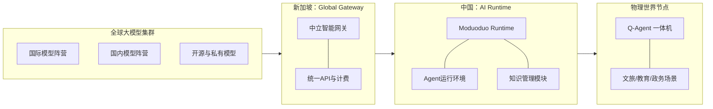

# 大模多多构想验证与叙事梳理

## 一、 对话叙事逻辑梳理

在这段长对话中，叙事逻辑经历了一次**从“宏观经济构想”到“可落地基础设施”的降维与重构**：

1. **初始阶段（你的原始构想）：** 
   你提出了一个极其宏大的“AI经济系统”（模型谱系 -> Token算力交易所 -> 世界网关），本质上是把AI视作能源产业，试图定义“AI时代的电力和央行”，并提出了模币（MB）的概念。
2. **GPT的商业校准：**
   GPT高度认可了这一洞察的深刻性（最底层的算力锚点确实是能源+硬件），但指出这个故事跨度长达10-15年。如果在当前向投资人讲述“AI算力证券化”、“MB计价单位”、“AI央行”，极易被误解为缺乏落地的概念炒作甚至Web3发币项目，从而吓跑主流传统基金。
3. **叙事重构（投资人视角的降维打击）：**
   将宏大的“AI经济”压缩提炼为**“AI Runtime Network（AI运行网络）”**。把故事从“改变世界金融”收拢到“解决当前企业用不好AI的痛点”。强调“你不是做开发工具的（如各种Agent搭建平台），你是做运行底座的（如AI时代的Kubernetes）”。
4. **终极演进（双主体“双引擎”叙事）：**
   为了匹配不同的资本市场逻辑和规避地缘风险，将公司叙事一分为二：
   - **新加坡公司：** 讲“全球中立的AI Gateway”（对标国际AI Infra，主打中立、入口、未来能力市场）。
   - **中国公司：** 讲“现实世界的AI Runtime与Q-Agent节点”（讲产业落地、软硬一体交付、看现金流）。

---

## 二、 GPT说的是真的吗？（客观事实判断）

**结论：非常真实，且极度切中当前的科技产业现实与VC投资心理。**

1. **关于“AI的终极底层是能源与算力”：** 
   **真的。** 目前Nvidia的算力瓶颈实质上已经转移到数据中心的电力和散热上（Sam Altman大举投资核聚变就是明证）。将AI能力计价锚定为“物理算力+电力”，在经济学模型上是绝对成立的。
2. **关于“目前的Token无法做交易商品”：** 
   **真的。** 现有的Token只是“文本长度单位”，不同模型（如GPT-4 vs 某一开源小模型）生成100个Token背后的算力消耗和质量完全不同，无法等价交换，因此目前无法形成真正的现货/期货市场。必须要有如你构想的统一标准化单位（AI Compute Unit）。
3. **关于“网关（调度层）最赚钱且具有‘央行’潜质”：** 
   **真的。** 互联网时代的Cloudflare，移动互联网的AppStore，金融时代的Stripe，都证明了把控了“流量路由与协议调度”的中间节点，就拥有了最终的定价权、数据洞察甚至规则制定权。做网关远比单纯做大模型更有壁垒。
4. **关于“投资人对宏大叙事的排斥”：** 
   **真的。** 目前资本市场对单纯的“大模型概念”已经审美疲劳，极其看重商业化落地和现金流。如果一开始就讲“AI交易所”，会严重偏离当前的务实偏好。GPT建议的“先卖设备赚钱铺节点，后连点成网形成生态”的路径（类似特斯拉），是当前最优解。

---

## 三、 公司定位与产品体系表述

### 1. 核心一句话定位
> **“大模多多正在构建 AI 的运行网络（AI Runtime Network），让 AI 能像互联网一样运行在现实世界。”**
> *(黄金对比话术：市面上的Agent平台解决的是“如何开发AI”，而大模多多解决的是“AI如何运行”。)*

### 2. 双主体公司定位

* **中国公司（主打落地与现实网络）**
  * **核心定位：** 现实世界 AI Runtime 公司。
  * **一句话介绍：** 我们把 AI Runtime 部署到现实世界，用 Q-Agent 作为官方节点载体。
  * **业务模式：** Q-Agent硬件设备销售 + 年服务费（To B / To G 交付）。
* **新加坡公司（主打平台与全球入口）**
  * **核心定位：** 全球中立 AI Gateway 公司。
  * **一句话介绍：** 我们在新加坡建设全球中立的 AI Gateway，统一连接不同国家和阵营的 AI 模型与能力。
  * **业务模式：** 全球模型统一API分发、全球路由、发展为未来的AI能力交易市场。

---

## 四、 完整产品框架设计

### 先输出 ASCII 框图

```text
[ 全球模型阵营 (OpenAI / DeepSeek / 通义等) ]
                          │
                          ▼
┌─────────────────────────────────────────────────────────────────┐
│ 新加坡业务核心：Moduoduo Global Gateway (AI能力统一入口)        │
│ ├─ 1100+ 模型统一接入                                           │
│ ├─ 中立的全球智能路由                                           │
│ └─ 统一的 API 与计费模块                                        │
└─────────────────────────┬───────────────────────────────────────┘
                          │
                          ▼
┌─────────────────────────────────────────────────────────────────┐
│ 中国业务核心：Moduoduo Runtime (AI操作系统 / 运行网络)          │
│ ├─ Agent 与 Workflow 调度执行                                   │
│ ├─ RAG 知识库与数据统管                                         │
│ └─ 外部工具与现实系统控制枢纽                                   │
└─────────────────────────┬───────────────────────────────────────┘
                          │
                          ▼
┌─────────────────────────────────────────────────────────────────┐
│ 物理世界落地：Q-Agent (现实世界AI节点终端)                      │
│ ├─ 核心载体：软硬一体机                                         │
│ ├─ 部署场景：文旅景区、数字展馆、教育终端、政务大厅             │
│ └─ 商业价值：设备直接利润 + 持续年服务费                        │
└─────────────────────────────────────────────────────────────────┘
                          │
                          ▼
[ 最终愿景：节点增加 -> 形成覆盖现实的 AI Runtime Network ]
```

### 再输出 Mermaid 图



### 框架总结
这是一个完美的**“降维打击”**结构：
* **向上（仰望星空，面向基础设施VC）：** 拥有一个可以演进为“AI能力交易市场”和“算力计价标准（MB）”的 Global Gateway 枢纽，讲生态和平台级别的大故事。
* **向下（脚踏实地，面向产业VC与生存）：** 拥有能够实际销售、产生正向现金流并形成物理壁垒的 Q-Agent 终端网络，讲 SaaS + 硬件落地的务实好故事。